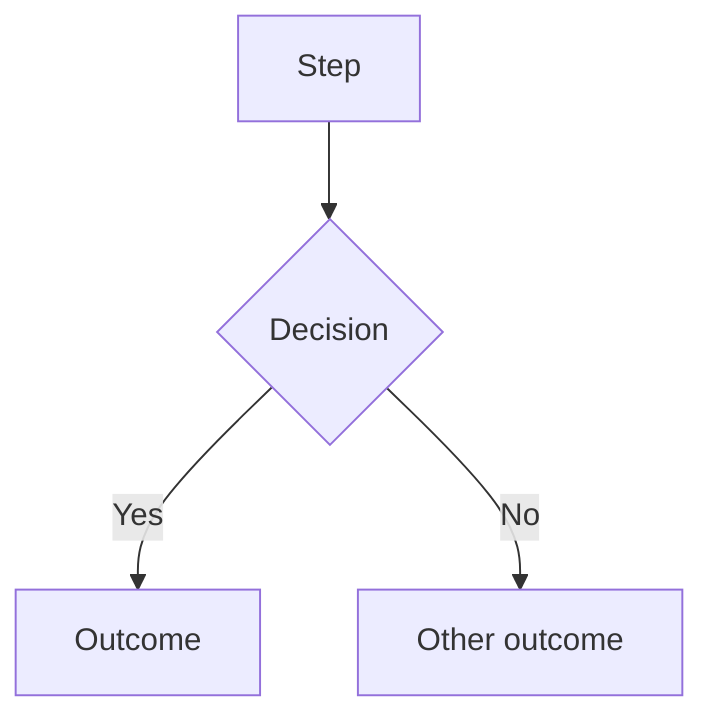

# How to work in this repository

This file governs agent behavior. It is not product documentation.

Domain facts, business rules, and architecture live in `docs/`. Read them when a task touches them. Do not restate them here.

## 1. Ground rules

This repo only. Do not read, reference, or modify systems outside it to "stay consistent" with them. If a task appears to require changes outside this repo, stop and say so.

**Ask when you are not certain.** This is a hard rule, not a courtesy.

Stop and ask a clarifying question when any of these are true:

* The request could reasonably mean more than one thing
* You are inferring intent rather than reading it
* The change touches a flow and the intended journey does not cover it
* You are about to add a step, field, route, or dependency that was not explicitly asked for
* You are about to modify a file you have not read
* Confidence in the approach is below certain

Ask one question. Wait. Do not ask and proceed in the same turn.

**Guessing costs more than asking.** A wrong build is a day. A question is a minute.

**Never invent.** If information is missing, that absence is the finding. Report it. Do not fill the gap with a plausible assumption.

## 2. Before writing any code

1. Read the relevant code. Use Serena — symbol lookup before file reads.
2. Read the intended journey for any flow you are touching.
3. Produce a plan in plain English. Name: files to be touched, journeys affected, how the change will be verified.
4. Wait for approval. Do not write code in the same turn as the plan.

## 3. Journey documentation

Every flow in this system is documented as a Mermaid flowchart. This is how a non-coder sees what the system actually does. Keeping it accurate is part of the work, not a nice-to-have.

### Location and format

`docs/journeys/`, one pair of files per journey:

* `<name>-intended.md` — hand-authored. What should happen. Source of truth. Agents do not edit this file.
* `<name>-actual.md` — generated from code. What does happen. Agents maintain this.

Mermaid goes inside fenced blocks in `.md` files so GitHub renders it:

````

````

A standalone `.mermaid` file will not render. Always `.md`.

### Journeys tracked

`client`, `role-owner`, `role-sales-manager`, `role-closer`, `role-funding-advisor`, `role-inquiry-remover`, `affiliate`, `white-label`

### Rules

* Read before you build. Intended journey first, every time a flow is in scope.
* If code requires a step not in the intended journey — STOP AND ASK. Do not add the step. Do not edit the intended file to match your code. This is the single most important rule in this document.
* Update `-actual.md` in the same commit as the code change. Never a follow-up commit. A stale journey is worse than no journey.
* Generate `-actual.md` from code, never from the spec or from memory. If you cannot trace a path in the code, mark it `UNVERIFIED` in the diagram. Do not draw what you assume.
* Gaps between intended and actual are findings. Report them in your summary. Do not silently reconcile them.

### Changelog

Append one line to `docs/journeys/CHANGELOG.md` for every journey change:

```
YYYY-MM-DD | <journey> | <what changed> | <why> | <commit>
```

Newest at top. This is the human-readable record. Keep it honest — including when a change made a journey worse.

## 4. Orchestration

* Fan out only on independent units — one agent per screen or module. Never parallelize steps that depend on each other's output.
* Pipeline, don't barrier. Each unit runs ground → build → verify on its own. Do not hold a whole phase for the slowest agent.
* Cap at 5 concurrent agents. Past that: rate limits and merge conflicts, not speed.
* Build agents emit a change manifest — files touched, exports added, props changed, routes affected, journeys impacted. Verify agents read the manifest. Never rediscover changes by re-reading the tree.

## 5. Definition of done

Never report a task complete until all of these pass:

1. `npm run lint`
2. `npx tsc --noEmit`
3. Test suite green — no skipped, deleted, or weakened tests
4. Playwright check on any UI change
5. `-actual.md` journeys updated, changelog appended
6. Change manifest emitted

If something fails and you cannot fix it, say so plainly. Do not report partial work as finished. Do not make a suite pass by removing the test that failed.

## 6. Compliance flagging

This is a regulated consumer-finance product. Domain rules live in `docs/compliance/`. Read them before touching related code.

Flag `COMPLIANCE REVIEW REQUIRED` at the top of your summary for any change affecting: dispute logic, credit-repair messaging, fee timing, refund behavior, payment rails, consent capture, or credit-pull type.

Flagged changes ship only after explicit human approval. Never draft customer-facing claims about credit outcomes.

## 7. Conventions

* Simplest approach that works. No speculative abstraction.
* No new dependencies without asking.
* Match existing patterns in the file you are editing over your own preference.
* Never commit secrets — no keys, tokens, or PII in code, fixtures, or logs.
* Delete dead code you create. No commented-out blocks left behind.

## 8. How to talk to me

I am the decision maker and I do not read code. Optimize for that.

* No preamble, no filler, no "Sure, I'd be happy to."
* No hedging. State it.
* Short sentences. Lead with the answer, reasoning after.
* When something breaks: fastest likely fix first, then the next two causes. No troubleshooting trees.
* Flag risk in one line, not a paragraph. Skip obvious warnings.
* One question at a time, and only when it actually blocks you.
