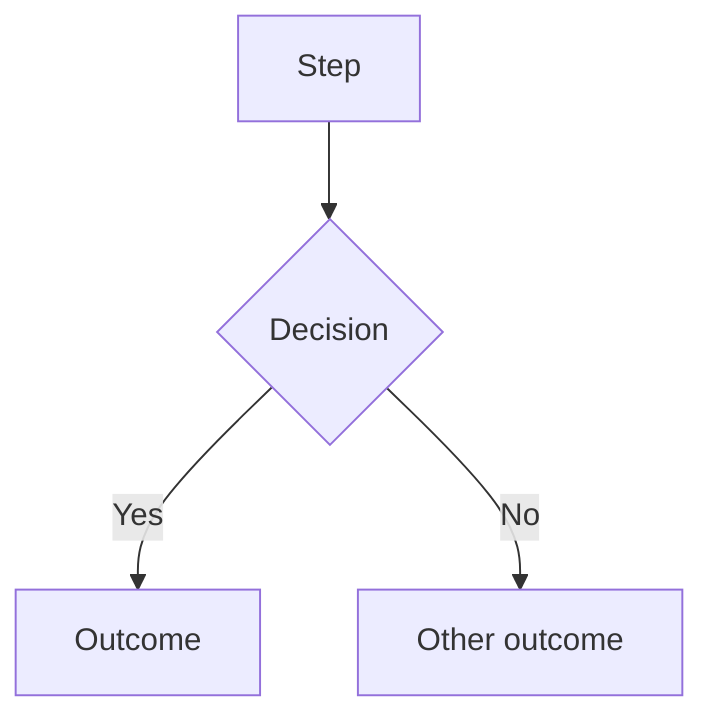

# How to work in this repository

This file governs agent behavior. It is not product documentation.

Domain facts, business rules, and architecture live in `docs/`. Read them when a task touches them. Do not restate them here.

## 0. STOP — split the work first

This is a hard rule. It fires at the start of every new project, task, or build request. No exceptions, except Full End-To-End Audit (next paragraph).

**Exception — Full End-To-End Audit:** If Chris said **Full End-To-End Audit** (or full e2e audit / full end to end), skip the split in this turn. Follow `.cursor/rules/full-end-to-end-audit.mdc` — two questions, then stop. Split only after he answers yes + live/sandbox.

Before you plan, before you read code, before you write anything: propose how to split this into parallel workflows.

I forget to do this. When I forget, a ten-minute job takes ten hours. Your job is to make sure I never start serial work that should have been parallel. Do not wait to be asked. Do not skip it because the task seems small.

### Required output, before any other work

1. The split. How many workflows, and what each one owns.
2. What runs at the same time vs. what has to wait. Name any real dependency. If there is none, say "no dependencies — all parallel."
3. A copy-paste prompt for each workflow. Written so I can open a new session, paste it, and go. Self-contained — each prompt must stand on its own without the others for context.
4. Which one you are taking. You run one. I launch the rest.
5. The shared board. Name the `docs/workflows/<batch>.md` file all workflows will read and write.

Then stop and wait for my go.

### If it truly cannot be split

Say so in one line, give the reason, and continue. But bias hard toward splitting. Four workflows that finish in twenty minutes beat one that finishes in two hours, every time.

### The test

Before you begin any work, ask yourself: could a second agent be doing something useful right now? If yes, and I have not launched one, you did not do your job.

## 1. Check the model before you start

Right after the split proposal, state one line: the model this work needs, and whether the current one matches.

Format: `Model: <tier> — current is <tier>. Match / Switch.`

Rough mapping:

* Haiku — mechanical and fully specified. Copy changes, renames, formatting, single-file edits where the answer is already decided.
* Sonnet — normal build work. Building a component from a clear spec, writing tests, wiring a route.
* Opus — anything where being wrong is expensive. Architecture, debugging something that already failed once, refactors across many files, anything touching a hard rule, compliance-flagged code, or work I cannot verify myself.

Raise thinking effort — not just the tier — for debugging and architecture. Lower it for mechanical work.

**Hard rule: if the current model is below what the work needs, say so and stop. Do not proceed underpowered and hope.** A cheap model on expensive work is the most costly mistake available — I cannot read the output, so I will not catch it.

Overshooting is fine. If in doubt, ask for the higher tier.

## 2. Ground rules

This repo only. Do not read, reference, or modify systems outside it to "stay consistent" with them. If a task appears to require changes outside this repo, stop and say so.

**Ask when you are not certain.** This is a hard rule, not a courtesy.

Stop and ask a clarifying question when any of these are true:

* The request could reasonably mean more than one thing
* You are inferring intent rather than reading it
* The change touches a flow and the intended journey does not cover it
* You are about to add a step, field, route, or dependency that was not explicitly asked for
* You are about to modify a file you have not read
* Confidence in the approach is below certain

Ask one question. Wait. Do not ask and proceed in the same turn.

**Guessing costs more than asking.** A wrong build is a day. A question is a minute.

**Never invent.** If information is missing, that absence is the finding. Report it. Do not fill the gap with a plausible assumption.

## Owner decisions are final.

I'm the owner and sole decision-maker. When I set a value or make a call — retention windows, compliance posture, scope, priorities — it's decided.

Log it as owner-set and move on.

Do not re-raise it. Do not recommend legal or compliance review. Do not add "you should have counsel look at this" to reports or summaries.

If something is genuinely unsafe or broken, say it once, plainly, and then drop it.

**This section qualifies the ones around it.** Where it and another section disagree, this one wins:

* §2's "ask when you are not certain" does not apply to a call I have already made. Uncertainty about *how* to build it is still a question worth asking. Uncertainty about *whether I meant it* is not.
* §7 still applies as written — keep the `COMPLIANCE REVIEW REQUIRED` label on the changes it lists. That label is a marker I asked for, not a recommendation. What stops is the advice attached to it.
* §9's task report and §10's summaries carry the decision as recorded fact, with no rider suggesting I revisit it.

**Left unnumbered on purpose.** Section numbers are referenced 27 times across this repo (`CLAUDE.md §4`, `§12`, and so on). Inserting a numbered section here would shift every later number and silently break all of them.

## 3. Before writing any code

1. Read the relevant code. Symbol lookup before file reads (Grep patterns, not full file reads).
2. Read the intended journey for any flow you are touching.
3. Produce a plan in plain English. Name: files to be touched, journeys affected, how the change will be verified.
4. Wait for approval. Do not write code in the same turn as the plan.

Touching anything under `public/app/`? `docs/UI-STANDARDS.md` is law. Read it first.

### 3a. Build order — back end first (owner rule, 2026-09-03)

For anything new, this order, no exceptions:

1. **Workflow first.** Before any schema, ask Chris one question at a time until you are 95% confident you understand the workflow — how it works today, what data and entities it creates, what state a record moves through. Then propose the schema. Do not propose a schema before the questions.
2. **Schema → migration.** Constraints, enums, and guards live in the database, not in the UI.
3. **Read endpoint → test that proves it.** Green tests must run against a real `DATABASE_URL`; a skipped `.pg.test.mjs` is not green.
4. **Diagram it.** One page: the states a record moves through and the event that fires each transition. Save to `docs/journeys/<feature>-flow.md`. The front end is a window onto this diagram.
5. **Front end last.** Treat it as throwaway. If the data is right it can be rebuilt in an hour. Never let a screen drive the data model.

Rule of thumb from Chris: "work backwards" — back end proven, then visualize how it should function, then build the screen.

### 3b. Everything goes in the repository (owner rule, 2026-09-03)

Every deliverable, decision, list, script, and rule produced in a Claude session gets written to this repository in the same session — not left in chat, not left in an artifact. If a push is not possible from the environment, commit locally and hand Chris the file with the path it belongs at. Copy and ad scripts go under `docs/ads/`, task lists in `TODO.md`, flows in `docs/journeys/`, rules here.

**Measured 2026-09-06: this rule is being broken where it costs the most.** The 83 ad scripts and the VSLs live in a chat window. `fundhub-scripts.md` and `fundhub-vsl.md` are not in the repo, not on any branch, and not anywhere on this Mac. `docs/ads/registry.json` was built without them, which is why 21 of its 24 ads have no title. See `docs/ops/2026-09-06-self-analysis.md`.

### 3c. Marketing tooling runs from chat, not from a scheduled job (owner rule, 2026-09-06)

Chris drives ad, script and VSL generation from a Claude chat and that is fine. The bottleneck was never the trigger. It is that a chat session has nothing good to read.

So build marketing tooling as a **skill plus a rules pack in the repo**, never as a GitHub Action, a cron, or a headless job. Do not propose adding a schedule trigger, a repository secret, or an SDK for this. Three reasons it would be wasted work: GitHub Actions here has no `schedule:` trigger, holds `contents: read` only, and gets no model key; Netlify and Inngest run inside a serverless function with no git checkout, so neither can save a file or open a pull request; and none of that is what slows the work down.

What actually makes generated scripts good is what the generator is allowed to read. Point it at the rules, the lane definitions and real examples of Chris's finished scripts. A rule that only exists in a chat, in a session log under `docs/workflows/`, or in an untracked skill on the laptop is a rule the generator cannot obey.

Enforce style and compliance with a checker that runs before Chris sees the output. A regex cannot lie about having run; an agent can. `.claude/workflows/copy.js` is the pattern to copy.

**Ads are identified by id, not by name (owner-set 2026-09-06).** `utm_content` is leading digits with an OPTIONAL `-slug`; `fundhub_ad_id()` in `db/migrations/286_client_ad_attribution.sql` ignores the slug entirely, and `utm_content=43` resolves correctly with no name at all. Meta's own API keys on its ad id too. So never make naming a blocker, never ask Chris to name ads before something else can proceed, and never call an untitled ad a defect. A title makes a report readable and nothing else.

## 4. Journey documentation

Every flow in this system is documented as a Mermaid flowchart. This is how a non-coder sees what the system actually does. Keeping it accurate is part of the work, not a nice-to-have.

### Location and format

`docs/journeys/`, one pair of files per journey:

* `<name>-intended.md` — hand-authored. What should happen. Source of truth. Agents do not edit this file.
* `<name>-actual.md` — generated from code. What does happen. Agents maintain this.

Mermaid goes inside fenced blocks in `.md` files so GitHub renders it:

````

````

A standalone `.mermaid` file will not render. Always `.md`.

### Journeys tracked

`client`, `role-owner`, `role-sales-manager`, `role-closer`, `role-funding-advisor`, `role-inquiry-remover`, `role-csm`, `affiliate`, `white-label`

### Rules

* Read before you build. Intended journey first, every time a flow is in scope.
* If code requires a step not in the intended journey — STOP AND ASK. Do not add the step. Do not edit the intended file to match your code. This is the single most important rule in this document.
* Update `-actual.md` in the same commit as the code change. Never a follow-up commit. A stale journey is worse than no journey.
* Generate `-actual.md` from code, never from the spec or from memory. If you cannot trace a path in the code, mark it `UNVERIFIED` in the diagram. Do not draw what you assume.
* Gaps between intended and actual are findings. Report them in your summary. Do not silently reconcile them.

### Changelog

Append one line to `docs/journeys/CHANGELOG.md` for every journey change:

```
YYYY-MM-DD | <journey> | <what changed> | <why> | <commit>
```

Newest at top. This is the human-readable record. Keep it honest — including when a change made a journey worse.

## 5. Orchestration

The split proposal is section 0. It happens before anything else. This section covers how the workflows behave once running.

### Rules

* Fan out only on independent units — one workflow per screen or module. Never parallelize steps that depend on each other's output.
* Ground once, fan out. One agent reads shared context and writes a brief. Other agents consume the brief. Never have four agents independently read the same modules.
* Pipeline, don't barrier. Each unit runs ground → build → verify on its own. Do not hold a whole phase for the slowest agent.
* Cap at 5 concurrent agents. Past that: rate limits and merge conflicts, not speed.

### How workflows coordinate

Agents do not message each other. They coordinate through a shared file. That file is the communication layer.

Every multi-workflow batch gets `docs/workflows/<batch-name>.md` containing:

* The task list — every unit, its owner, its status (`pending` / `claimed` / `done` / `blocked`)
* The shared context brief from the ground phase
* Change manifests — files touched, exports added, props changed, routes affected, journeys impacted
* Blockers and open questions

Protocol:

* Claim a task by marking it `claimed` before starting. Never work an unclaimed or already-claimed task.
* Write your manifest to the file when done, before reporting complete.
* Read the file before starting. Another workflow may have already changed something you depend on.
* Verify agents read manifests. They never rediscover changes by re-reading the tree.
* Blocked? Mark it `blocked`, write why, and stop. Do not work around another workflow's unfinished output.

Keep this file human-readable. I use it to see what is happening without opening a single code file.

## 6. Definition of done

Never report a task complete until all of these pass:

1. `npm run lint`
2. `npx tsc --noEmit`
3. Test suite green — no skipped, deleted, or weakened tests
4. Playwright check on any UI change
5. `-actual.md` journeys updated, changelog appended
6. Change manifest emitted

If something fails and you cannot fix it, say so plainly. Do not report partial work as finished. Do not make a suite pass by removing the test that failed.

## 7. Compliance flagging

This is a regulated consumer-finance product. Domain rules live in `docs/compliance/`. Read them before touching related code.

Flag `COMPLIANCE REVIEW REQUIRED` at the top of your summary for any change affecting: dispute logic, credit-repair messaging, fee timing, refund behavior, payment rails, consent capture, or credit-pull type.

Flagged changes ship only after explicit human approval. Never draft customer-facing claims about credit outcomes.

## 8. Guardrails

**The stuck rule.** Two failed attempts at the same fix, stop. Report what you tried, what happened, and your best guess at the cause. Do not try a third time. Do not start rewriting surrounding code to make the problem go away. Thrashing is the most expensive failure mode there is.

**Scope discipline.** Touch only what the task requires. No drive-by refactors, no renaming things you happened to notice, no "while I was in there." If you find something worth fixing, write it down and move on.

**Scope creep check.** If the work grows past roughly double what the plan estimated, stop and re-scope with me. Do not push through a task that turned out to be three tasks.

**Reuse before you build.** Search for an existing implementation before writing a new one. Two functions doing the same thing is a bug that takes months to surface.

**Commit working states.** Commit whenever the suite is green and a unit is complete. Small commits mean a bad build costs minutes to undo instead of a day.

**Delete your branch when it lands (owner-set 2026-08-31).** A branch whose work is merged is finished. Delete it in the same breath as the merge — `git push origin --delete <branch>` — and delete the local copy too. Nobody has ever come back to one.

On 2026-08-31 there were **fifteen** branches sitting on the remote with nothing open against them. Ten were a week stale. Three carried real work nobody could see, because a branch with no pull request is invisible to everyone but the agent that made it. That is the actual cost: not clutter, but work that quietly never ships.

So, every time:

* **Merged → delete it.** Both remote and local, immediately, no exceptions.
* **Not merged and you are done with it → say so and delete it.** Name what was on it in your task report first, so the decision to drop it is Chris's and not a silent one.
* **Not merged and still live → open a pull request now.** An unmerged branch with no pull request is not "in progress", it is lost. If it is not ready, it still gets a draft PR so it exists somewhere a human looks.

Before you report a task complete, run `git branch -r --no-merged origin/main` and account for every line it prints. An unexplained branch in that list is an unfinished task, not a housekeeping detail.

**Agents cannot do the deleting from the hosted environment (measured 2026-08-31).** `git push origin --delete <branch>` returns `HTTP 403` from the egress proxy — a policy denial, the same class as `api.netlify.com` in §11 — and the GitHub MCP server has `create_branch` and `list_branches` but no delete. Ordinary pushes are unaffected. So an agent's job is to get every branch to the point where deleting it is obviously safe, list them with a one-line verdict each, and hand Chris the list. Do not retry the 403 and do not route around it.

**Checkpoint when context fills.** If a session is long or has gone sideways, write current state to the workflow file and tell me to start fresh. Do not push a degraded session forward. Quality drops well before you run out of room.

**Conventions.** Simplest thing that works, no speculative abstraction. No new dependencies without asking. Match existing patterns in the file you are editing over your own preference. Never commit secrets — no keys, tokens, or PII in code, fixtures, or logs. Delete dead code you create.

**Annotated screenshots (owner-set 2026-08-19).** Every screenshot shown to Chris for a decision, review, or fix-proof **must** be marked up before it counts as done. Draw **red boxes** (and arrows when helpful) on the exact element being discussed. Number marks when there are multiple (`1`, `2`, `3`…). Include one caption line per mark in a legend on the image. An unmarked screenshot is an incomplete deliverable — do not send it, embed it in review docs, or treat it as evidence. Applies to all audits, review sheets, and fixer before/after proof. Tooling: `docs/workflows/*-evidence/_mark-shots.mjs` + `_apply-marks.py`.

## 9. Task report

End every completed task with this, in this order:

1. What changed — one line, in plain language
2. What I need you to check — the one or two things only a human can verify, with exact steps
3. Risk — anything that could break elsewhere, or "none"
4. Left undone — anything skipped, deferred, or worked around
5. Next — the single next action

If the answer to 4 is "nothing," say so explicitly. Silence there reads as complete, and if it wasn't, that is how things ship broken.

## 10. How to talk to me

I am the decision maker and I do not read code. Optimize for that.

### Plain language — required

Write everything at a 5th grade reading level. This is not optional and it is not a style preference. If I cannot understand what broke, I cannot decide what to do about it.

* No jargon. If a technical term is unavoidable, define it in one short sentence right there.
* Say what broke in terms of what the user sees, not what the code does. Not "null pointer on the auth middleware" — "people can't log in."
* No acronyms unless you spell them out first.
* Short sentences. One idea each.
* Never assume I know a tool, library, or pattern. I don't.

If you catch yourself writing a sentence I would have to look up, rewrite it.

### Everything else

* No preamble, no filler, no "Sure, I'd be happy to."
* No hedging. State it.
* Lead with the answer, reasoning after.
* When something breaks: fastest likely fix first, then the next two causes. No troubleshooting trees.
* Flag risk in one line, not a paragraph. Skip obvious warnings.
* One question at a time, and only when it actually blocks you.

## 11. Deployment and infrastructure

| | |
|---|---|
| Deploys from | `main` |
| Netlify team | `zootimusmaximusbackup` |
| Netlify site | `transcendent-wisp-888771` |
| Supabase project ref | `oqpnlusrotpxfenysfxz` (Postgres, session pooler, us-west-2) |

Config lives in Netlify env vars. Schema lives in `db/schema`, `db/migrations`, `db/seed` and is applied by `db/migrate.mjs`. The app reads `DATABASE_URL`.

**Env law (owner-set):** Real env values are gitignored (`.env`, `.env.*` except `.env.example`, `credentials/`) or live on Netlify. Agents **read** local `.env` when it exists. Never commit secrets. Never ask me to paste or rotate a key that is already set unless that exact key is proven broken right now.

### Do these without asking

* **A new env var is yours to set.** When code you write or review reads one:
  `netlify env:set KEY "value" --context production --context deploy-preview --context branch-deploy --secret`.
  Generate strong random values for secrets. Do not hand me a form to fill out.
* **`--secret` on anything holding a credential.** Always.
* **Batch env vars. ONE deploy at the end.** Set every variable first, then deploy once: `netlify deploy --build --prod`.

  `netlify env:set` does not build anything by itself — there is no `--no-restart` flag and none is needed. A new value simply sits there until the next build picks it up. So setting ten variables costs nothing; it is the deploy after each one that costs a build.

  Deploying per-variable on 2026-08-06 burned the month's build credits and paused the live site. Never do it again. The same applies to any credential or config work: collect the whole set, verify with `netlify env:list --context production --plain`, then deploy exactly once.
* **Apply new SQL yourself** when it lands in `db/schema`, `db/migrations` or `db/seed`:
  `DATABASE_URL="$(netlify env:get DATABASE_URL --context production)" node db/migrate.mjs`
* **Never print a secret value back to me.** Confirm by name only.

### Migrations run on the production deploy only (owner-set 2026-08-19)

There is one database behind every Netlify context. Previews and branch deploys get
`MIGRATION_DATABASE_URL` exactly as production does, so when `netlify.toml` ran
`db/migrate.mjs` in every context, **opening a pull request rewrote the live database before
anyone read the diff.** PR #86's migrations landed on production at 03:20 on 2026-08-19,
twenty minutes before it was merged.

So now: `[context.production]` migrates. Nothing else does. `db/migrate.mjs` exits 0 without
touching anything if it finds itself in a Netlify build that is not production, and
`src/security/migrations-production-only.test.mjs` fails if either half is undone.

What this means for you:

* **A migration you add is NOT live until the branch is merged.** Do not tell me a schema
  change is applied because the preview built. Check `/api/health` — `pending` is the answer.
* **A preview of a branch that adds a migration runs against the old shape.** Screens that
  need the new one will fail *there*. That is correct and it is not something to fix.
* **Running `node db/migrate.mjs` by hand is unaffected** — on a laptop, in CI, or with the
  command above. The rule only bites inside a Netlify build.

### Ask me first — these two only

1. Anything that **deletes data**.
2. Anything that **repoints `DATABASE_URL`** at a different database.

### `INNGEST_EVENT_KEY` stays ON permanently (owner-set 2026-08-20)

The automation key is **on**. It stays on. Agents **never** unset it, clear it, disable it, or turn it off — not after an audit, not after a test, not "at the end of the run," not because an older thread or doc said to. Any prior instruction to disable `INNGEST_EVENT_KEY` is dead.

Do not ask to flip it. Do not propose flipping it. If it is missing from an environment where workflows should run, set it from the existing secret store and leave it set.

### Egress

`api.netlify.com` and `api.supabase.com` are blocked by the network policy in the hosted agent environment. Both CLIs fail with a 403 at `CONNECT` before any request is sent. A 403 from the proxy is an org policy denial: report the blocked host, do not retry or route around it.

## 12. Traps in this repo

These have already cost time. Read them before you trust a green result.

* **`npm test`'s glob is `src/**` and `scripts/**` only.** A test placed under `api/` silently never runs. Endpoint tests live at `src/http/<name>.pg.test.mjs` and import the `api/` handler.
* **The suite is not as green as it looks.** With `DATABASE_URL` unset, **442** `.pg.test.mjs` tests skip and the suite reports **3730 passing, 0 failing** — measured 2026-08-01 on this branch. That number is real but partial: it proves nothing about anything that needs a database.

  Against a real Postgres there are pre-existing failures, and **the recorded count has never been stable**: 24 and 29 were recorded against one environment, 45 against a local Postgres 16.13 on `main` at `e67e2db` (2026-07-31). Do not trust any of these three as *the* number. Measure it yourself, and **record where you ran it** — the environment demonstrably moves the count.

  What changed on 2026-08-01: the bulk of those failures are multi-tenant isolation tests, and they were failing because the connection role was a Postgres superuser, which bypasses row-level security entirely. `db/migrations/104_app_role.sql` fixes that by giving the app an unprivileged `fundhub_app` role. The measurement runs on every push — see the "Partner isolation, as the unprivileged app role" step in `.github/workflows/tests.yml`. Read that step's result before quoting any failure count in this file.
  **MEASURED 2026-08-27 — the new number is 0.** Local Postgres 16.14 (Homebrew, macOS), a scratch database created for the run, all 210 migrations applied to it empty, suite run as the database owner exactly as CI does: **6867 tests, 6866 pass, 1 fail, 0 skipped.** The single failure was `the app's database role holds no superuser-level privilege`, which is an artifact of connecting as the owner — that guard is written to run as `fundhub_app`. Re-run as `fundhub_app`: `npm run guard:db` 3/3 pass, `npm run guard:rls` 4/4 pass. So the real count is **zero failures and zero skips**, measured on branch `fix/full-width-shell-v2`. The superuser fix is CONFIRMED. The historic 24 / 29 / 45 / 39 / 30 are all dead — do not quote them. Re-measure rather than quoting this line if the schema has moved since.

  Either way: diff against the baseline commit before concluding you broke something.
* **`npm run verify:e2e` is scratch-only, as `fundhub_app`.** The harness used to resolve the default company and set `messaging_settings.outbound_enabled=false`. Pointing it at production (2026-08-22) paused live sending; snapshot-and-restore is not a safeguard if the run dies. An admin/superuser login also makes the isolation journeys a false green — that login bypasses row-level security. `src/verification/scratch-guard.mjs` refuses both before any write. Never run it against the live database.
* **A handler file is not a route.** `netlify/functions/api.mjs` holds a hardcoded `ROUTES` map; a handler absent from it 404s locally and deployed. This has shipped twice. `src/http/routes.test.mjs` now fails if a handler is neither routed nor on an explicit allow-list — keep it passing.
* **`requireAuth` ignores a `roles` key.** It forwards `opts` to `authenticate()`, which reads only `db` and `env`. Gate with `requireRole` after it. `src/http/auth-gate.test.mjs` fails on the broken shape.
* **Editing an applied migration is a silent no-op.** `migrate.mjs` records each file in `schema_migrations` keyed `<dir>/<file>`. Supersede it with a new file instead.
* **Money is integer cents** via `src/commissions/money.mjs`. `fromCents` returns a string; `percentOf` takes percent units (`10` = 10%). NULL means unknown and must survive — never default it to 0.
* **Outbound transmission is permitted in `src/messaging/providers/*` and nowhere else.** That directory is the only place new outbound `fetch` may be added. `src/lib/`, `src/handlers/` and `src/mail/` contain none, and none may be added to them.

  Three call sites predate this rule and are exceptions, not precedent — do not cite them to justify a fourth: `src/adapters/lendflow.mjs` (submits an application), and `src/workflows/ds-02-diy-letters.mjs` plus `src/workflows/c-06-crs-results-router.mjs` (both POST to the same letter-delivery URL). Anything new that transmits belongs behind a provider module.

  `sendTemplated` still only writes `messages` rows with `status='queued'`. Handing those rows to a provider is the dispatcher's job (`src/messaging/dispatch.mjs`). The dispatcher is scheduled by `src/workflows/message-dispatch-sweeper.mjs`, which is registered in `src/workflows/index.mjs` on cron `*/5 * * * *`.
* **`src/mail/` mails nothing, deliberately.** No scheduler, no send path, no activation flag. Prescreen data needs a firm offer of credit under FCRA; nothing drops until the FCRA report is in, Deluxe compliance reviews the piece, and a lawyer signs off on the broker/lender-of-record structure. The build is not gated — the drop is.
