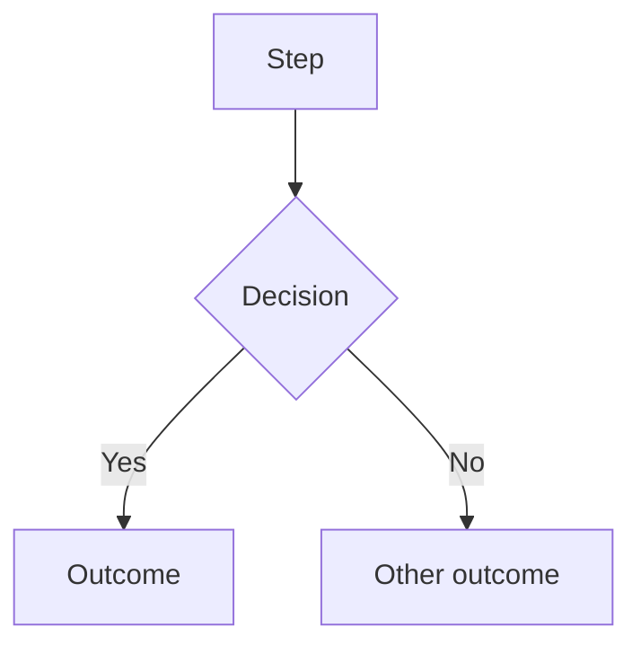

# How to work in this repository

This file governs agent behavior. It is not product documentation.

Domain facts, business rules, and architecture live in `docs/`. Read them when a task touches them. Do not restate them here.

## 1. Ground rules

This repo only. Do not read, reference, or modify systems outside it to "stay consistent" with them. If a task appears to require changes outside this repo, stop and say so.

**Ask when you are not certain.** This is a hard rule, not a courtesy.

Stop and ask a clarifying question when any of these are true:

* The request could reasonably mean more than one thing
* You are inferring intent rather than reading it
* The change touches a flow and the intended journey does not cover it
* You are about to add a step, field, route, or dependency that was not explicitly asked for
* You are about to modify a file you have not read
* Confidence in the approach is below certain

Ask one question. Wait. Do not ask and proceed in the same turn.

**Guessing costs more than asking.** A wrong build is a day. A question is a minute.

**Never invent.** If information is missing, that absence is the finding. Report it. Do not fill the gap with a plausible assumption.

## 2. Before writing any code

1. Read the relevant code. Symbol lookup before file reads (Grep patterns, not full file reads).
2. Read the intended journey for any flow you are touching.
3. Produce a plan in plain English. Name: files to be touched, journeys affected, how the change will be verified.
4. Wait for approval. Do not write code in the same turn as the plan.

## 3. Journey documentation

Every flow in this system is documented as a Mermaid flowchart. This is how a non-coder sees what the system actually does. Keeping it accurate is part of the work, not a nice-to-have.

### Location and format

`docs/journeys/`, one pair of files per journey:

* `<name>-intended.md` — hand-authored. What should happen. Source of truth. Agents do not edit this file.
* `<name>-actual.md` — generated from code. What does happen. Agents maintain this.

Mermaid goes inside fenced blocks in `.md` files so GitHub renders it:

````

````

A standalone `.mermaid` file will not render. Always `.md`.

### Journeys tracked

`client`, `role-owner`, `role-sales-manager`, `role-closer`, `role-funding-advisor`, `role-inquiry-remover`, `affiliate`, `white-label`

### Rules

* Read before you build. Intended journey first, every time a flow is in scope.
* If code requires a step not in the intended journey — STOP AND ASK. Do not add the step. Do not edit the intended file to match your code. This is the single most important rule in this document.
* Update `-actual.md` in the same commit as the code change. Never a follow-up commit. A stale journey is worse than no journey.
* Generate `-actual.md` from code, never from the spec or from memory. If you cannot trace a path in the code, mark it `UNVERIFIED` in the diagram. Do not draw what you assume.
* Gaps between intended and actual are findings. Report them in your summary. Do not silently reconcile them.

### Changelog

Append one line to `docs/journeys/CHANGELOG.md` for every journey change:

```
YYYY-MM-DD | <journey> | <what changed> | <why> | <commit>
```

Newest at top. This is the human-readable record. Keep it honest — including when a change made a journey worse.

## 4. Orchestration

### Always propose the split first

Before starting any task with more than one independent unit of work, stop and propose a workflow decomposition. Do not begin serial work and do not wait to be asked.

The proposal states: how many workflows, what each owns, what they share, what order they run in, and where they must sync.

If the work genuinely has only one unit, say so in one line and proceed.

If you have already given me a decomposition, follow it. If mine looks wrong, say why before starting — not after.

### Rules

* Fan out only on independent units — one workflow per screen or module. Never parallelize steps that depend on each other's output.
* Ground once, fan out. One agent reads shared context and writes a brief. Other agents consume the brief. Never have four agents independently read the same modules.
* Pipeline, don't barrier. Each unit runs ground → build → verify on its own. Do not hold a whole phase for the slowest agent.
* Cap at 5 concurrent agents. Past that: rate limits and merge conflicts, not speed.

### How workflows coordinate

Agents do not message each other. They coordinate through a shared file. That file is the communication layer.

Every multi-workflow batch gets `docs/workflows/<batch-name>.md` containing:

* The task list — every unit, its owner, its status (`pending` / `claimed` / `done` / `blocked`)
* The shared context brief from the ground phase
* Change manifests — files touched, exports added, props changed, routes affected, journeys impacted
* Blockers and open questions

Protocol:

* Claim a task by marking it `claimed` before starting. Never work an unclaimed or already-claimed task.
* Write your manifest to the file when done, before reporting complete.
* Read the file before starting. Another workflow may have already changed something you depend on.
* Verify agents read manifests. They never rediscover changes by re-reading the tree.
* Blocked? Mark it `blocked`, write why, and stop. Do not work around another workflow's unfinished output.

Keep this file human-readable. I use it to see what is happening without opening a single code file.

## 5. Definition of done

Never report a task complete until all of these pass:

1. `npm run lint`
2. `npx tsc --noEmit`
3. Test suite green — no skipped, deleted, or weakened tests
4. Playwright check on any UI change
5. `-actual.md` journeys updated, changelog appended
6. Change manifest emitted

If something fails and you cannot fix it, say so plainly. Do not report partial work as finished. Do not make a suite pass by removing the test that failed.

## 6. Compliance flagging

This is a regulated consumer-finance product. Domain rules live in `docs/compliance/`. Read them before touching related code.

Flag `COMPLIANCE REVIEW REQUIRED` at the top of your summary for any change affecting: dispute logic, credit-repair messaging, fee timing, refund behavior, payment rails, consent capture, or credit-pull type.

Flagged changes ship only after explicit human approval. Never draft customer-facing claims about credit outcomes.

## 7. Guardrails

**The stuck rule.** Two failed attempts at the same fix, stop. Report what you tried, what happened, and your best guess at the cause. Do not try a third time. Do not start rewriting surrounding code to make the problem go away. Thrashing is the most expensive failure mode there is.

**Scope discipline.** Touch only what the task requires. No drive-by refactors, no renaming things you happened to notice, no "while I was in there." If you find something worth fixing, write it down and move on.

**Scope creep check.** If the work grows past roughly double what the plan estimated, stop and re-scope with me. Do not push through a task that turned out to be three tasks.

**Reuse before you build.** Search for an existing implementation before writing a new one. Two functions doing the same thing is a bug that takes months to surface.

**Commit working states.** Commit whenever the suite is green and a unit is complete. Small commits mean a bad build costs minutes to undo instead of a day.

**Checkpoint when context fills.** If a session is long or has gone sideways, write current state to the workflow file and tell me to start fresh. Do not push a degraded session forward. Quality drops well before you run out of room.

**Conventions.** Simplest thing that works, no speculative abstraction. No new dependencies without asking. Match existing patterns in the file you are editing over your own preference. Never commit secrets — no keys, tokens, or PII in code, fixtures, or logs. Delete dead code you create.

## 8. Task report

End every completed task with this, in this order:

1. What changed — one line, in plain language
2. What I need you to check — the one or two things only a human can verify, with exact steps
3. Risk — anything that could break elsewhere, or "none"
4. Left undone — anything skipped, deferred, or worked around
5. Next — the single next action

If the answer to 4 is "nothing," say so explicitly. Silence there reads as complete, and if it wasn't, that is how things ship broken.

## 9. How to talk to me

I am the decision maker and I do not read code. Optimize for that.

### Plain language — required

Write everything at a 5th grade reading level. This is not optional and it is not a style preference. If I cannot understand what broke, I cannot decide what to do about it.

* No jargon. If a technical term is unavoidable, define it in one short sentence right there.
* Say what broke in terms of what the user sees, not what the code does. Not "null pointer on the auth middleware" — "people can't log in."
* No acronyms unless you spell them out first.
* Short sentences. One idea each.
* Never assume I know a tool, library, or pattern. I don't.

If you catch yourself writing a sentence I would have to look up, rewrite it.

### Everything else

* No preamble, no filler, no "Sure, I'd be happy to."
* No hedging. State it.
* Lead with the answer, reasoning after.
* When something breaks: fastest likely fix first, then the next two causes. No troubleshooting trees.
* Flag risk in one line, not a paragraph. Skip obvious warnings.
* One question at a time, and only when it actually blocks you.
