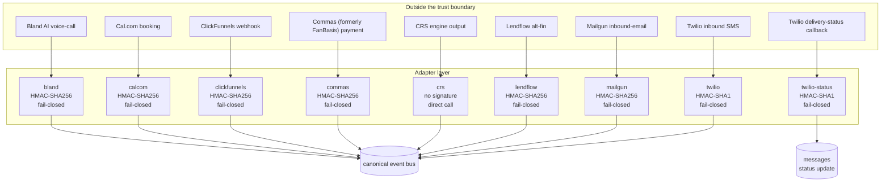

<!-- GENERATED by scripts/diagrams/generate.mjs — do not edit by hand. Run `npm run diagrams`. -->

# Adapter boundary

Where the platform stops trusting the outside world. An adapter verifies, normalizes and emits —
and does nothing else. All business reaction happens on the far side of the bus.

**Generated from:** `src/adapters/`, `src/events/canonical.mjs`

| adapter | direction | auth | emits | verified against a real payload? |
|---|---|---|---|---|
| `bland` | inbound webhook | `verifyBlandSignature` (HMAC-SHA256) | `call.completed` | ⚠️ **no** — carries a CONFIRM banner |
| `calcom` | inbound webhook | `verifyCalcomSignature` (HMAC-SHA256) | `booking.created` | yes |
| `clickfunnels` | inbound webhook | `verifyClickFunnelsSignature` (HMAC-SHA256) | `entry.captured` `survey.submitted` | ⚠️ **no** — carries a CONFIRM banner |
| `commas` | inbound webhook | `verifyCommasSignature` (HMAC-SHA256) | `diagnostic.paid` `deposit.paid` `sale.closed` `payment.received` `payment.failed` | ⚠️ **no** — carries a CONFIRM banner |
| `crs` | direct call | none — not a webhook | `analysis.completed` `decision.rendered` | yes |
| `lendflow` | inbound webhook + outbound call | `verifyLendflowSignature` (HMAC-SHA256) | `round.started` `round.submitted` `round.approved` `round.funded` | ⚠️ **no** — carries a CONFIRM banner |
| `mailgun` | inbound webhook | `verifyMailgunSignature` (HMAC-SHA256) | `mail.response` | yes |
| `twilio-status` | inbound webhook | `verifyTwilioSignature` (HMAC-SHA1) | — | yes |
| `twilio` | inbound webhook | `verifyTwilioSignature` (HMAC-SHA1) | `message.inbound` | yes |

> ⚠️ 4 of 9 adapters still carry a `CONFIRM` banner in their header:
> `bland`, `clickfunnels`, `commas`, `lendflow`. Their field paths, header names or signature
> schemes were written from documentation rather than from an observed payload. The boundary is drawn
> here as the code intends it, which is not the same as how the vendor actually behaves.
