<!-- GENERATED by scripts/diagrams/generate.mjs — do not edit by hand. Run `npm run diagrams`. -->

# Agent trigger map

Which canonical event wakes which automation. "Agent" here means a registered Inngest function —
the 70 workflow ports in `src/workflows/`, read off their real `createFunction` triggers.
(The AG-xx prompt-driven agents in `wireframes/agent-editor.html` are a UI mock with no code behind
them yet, and are deliberately not drawn here.)

**Generated from:** `src/workflows/index.mjs`, `src/events/canonical.mjs`

```mermaid
flowchart LR
  e_analysis_completed(["analysis.completed"])
  e_analysis_completed --> w_af_02_referral_ownership_capture["af-02-referral-ownership-capture"]
  e_analysis_completed --> w_c_02_inquiry_created["c-02-inquiry-created"]
  e_analysis_completed --> w_c_06_crs_results_router["c-06-crs-results-router"]
  e_analysis_completed --> w_dpc_01_analyzer_lock["dpc-01-analyzer-lock"]
  e_analysis_completed --> w_u_02_analyzer_complete_delivery["u-02-analyzer-complete-delivery"]
  e_analysis_completed --> w_u_03_crs_snapshot_sync["u-03-crs-snapshot-sync"]
  e_analysis_completed --> w_u_04_promote_crs_primary["u-04-promote-crs-primary"]
  e_analysis_completed --> w_u_05_data_health_monitor["u-05-data-health-monitor"]
  e_booking_created(["booking.created"])
  e_booking_created --> w_ai_set_01_josh_setter["ai-set-01-josh-setter"]
  e_booking_created --> w_ai_set_04_3way_handoff["ai-set-04-3way-handoff"]
  e_booking_created --> w_bs_01_precall_launcher["bs-01-precall-launcher"]
  e_booking_created --> w_dpc_02_call_outcome_enforcement["dpc-02-call-outcome-enforcement"]
  e_booking_created --> w_dpc_05_no_progress_escalation["dpc-05-no-progress-escalation"]
  e_booking_created --> w_s_04_call_booked["s-04-call-booked"]
  e_booking_created --> w_s_04b_booking_reminders["s-04b-booking-reminders"]
  e_booking_created --> w_s_04c_staff_booked_alert["s-04c-staff-booked-alert"]
  e_booking_created --> w_s_portal_invite["s-portal-invite"]
  e_booking_noshow(["booking.noshow"])
  e_booking_noshow --> w_s_05a_no_show_recovery["s-05a-no-show-recovery"]
  e_booking_rescheduled(["booking.rescheduled"])
  e_booking_rescheduled --> w_bs_01_precall_launcher["bs-01-precall-launcher"]
  e_booking_rescheduled --> w_s_04b_booking_reminders["s-04b-booking-reminders"]
  e_call_completed(["call.completed"])
  e_call_completed --> w_ai_set_03_no_answer_cadence["ai-set-03-no-answer-cadence"]
  e_call_completed --> w_ds_01_repair_referral["ds-01-repair-referral"]
  e_call_completed --> w_s_08_post_call_funding_declined["s-08-post-call-funding-declined"]
  e_call_completed --> w_s_offer_bucket["s-offer-bucket"]
  e_deposit_paid(["deposit.paid"])
  e_deposit_paid --> w_c_02b_inquiry_removal_requested["c-02b-inquiry-removal-requested"]
  e_deposit_paid --> w_s_06_post_call_funding_purchased["s-06-post-call-funding-purchased"]
  e_deposit_paid --> w_s_doc_collection["s-doc-collection"]
  e_diagnostic_paid(["diagnostic.paid"])
  e_diagnostic_paid --> w_af_02_referral_ownership_capture["af-02-referral-ownership-capture"]
  e_diagnostic_paid --> w_c_00_crs_soft_pull_request["c-00-crs-soft-pull-request"]
  e_docs_received(["docs.received"])
  e_docs_received --> w_doc_check["doc-check"]
  e_docs_received --> w_f_06_funding_conditions_missing_docs["f-06-funding-conditions-missing-docs"]
  e_docs_received --> w_repair_bureau_response_reader["repair-bureau-response-reader"]
  e_entry_captured(["entry.captured"])
  e_entry_captured --> w_af_02_referral_ownership_capture["af-02-referral-ownership-capture"]
  e_entry_captured --> w_at_01_first_touch_capture["at-01-first-touch-capture"]
  e_entry_captured --> w_s_00_welcome["s-00-welcome"]
  e_entry_captured --> w_s_01_new_lead_intake["s-01-new-lead-intake"]
  e_entry_captured --> w_s_02_incomplete_survey_nudge["s-02-incomplete-survey-nudge"]
  e_inquiry_removed(["inquiry.removed"])
  e_inquiry_removed --> w_c_03_inquiry_removed_resume_or_hold["c-03-inquiry-removed-resume-or-hold"]
  e_invoice_sent(["invoice.sent"])
  e_invoice_sent --> w_ar_collections["ar-collections"]
  e_mail_response(["mail.response"])
  e_mail_response --> w_f_06_funding_conditions_missing_docs["f-06-funding-conditions-missing-docs"]
  e_mail_response --> w_f_09_funding_declined_no_path["f-09-funding-declined-no-path"]
  e_mail_response --> w_f_11_bank_email_event_router["f-11-bank-email-event-router"]
  e_message_inbound(["message.inbound"])
  e_message_inbound --> w_dpc_03_inbound_reply_router["dpc-03-inbound-reply-router"]
  e_payment_received(["payment.received"])
  e_payment_received --> w_ar_collections["ar-collections"]
  e_payment_received --> w_ds_02_diy_letters["ds-02-diy-letters"]
  e_round_approved(["round.approved"])
  e_round_approved --> w_f_04_round_approvals["f-04-round-approvals"]
  e_round_approved --> w_f_05_inquiry_cleanup_gate["f-05-inquiry-cleanup-gate"]
  e_round_approved --> w_sys_01_client_value_calculator["sys-01-client-value-calculator"]
  e_round_closeout(["round.closeout"])
  e_round_closeout --> w_n_04_post_funding_nurture["n-04-post-funding-nurture"]
  e_round_funded(["round.funded"])
  e_round_funded --> w_f_07_funding_locked["f-07-funding-locked"]
  e_round_funded --> w_f_08_post_funding_monitoring["f-08-post-funding-monitoring"]
  e_round_funded --> w_n_06_renewal_second_wave["n-06-renewal-second-wave"]
  e_round_funded --> w_sys_01_ltv_calculator["sys-01-ltv-calculator"]
  e_round_started(["round.started"])
  e_round_started --> w_bc_01_customer_responsiveness["bc-01-customer-responsiveness"]
  e_round_started --> w_bc_02_customer_friction["bc-02-customer-friction"]
  e_round_started --> w_c_05_pre_funding_review["c-05-pre-funding-review"]
  e_round_started --> w_f_01_funding_intake["f-01-funding-intake"]
  e_round_started --> w_f_02_portal_id_missing["f-02-portal-id-missing"]
  e_round_started --> w_f_10_client_funding_inbox_provisioner["f-10-client-funding-inbox-provisioner"]
  e_round_started --> w_round_started_client_notify["round-started-client-notify"]
  e_round_submitted(["round.submitted"])
  e_round_submitted --> w_f_03_round_submitted["f-03-round-submitted"]
  e_survey_submitted(["survey.submitted"])
  e_survey_submitted --> w_s_nobook_chase["s-nobook-chase"]
```

## Fan-out per event

| event | functions | triggered |
|---|---|---|
| `analysis.completed` | 8 | `af-02-referral-ownership-capture`, `c-02-inquiry-created`, `c-06-crs-results-router`, `dpc-01-analyzer-lock`, `u-02-analyzer-complete-delivery`, `u-03-crs-snapshot-sync`, `u-04-promote-crs-primary`, `u-05-data-health-monitor` |
| `booking.created` | 9 | `ai-set-01-josh-setter`, `ai-set-04-3way-handoff`, `bs-01-precall-launcher`, `dpc-02-call-outcome-enforcement`, `dpc-05-no-progress-escalation`, `s-04-call-booked`, `s-04b-booking-reminders`, `s-04c-staff-booked-alert`, `s-portal-invite` |
| `booking.noshow` | 1 | `s-05a-no-show-recovery` |
| `booking.rescheduled` | 2 | `bs-01-precall-launcher`, `s-04b-booking-reminders` |
| `call.completed` | 4 | `ai-set-03-no-answer-cadence`, `ds-01-repair-referral`, `s-08-post-call-funding-declined`, `s-offer-bucket` |
| `deposit.paid` | 3 | `c-02b-inquiry-removal-requested`, `s-06-post-call-funding-purchased`, `s-doc-collection` |
| `diagnostic.paid` | 2 | `af-02-referral-ownership-capture`, `c-00-crs-soft-pull-request` |
| `docs.received` | 3 | `doc-check`, `f-06-funding-conditions-missing-docs`, `repair-bureau-response-reader` |
| `entry.captured` | 5 | `af-02-referral-ownership-capture`, `at-01-first-touch-capture`, `s-00-welcome`, `s-01-new-lead-intake`, `s-02-incomplete-survey-nudge` |
| `inquiry.removed` | 1 | `c-03-inquiry-removed-resume-or-hold` |
| `invoice.sent` | 1 | `ar-collections` |
| `mail.response` | 3 | `f-06-funding-conditions-missing-docs`, `f-09-funding-declined-no-path`, `f-11-bank-email-event-router` |
| `message.inbound` | 1 | `dpc-03-inbound-reply-router` |
| `payment.received` | 2 | `ar-collections`, `ds-02-diy-letters` |
| `round.approved` | 3 | `f-04-round-approvals`, `f-05-inquiry-cleanup-gate`, `sys-01-client-value-calculator` |
| `round.closeout` | 1 | `n-04-post-funding-nurture` |
| `round.funded` | 4 | `f-07-funding-locked`, `f-08-post-funding-monitoring`, `n-06-renewal-second-wave`, `sys-01-ltv-calculator` |
| `round.started` | 7 | `bc-01-customer-responsiveness`, `bc-02-customer-friction`, `c-05-pre-funding-review`, `f-01-funding-intake`, `f-02-portal-id-missing`, `f-10-client-funding-inbox-provisioner`, `round-started-client-notify` |
| `round.submitted` | 1 | `f-03-round-submitted` |
| `survey.submitted` | 1 | `s-nobook-chase` |

## Canonical events that trigger nothing

Declared in `canonical.mjs`, emitted or emittable, with no Inngest function listening:

- `booking.cancelled`
- `decision.rendered`
- `sale.closed`
- `file.finalized`
- `payment.failed`
- `payment.expired`
- `payment.canceled`
- `payment.refunded`
- `payment.disputed`
- `inquiry.gate.raised`
- `inquiry.gate.clear`
- `inquiry.docs.needed`
- `letter.generated`
- `message.queued`
- `message.sent`
- `message.failed`
- `message.blocked`
- `commission.earned`
- `commission.approved`
- `commission.paid`
- `invoice.created`
- `invoice.paid`
- `invoice.voided`
- `contract.sent`
- `contract.signed`
- `repair.enrolled`
- `repair.docs.needed`
- `repair.docs.complete`
- `repair.analysis.complete`
- `repair.analysis.empty`
- `repair.letters.ready`
- `repair.letters.sent`
- `repair.letters.delivered`
- `repair.response.received`
- `repair.response.parsed`
- `repair.parse.low_confidence`
- `repair.response.retake`
- `repair.item.deleted`
- `repair.item.verified`
- `repair.item.updated`
- `repair.item.unaddressed`
- `repair.round.complete`
- `repair.round.escalated`
- `repair.program.complete`
- `repair.stalled`
- `repair.cancelled`
- `partner.approved`
- `diy.package.requested`
- `diy.package.generating`
- `diy.package.ready`
- `diy.package.delivered`
- `diy.package.downloaded`
- `subscription.started`
- `subscription.renewed`
- `subscription.past_due`
- `subscription.canceled`
- `subscription.completed`

Some are handled synchronously by a bus handler instead (see [event-flow](./event-flow.md)); the
commission and billing events are proposed-but-unbuilt. Either way, nothing durable reacts to them.

## Functions with more than one trigger

| function | events |
|---|---|
| `af-02-referral-ownership-capture` | `entry.captured`, `diagnostic.paid`, `analysis.completed` |
| `ar-collections` | `invoice.sent`, `payment.received` |
| `bs-01-precall-launcher` | `booking.created`, `booking.rescheduled` |
| `f-06-funding-conditions-missing-docs` | `mail.response`, `docs.received` |
| `s-04b-booking-reminders` | `booking.created`, `booking.rescheduled` |
