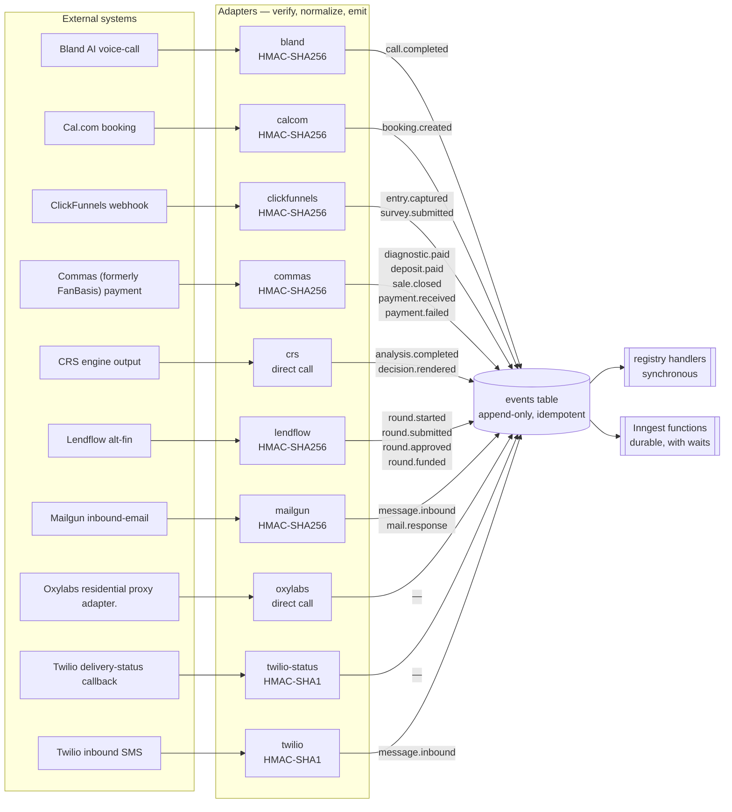

<!-- GENERATED by scripts/diagrams/generate.mjs — do not edit by hand. Run `npm run diagrams`. -->

# Event flow

How a fact gets into the platform and what reacts to it. Every inbound signal becomes a canonical
event on the bus first; nothing reacts to a webhook directly.

**Generated from:** `src/events/canonical.mjs`, `src/events/bus.mjs`, `src/adapters/`, `src/handlers/`, `src/workflows/`

## Ingress path

## Journey spine

The ordered backbone of a client's life in the system. Side events and billing events hang off it
but do not advance it.

```mermaid
flowchart LR
  s0["entry.captured"]
  s1["survey.submitted"]
  s0 --> s1
  s2["diagnostic.paid"]
  s1 --> s2
  s3["analysis.completed"]
  s2 --> s3
  s4["booking.created"]
  s3 --> s4
  s5["call.completed"]
  s4 --> s5
  s6["decision.rendered"]
  s5 --> s6
  s7["deposit.paid"]
  s6 --> s7
  s8["sale.closed"]
  s7 --> s8
  s9["round.started"]
  s8 --> s9
  s10["round.submitted"]
  s9 --> s10
  s11["round.approved"]
  s10 --> s11
  s12["round.funded"]
  s11 --> s12
  s13["file.finalized"]
  s12 --> s13
```

## Reactions per event

| event | group | bus handlers | Inngest functions |
|---|---|---|---|
| `entry.captured` | journey spine | `onEntryCaptured` | 5 |
| `survey.submitted` | journey spine | `onSurveySubmitted` | 1 |
| `diagnostic.paid` | journey spine | `onDiagnosticPaid`, `onDiagnosticPaidMoney` | 2 |
| `analysis.completed` | journey spine | `onAnalysisCompleted` | 8 |
| `booking.created` | journey spine | `onBookingCreated` | 6 |
| `call.completed` | journey spine | `onCallCompleted` | 4 |
| `decision.rendered` | journey spine | `onDecisionRendered` | 0 |
| `deposit.paid` | journey spine | `onDepositPaid`, `onDepositPaidMoney` | 2 |
| `sale.closed` | journey spine | `onSaleClosed`, `onSaleClosedMoney` | 0 |
| `round.started` | journey spine | `onRoundStartedMoney` | 7 |
| `round.submitted` | journey spine | — | 1 |
| `round.approved` | journey spine | — | 3 |
| `round.funded` | journey spine | `onRoundFundedMoney` | 5 |
| `file.finalized` | journey spine | — | 0 |
| `payment.received` | side events | `onPaymentReceived`, `onPaymentReceivedMoney`, `onPaymentReceivedForLink` | 1 |
| `payment.failed` | side events | `onPaymentFailed` | 0 |
| `docs.received` | side events | — | 1 |
| `inquiry.removed` | side events | — | 1 |
| `letter.generated` | side events | — | 0 |
| `message.inbound` | side events | `onMessageInbound` | 1 |
| `mail.response` | side events | `onMailResponse` | 3 |
| `message.queued` | outbound messaging | — | 0 |
| `message.sent` | outbound messaging | — | 0 |
| `message.failed` | outbound messaging | — | 0 |
| `message.blocked` | outbound messaging | — | 0 |
| `commission.earned` | commission + billing | — | 0 |
| `commission.approved` | commission + billing | — | 0 |
| `commission.paid` | commission + billing | — | 0 |
| `invoice.created` | commission + billing | — | 0 |
| `invoice.sent` | commission + billing | — | 0 |
| `invoice.paid` | commission + billing | — | 0 |
| `invoice.voided` | commission + billing | — | 0 |
| `contract.sent` | contracts | — | 0 |
| `contract.signed` | contracts | — | 0 |

An event with no handler and no function is declared but inert — it can be emitted and stored,
and nothing happens. That is a real state in this repo, not an omission in the diagram.
