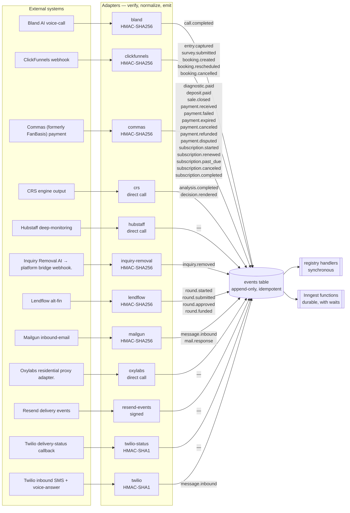

<!-- GENERATED by scripts/diagrams/generate.mjs — do not edit by hand. Run `npm run diagrams`. -->

# Event flow

How a fact gets into the platform and what reacts to it. Every inbound signal becomes a canonical
event on the bus first; nothing reacts to a webhook directly.

**Generated from:** `src/events/canonical.mjs`, `src/events/bus.mjs`, `src/adapters/`, `src/handlers/`, `src/workflows/`

## Ingress path

## Journey spine

The ordered backbone of a client's life in the system. Side events and billing events hang off it
but do not advance it.

```mermaid
flowchart LR
  s0["entry.captured"]
  s1["survey.submitted"]
  s0 --> s1
  s2["diagnostic.paid"]
  s1 --> s2
  s3["analysis.completed"]
  s2 --> s3
  s4["booking.created"]
  s3 --> s4
  s5["booking.rescheduled"]
  s4 --> s5
  s6["booking.cancelled"]
  s5 --> s6
  s7["booking.noshow"]
  s6 --> s7
  s8["call.completed"]
  s7 --> s8
  s9["decision.rendered"]
  s8 --> s9
  s10["deposit.paid"]
  s9 --> s10
  s11["sale.closed"]
  s10 --> s11
  s12["round.started"]
  s11 --> s12
  s13["round.submitted"]
  s12 --> s13
  s14["round.approved"]
  s13 --> s14
  s15["round.funded"]
  s14 --> s15
  s16["round.closeout"]
  s15 --> s16
  s17["file.finalized"]
  s16 --> s17
```

## Reactions per event

| event | group | bus handlers | Inngest functions |
|---|---|---|---|
| `entry.captured` | journey spine | `onEntryCaptured` | 5 |
| `survey.submitted` | journey spine | `onSurveySubmitted` | 1 |
| `diagnostic.paid` | journey spine | `onDiagnosticPaid`, `onDiagnosticPaidSoftPull`, `onDiagnosticPaidMoney` | 2 |
| `analysis.completed` | journey spine | `onAnalysisCompleted` | 8 |
| `booking.created` | journey spine | `onBookingCreated`, `onInterviewBooked` | 9 |
| `booking.rescheduled` | journey spine | `onBookingRescheduled` | 2 |
| `booking.cancelled` | journey spine | `onBookingCancelled` | 0 |
| `booking.noshow` | journey spine | `onBookingNoshow` | 1 |
| `call.completed` | journey spine | `onCallCompleted` | 4 |
| `decision.rendered` | journey spine | `onDecisionRendered` | 0 |
| `deposit.paid` | journey spine | `onDepositPaid`, `onPaidMidCheckin`, `onDepositPaidGate`, `onDepositPaidMoney`, `onDealCloseWinAlert` | 3 |
| `sale.closed` | journey spine | `onSaleClosed`, `onPaidMidCheckin`, `onSaleClosedMoney`, `onDealCloseWinAlert` | 0 |
| `round.started` | journey spine | `onRoundStartedMoney` | 7 |
| `round.submitted` | journey spine | — | 1 |
| `round.approved` | journey spine | — | 3 |
| `round.funded` | journey spine | `onRoundFundedInsights`, `onRoundFundedMoney` | 4 |
| `round.closeout` | journey spine | `onRoundCloseoutGate` | 1 |
| `file.finalized` | journey spine | — | 0 |
| `payment.received` | side events | `onPaymentReceived`, `onPaymentReceivedMoney`, `onPaymentReceivedForAddOn`, `onPaymentReceivedForLink` | 2 |
| `payment.failed` | side events | `onPaymentFailed` | 0 |
| `payment.expired` | side events | — | 0 |
| `payment.canceled` | side events | — | 0 |
| `payment.refunded` | side events | `onPaymentRefunded`, `onPaymentRefundedMoney` | 0 |
| `payment.disputed` | side events | `onPaymentDisputed`, `onPaymentDisputedMoney` | 0 |
| `docs.received` | side events | `onDocsReceivedFlipInquiryGate` | 3 |
| `inquiry.removed` | side events | — | 1 |
| `inquiry.gate.raised` | side events | — | 0 |
| `inquiry.gate.clear` | side events | — | 0 |
| `inquiry.docs.needed` | side events | `onInquiryDocsNeeded` | 0 |
| `letter.generated` | side events | — | 0 |
| `message.inbound` | side events | `onMessageInbound`, `onInboundMmsDocs` | 1 |
| `mail.response` | side events | `onMailResponse` | 3 |
| `message.queued` | outbound messaging | — | 0 |
| `message.sent` | outbound messaging | — | 0 |
| `message.failed` | outbound messaging | — | 0 |
| `message.blocked` | outbound messaging | — | 0 |
| `commission.earned` | commission + billing | — | 0 |
| `commission.approved` | commission + billing | — | 0 |
| `commission.paid` | commission + billing | `onCommissionPaidAlert` | 0 |
| `invoice.created` | commission + billing | — | 0 |
| `invoice.sent` | commission + billing | — | 1 |
| `invoice.paid` | commission + billing | — | 0 |
| `invoice.voided` | commission + billing | — | 0 |
| `contract.sent` | contracts | — | 0 |
| `contract.signed` | contracts | `onContractSignedConsent`, `onContractSigned` | 0 |
| `repair.enrolled` | credit repair | — | 0 |
| `repair.docs.needed` | credit repair | — | 0 |
| `repair.docs.complete` | credit repair | — | 0 |
| `repair.analysis.complete` | credit repair | — | 0 |
| `repair.analysis.empty` | credit repair | — | 0 |
| `repair.letters.ready` | credit repair | — | 0 |
| `repair.letters.sent` | credit repair | — | 0 |
| `repair.letters.delivered` | credit repair | — | 0 |
| `repair.response.received` | credit repair | — | 0 |
| `repair.response.parsed` | credit repair | — | 0 |
| `repair.parse.low_confidence` | credit repair | — | 0 |
| `repair.response.retake` | credit repair | — | 0 |
| `repair.item.deleted` | credit repair | — | 0 |
| `repair.item.verified` | credit repair | — | 0 |
| `repair.item.updated` | credit repair | — | 0 |
| `repair.item.unaddressed` | credit repair | — | 0 |
| `repair.round.complete` | credit repair | — | 0 |
| `repair.round.escalated` | credit repair | — | 0 |
| `repair.program.complete` | credit repair | — | 0 |
| `repair.stalled` | credit repair | — | 0 |
| `repair.cancelled` | credit repair | — | 0 |
| `partner.approved` | partner lifecycle | — | 0 |
| `diy.package.requested` | diy package | — | 0 |
| `diy.package.generating` | diy package | — | 0 |
| `diy.package.ready` | diy package | — | 0 |
| `diy.package.delivered` | diy package | — | 0 |
| `diy.package.downloaded` | diy package | — | 0 |
| `subscription.started` | processor-billed subscriptions | `onSubscriptionStarted` | 0 |
| `subscription.renewed` | processor-billed subscriptions | `onSubscriptionRenewed` | 0 |
| `subscription.past_due` | processor-billed subscriptions | `onSubscriptionPastDue` | 0 |
| `subscription.canceled` | processor-billed subscriptions | `onSubscriptionEnded` | 0 |
| `subscription.completed` | processor-billed subscriptions | `onSubscriptionEnded` | 0 |

An event with no handler and no function is declared but inert — it can be emitted and stored,
and nothing happens. That is a real state in this repo, not an omission in the diagram.
