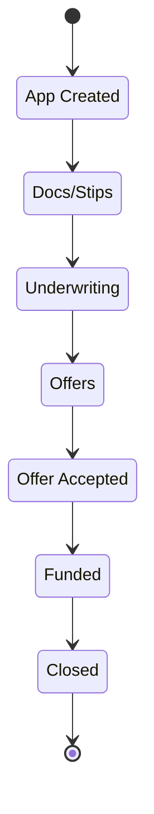

<!-- GENERATED by scripts/diagrams/generate.mjs — do not edit by hand. Run `npm run diagrams`. -->

# Rail: Funding: Alt-Fin (Lendflow)

Pipeline key `funding_altfin` — 7 stages.

**Generated from:** `db/seed/002_pipelines.sql`, `src/workflows/`

**Read the arrows as seeded display order, not as permitted transitions.**
`002_pipelines.sql` defines each stage's `sort_order`; it does not define a transition table, and
this diagram does not invent one.

The notes are the part that *is* code-backed: they mark the stages some workflow actually moves a
card into, via `moveCardToStage`.

| # | stage key | name | moved into by |
|---|---|---|---|
| 0 | `app_created` | App Created | — |
| 1 | `docs_stips` | Docs/Stips | — |
| 2 | `underwriting` | Underwriting | — |
| 3 | `offers` | Offers | — |
| 4 | `offer_accepted` | Offer Accepted | — |
| 5 | `funded` | Funded | — |
| 6 | `closed` | Closed | — |

> **Nothing in this repo moves a card on this rail.** Every stage above is seeded and reachable only
> by a write from outside these workflows. For Alt-Fin that is the documented rule (Spec §5: those
> cards move ONLY from Lendflow webhooks). For the others it means the rail is seeded ahead of the
> workflows that will drive it.
