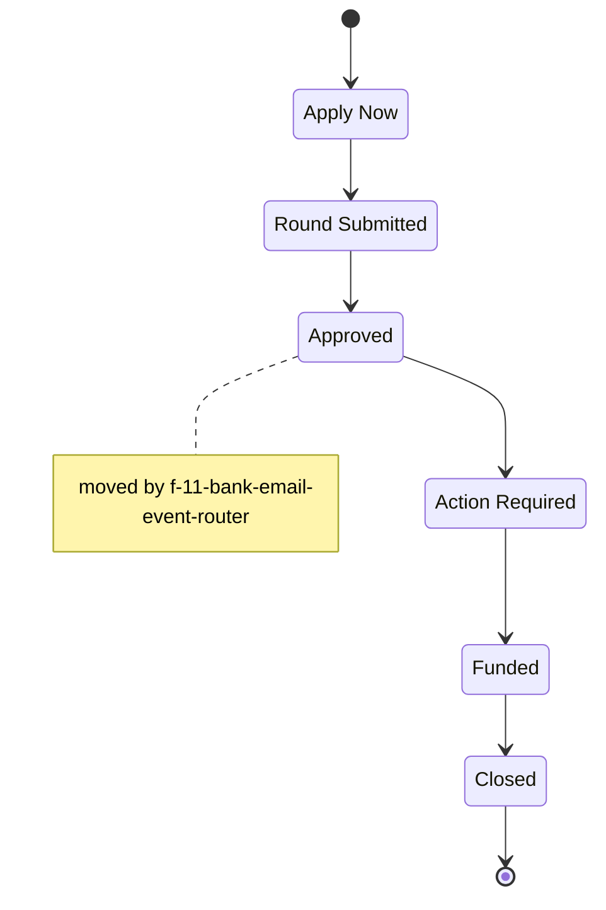

<!-- GENERATED by scripts/diagrams/generate.mjs — do not edit by hand. Run `npm run diagrams`. -->

# Rail: Funding: Card Stacking

Pipeline key `funding_card_stacking` — 6 stages.

**Generated from:** `db/seed/002_pipelines.sql`, `src/workflows/`

**Read the arrows as seeded display order, not as permitted transitions.**
`002_pipelines.sql` defines each stage's `sort_order`; it does not define a transition table, and
this diagram does not invent one.

The notes are the part that *is* code-backed: they mark the stages some workflow actually moves a
card into, via `moveCardToStage`.

| # | stage key | name | moved into by |
|---|---|---|---|
| 0 | `apply_now` | Apply Now | — |
| 1 | `round_submitted` | Round Submitted | — |
| 2 | `approved` | Approved | `f-11-bank-email-event-router` |
| 3 | `action_required` | Action Required | — |
| 4 | `funded` | Funded | — |
| 5 | `closed` | Closed | — |
