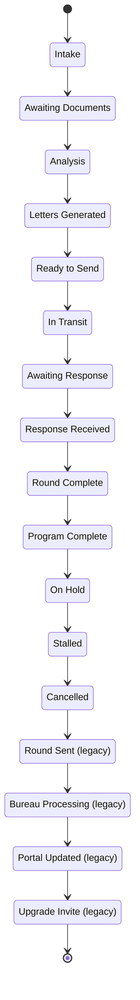

<!-- GENERATED by scripts/diagrams/generate.mjs — do not edit by hand. Run `npm run diagrams`. -->

# Rail: Optimization (Repair) Rounds

Pipeline key `optimization` — 17 stages.

**Generated from:** `db/seed/002_pipelines.sql`, `src/workflows/`

**Read the arrows as seeded display order, not as permitted transitions.**
`002_pipelines.sql` defines each stage's `sort_order`; it does not define a transition table, and
this diagram does not invent one.

The notes are the part that *is* code-backed: they mark the stages some workflow actually moves a
card into, via `moveCardToStage`.

| # | stage key | name | moved into by |
|---|---|---|---|
| 0 | `intake` | Intake | — |
| 1 | `awaiting_documents` | Awaiting Documents | — |
| 2 | `analysis` | Analysis | — |
| 3 | `letters_generated` | Letters Generated | — |
| 4 | `ready_to_send` | Ready to Send | — |
| 5 | `in_transit` | In Transit | — |
| 6 | `awaiting_response` | Awaiting Response | — |
| 7 | `response_received` | Response Received | — |
| 8 | `round_complete` | Round Complete | — |
| 9 | `program_complete` | Program Complete | — |
| 100 | `on_hold` | On Hold | — |
| 101 | `stalled` | Stalled | — |
| 102 | `cancelled` | Cancelled | — |
| 900 | `round_sent` | Round Sent (legacy) | — |
| 901 | `bureau_processing` | Bureau Processing (legacy) | — |
| 902 | `portal_updated` | Portal Updated (legacy) | — |
| 903 | `upgrade_invite` | Upgrade Invite (legacy) | — |

> **Nothing in this repo moves a card on this rail.** Every stage above is seeded and reachable only
> by a write from outside these workflows. For Alt-Fin that is the documented rule (Spec §5: those
> cards move ONLY from Lendflow webhooks). For the others it means the rail is seeded ahead of the
> workflows that will drive it.
