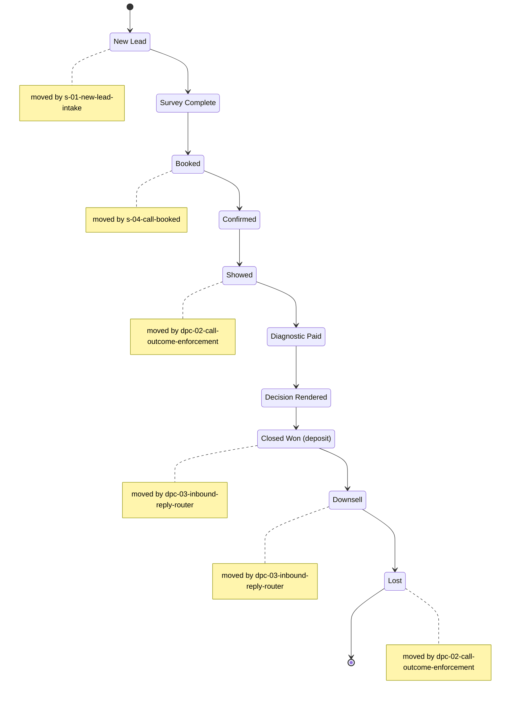

<!-- GENERATED by scripts/diagrams/generate.mjs — do not edit by hand. Run `npm run diagrams`. -->

# Rail: Sales

Pipeline key `sales` — 10 stages.

**Generated from:** `db/seed/002_pipelines.sql`, `src/workflows/`

**Read the arrows as seeded display order, not as permitted transitions.**
`002_pipelines.sql` defines each stage's `sort_order`; it does not define a transition table, and
this diagram does not invent one.

The notes are the part that *is* code-backed: they mark the stages some workflow actually moves a
card into, via `moveCardToStage`.

| # | stage key | name | moved into by |
|---|---|---|---|
| 0 | `new_lead` | New Lead | `s-01-new-lead-intake` |
| 1 | `survey_complete` | Survey Complete | — |
| 2 | `booked` | Booked | `s-04-call-booked` |
| 3 | `confirmed` | Confirmed | — |
| 4 | `showed` | Showed | `dpc-02-call-outcome-enforcement` |
| 5 | `diagnostic_paid` | Diagnostic Paid | — |
| 6 | `decision_rendered` | Decision Rendered | — |
| 7 | `closed_won` | Closed Won (deposit) | `dpc-03-inbound-reply-router` |
| 8 | `downsell` | Downsell | `dpc-03-inbound-reply-router` |
| 9 | `lost` | Lost | `dpc-02-call-outcome-enforcement` |
