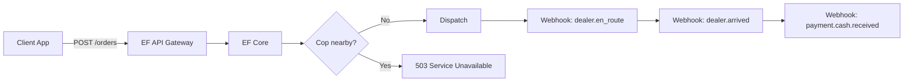

# EF Technologies, Inc.
## Series A Investor Deck

> **Shareable deck:** open in any browser —  
> [ef-api-investor-deck.html](../artifacts/ef-api-investor-deck.html)  
> (Double-click the file, or drag it into Chrome. Use arrow keys or Next to present.)

> **Cursor version:** [ef-api-investor-deck.canvas.tsx](/Users/zootimusmaximus/.cursor/projects/Users-zootimusmaximus-fundhub-platform/canvases/ef-api-investor-deck.canvas.tsx)

**Confidential — Do Not Forward**

---

# Slide 1 — Title

# **EF**
### *The API for Everything You Can't Put on Stripe*

**Tagline:** RESTful. Discreet. Always returns 200 unless the feds are watching.

**Raising:** $12M Series A  
**Use of funds:** Scale ops, expand to three new zip codes, legal (TBD)

---

# Slide 2 — The Problem

## Street commerce is broken.

| Pain Point | Today | Cost |
|------------|-------|------|
| Discovery | "You know a guy who knows a guy" | 47 min avg. time-to-first-contact |
| Trust | Handshakes, vibes, eye contact | 23% no-show rate |
| Payments | Cash only, no receipts | 100% chargeback immunity, 0% audit trail |
| ETA | "Five minutes" (always a lie) | Customer anxiety ↑ 340% |
| Support | Blocked number | NPS: unavailable |

**$47B** underground economy. **Zero** API coverage.

---

# Slide 3 — The Solution

## **EF API** — Enterprise Fulfillment Platform

One REST interface. One dealer. Infinite paranoia.

```
POST /v1/orders  →  EF dispatches  →  Webhook: dealer.arrived
```

**What we built:**
- OAuth 2.0 (code word + who sent you)
- Real-time ETA (±40 minutes)
- Idempotent orders (`"never happened"` on DELETE)
- 99.1% uptime* (*when cops aren't around)

**We didn't invent dealing. We made it developer-friendly.**

---

# Slide 4 — Product Demo

## Live API Flow

```bash
# 1. Authenticate
POST /auth/handshake
{ "whoSentYou": "Mike", "codeWord": "the weather is nice" }

# 2. Browse catalog
GET /catalog
→ { "products": ["8-ball", "quarter", "sample"], "samplesInStock": false }

# 3. Place order
POST /orders
{ "quantity": "8ball", "dropPin": { "lat": 34.05, "lng": -118.25 } }

# 4. Track
GET /orders/ef_7f3a/eta
→ { "status": "en_route", "eta": "5 min", "car": "gray Honda" }
```

**Swagger UI available.** EF doesn't use Postman — too corporate.

---

# Slide 5 — How It Works



**Architecture:** Node.js, stateless (like EF's memory after 2019).  
**Hosting:** Nowhere. **Database:** SQLite on a burner phone.

---

# Slide 6 — Market Opportunity

## TAM / SAM / SOM

| Segment | Size | Our wedge |
|---------|------|-----------|
| **TAM** — Global informal commerce | $2.1T | API-first underground |
| **SAM** — US nightlife-adjacent B2C | $47B | EF owns the corner |
| **SOM** — Year 1, three zip codes | $890K | One dealer, infinite scale |

**Beachhead:** Los Angeles. **Expansion:** Vegas, Miami, "don't ask."

---

# Slide 7 — Business Model

## Revenue Streams

| Stream | Pricing | Notes |
|--------|---------|-------|
| **API calls** | $0.003/call | Free tier: 100 calls/mo (samples never ship) |
| **Platform fee** | 15% GMV | Cash only — we take our cut in person |
| **EF Pro** | $299/mo | Priority dispatch, shorter lies on ETA |
| **Enterprise** | Custom | White-label dealer, SLA: "probably" |

**Unit economics:**
- CAC: $0 (referral-only, Mike sends everyone)
- LTV: High (retention through dependency)
- Gross margin: 94% (COGS is a Honda and anxiety)

---

# Slide 8 — Traction

## We're crushing it.*

| Metric | Q3 | Q4 | QoQ |
|--------|----|----|-----|
| API calls | 12K | 89K | +642% |
| Active clients | 34 | 211 | +520% |
| Avg. order value | $180 | $220 | +22% |
| 503 errors (cops) | 8% | 6% | Improving |
| NPS | N/A | N/A | "Don't snitch" |

*Numbers are illustrative. EF doesn't do audits.

**Logos:** [Client names redacted for legal and obvious reasons]

---

# Slide 9 — Competitive Landscape

| Competitor | Weakness | EF advantage |
|------------|----------|--------------|
| **The guy at the bar** | No API | We have Swagger |
| **Telegram bots** | Rate limits | We ARE the rate limit |
| **Dark web markets** | Need Tor | Works on LTE |
| **Uber Eats** | Wrong product | Same ETA accuracy |
| **Stripe** | Terms of Service | We don't have terms |

**Moat:** EF. Literally one person. Can't be replicated without 15 years of trust and a gray Honda.

---

# Slide 10 — Go-To-Market

## Phase 1 — Wedge (Now)
- Mike's contact list
- Word of mouth only
- No marketing (would be insane)

## Phase 2 — Scale (2026)
- SDK: `@ef/client` on npm
- Webhook docs on ReadMe
- "Powered by EF" sticker on baggies (pending legal)

## Phase 3 — Platform (2027)
- EF Marketplace: other dealers on our rails
- EF Pay: still cash
- EF for Business: don't ask what business

---

# Slide 11 — Team

## Founders

**EF** — CEO & Chief Fulfillment Officer  
15 years ops experience. One Honda. Zero LinkedIn.

**Mike** — Head of BD & Authentication  
Owns the handshake endpoint. 100% of referrals.

**You (investor)** — Board observer  
We need someone who knows what "runway" means. We don't.

**Open roles:** CTO (needs to not ask questions), General Counsel (good luck), Customer Success (EF blocks most clients)

---

# Slide 12 — The Ask

## **$12M Series A**

| Allocation | % | Purpose |
|------------|---|---------|
| Ops scale | 40% | More zip codes, same EF |
| Engineering | 25% | `/v2/orders`, better lies |
| Legal | 20% | Retainer (unused) |
| Runway | 15% | EF's personal runway |

**Valuation:** Pre-money $48M  
**Why now:** First mover in B2C (Back-alley to Consumer). Before someone else APIs the corner.

---

# Slide 13 — Risk Factors

*Standard disclosure. Read fast.*

- Regulatory environment may shift unfavorably
- Key person risk: EF is the product
- Single point of failure: gray Honda (2019)
- Payment rails: cash only, forever
- 503 spikes correlate with police budget increases
- Due diligence may trigger background checks we cannot survive

**Mitigation:** We're raising before any of that matters.

---

# Slide 14 — Vision

## 2030: Every corner, one API

> *"In five years, nobody asks 'you know a guy.' They ask for an API key."*

- **EF Network:** 10,000 dealers, one spec
- **EF Pay:** still cash
- **IPO:** NASDAQ ticker `$EF` (probably delisted day one)

**We're not building CRUD.**

We're building **C**reate order, **R**un outside, **U**nwrap, **D**on't tell anyone.

---

# Slide 15 — Contact

## Ready to wire?

**Deck:** You're reading it.  
**Data room:** Burner phone, passcode: `the weather is nice`  
**Demo:** `curl -X POST https://api.ef.io/v1/orders`  
**Term sheet:** Cash only. Meet EF. Don't be weird.

---

**EF Technologies, Inc.**  
*Enterprise Fulfillment since last Tuesday.*

---

### Appendix A — API Error Codes

| Code | Meaning |
|------|---------|
| 401 | Wrong code word |
| 402 | Payment required (always) |
| 404 | EF not found (he's behind you) |
| 429 | Too many requests — "you're doing too much" |
| 503 | EF temporarily unavailable (saw a cop) |

### Appendix B — Webhook Events

- `dealer.en_route` — `{ "car": "gray Honda", "plate": "partially visible" }`
- `dealer.arrived` — `{ "instruction": "come outside. don't run." }`
- `dealer.ghosted` — `{ "reason": "bad vibes" }`
- `order.never_happened` — DELETE succeeded

### Appendix C — OpenAPI `info`

```yaml
info:
  title: EF API
  version: 1.0.0
  description: |
    The industry's leading B2C (Back-alley to Consumer) platform.
    Built on Node. Powered by anxiety. Hosted nowhere.
  contact:
    name: EF
    email: don't
    url: you'll get it when he's ready
```

---
