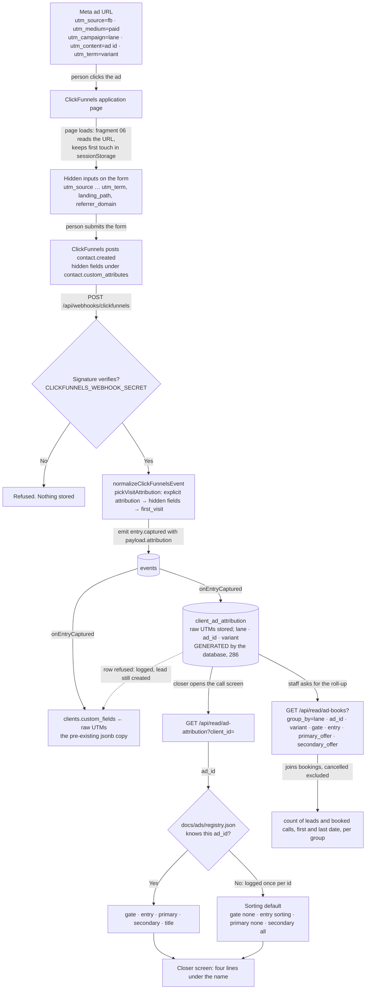

# ad-attribution-flow — actual

How a Meta ad's five UTMs become the four lines a closer reads on the call screen.
Generated from the code on 2026-09-03, by hand, from the files named beside each
step. Every arrow names the event that fires it. Nothing here is drawn from a spec.

## In one picture

## The states, and the event that moves each one

| State | Where it lives | What fires the move to the next state |
|---|---|---|
| UTMs on the ad URL | the person's browser | Page load. `clickfunnels-fragments/06-utm-hidden-fields.html` reads `location.search`. |
| UTMs in sessionStorage | the person's browser | Form render. The fragment stamps hidden inputs on every form, first touch wins. |
| Hidden inputs filled | the ClickFunnels form | Form submit. ClickFunnels posts `contact.created` with the inputs under `custom_attributes`. |
| Webhook received | `api/webhooks/[provider].mjs` → `src/http/router.mjs` | Signature check passes. A bad signature ends the flow with nothing stored. |
| Normalized event | `src/adapters/clickfunnels.mjs` `pickVisitAttribution` | `entry.captured` is emitted with `payload.attribution`. Order of trust, per field: an explicit `attribution` object, then hidden fields, then CF's own `visits.first_visit`. |
| Raw UTMs in jsonb | `clients.custom_fields` via `mergeCustomFields` | Same handler, same call. Unchanged from before this work. |
| Typed row | `client_ad_attribution` via `src/ads/store.mjs` `upsertClientAdAttribution` | Written in `onEntryCaptured` right after the jsonb merge. The database derives `lane` (enum, `unknown` when unrecognised), `ad_id` (leading digits or NULL) and `variant` (lowercased, squeezed). A second capture fills blanks only. A refused row is logged and the lead is still created. |
| Resolved tags | `src/ads/registry.mjs` `resolveAd` | The closer screen calls `GET /api/read/ad-attribution`. Known id → the registry entry. Unknown → sorting default, warned once per id. |
| Four lines on screen | `public/app/closer-dashboard.html` `#ccp-ad`, painted by `paintAd()` in `public/app/closer-call.js` | Fires after the cockpit paints. Hidden until the read answers; stays hidden if it cannot. |
| Roll-up | `GET /api/read/ad-books` via `adAttributionRollup` | On request. Groups by a database column or a registry tag. Cancelled bookings are not booked calls. Unknown ids are listed under `unknown_ad_ids`. |

## What the closer sees, in words

- **Gate** — `600+`, `720+`, `780+`, or `No FICO gate`.
- **Entry** — `Direct · sell what they were promised`, or `Sorting · every road is open`. When the ad is not in the registry the line says so in brackets.
- **Primary** — the offer the ad led with. On a sorting ad with a primary it adds `lead with it`.
- **Secondary** — `All` on a sorting ad, the listed offers on a direct ad, `None` when there are none.

## Gaps and things not drawn

- `UNVERIFIED` in production: which ClickFunnels payload key the live workspace uses for hidden inputs (`custom_attributes` vs `custom_fields`). The adapter reads both, in that order. The test proves `custom_attributes`.
- The registry was seeded from the owner's brief of 2026-09-03, not from `docs/ads/scripts/2026-09-02-ad-scripts.md`, which is not in the repository. Ids not named in the brief resolve to the sorting default until they are added.
- No intended journey exists for this flow. This file is the first record of it and it describes the code, not a spec.
