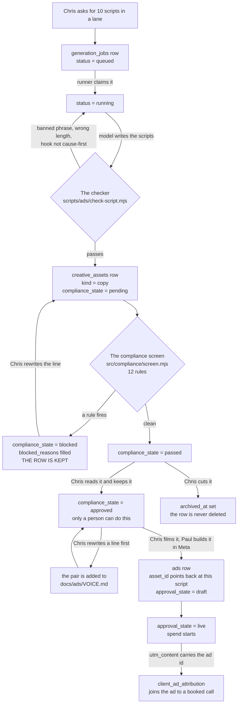

# Ad script flow — the states a script moves through

Required by `CLAUDE.md` §3a step 4. Written 2026-09-06, before any code.

This page is the back end. The screen is a window onto it. If this page is right, the
screen can be rebuilt in an hour.

---

## The one thing that decides the schema

**Every state a script needs already exists in this database.** Three state machines are
already shipped, and a generated ad script passes through all three. Nothing here invents
a fourth.

| Machine | Column | Values | Where |
|---|---|---|---|
| The job that writes it | `generation_jobs.status` | `queued` · `running` · `succeeded` · `failed` | `045_creative_factory.sql:312` |
| The script itself | `creative_assets.compliance_state` | `pending` · `passed` · `blocked` · `approved` | `045_creative_factory.sql:201` |
| The finished ad on the platform | `ads.approval_state` | `draft` · `awaiting_approval` · `approved` · `live` · `paused` · `archived` | `046_ad_platforms.sql:311` |

A script is a `creative_assets` row with `kind = 'copy'`. That is already allowed:
`creative_assets_kind_ck` permits `static`, `video`, `copy`.

---

## The flow

---

## Every transition, and what fires it

| From | To | What fires it | Who or what does it |
|---|---|---|---|
| — | `queued` | Chris asks for scripts | the skill |
| `queued` | `running` | the runner claims the job | `src/creative/runner.mjs` |
| `running` | rewrite loop | the checker finds a banned phrase, a bad length, or a hook that is not cause-first | `scripts/ads/check-script.mjs` |
| `running` | `succeeded` + a `creative_assets` row | the checker passes | `src/creative/generate.mjs` |
| `pending` | `blocked` | one of the twelve compliance rules matches | `src/compliance/screen.mjs`, inside `storeAsset` |
| `pending` | `passed` | no rule matches | same |
| `blocked` | `pending` | Chris rewrites the offending line | a person |
| `passed` | `approved` | Chris keeps it | **a person only.** Nothing in the generate path can approve |
| `passed` | archived | Chris cuts it | `api/creative/actions.mjs` |
| `approved` | filmed | Chris films it | **a person only.** Not recorded, and does not need to be |
| filmed | an `ads` row with `asset_id` set | Paul builds it in the ad account | outside this system. This row IS the proof it was filmed |

---

## The schema change, and it is one column plus one timestamp

**1. `copy_text` on `creative_assets`.** Nullable. Holds the words of a written ad.

Today the words are generated and thrown away: the table has `storage_key` for a file and
nothing for text, and nothing uploads a file for a copy asset anyway. So a written ad
exists for a moment and is gone. Every other state on this page is unreachable without it.

Written for blocked assets too, not only clean ones. A blocked script is the most useful
thing in the library, because it is the one Chris has to rewrite, and he cannot rewrite
what was not saved.

*Name chosen deliberately.* The redactor in `src/http/read-api.mjs` strips any field whose
name contains a forbidden substring, which is why `has_storage_key` is eaten today.
`copy_text` contains none of them.

**2. There is no second column. `filmed_at` was specced here and has been dropped.**

Chris's call, 2026-09-06: "seems a bit overengineering." He was right, and the code agrees.

`db/migrations/046_ad_platforms.sql:291` already carries `asset_id uuid REFERENCES
creative_assets(id) ON DELETE RESTRICT` on the `ads` table, with an index at line 318. So
the moment a script becomes an ad in the ad account, that row points straight back at the
script it came from.

**Which means "was it filmed" is already answerable and does not need recording.** A script
whose `creative_assets.id` appears as an `asset_id` on a live ad was filmed. That is the
proof, and it arrives on its own through the Meta sync. A hand-set `filmed_at` would be a
second, weaker copy of a fact the system already gets for free, and it would rot the first
week somebody forgot to tick it.

The transition table above keeps the filmed hop, because it is a real thing that happens.
It is just not a column.

**Nothing else changes.** No new table, no new state value, no new enum. Both columns are
nullable, so every row that exists today stays valid.

---

## Teleprompter and editing apps — checked, and the answer is no integration

Chris asked whether this should talk to BigVu, CapCut, or another teleprompter app.

**Nothing in this repo mentions any of them**, and none is needed. CapCut has no public
developer interface to build against. Whether BigVu offers one was not verified and should
not be assumed.

**A teleprompter takes pasted text, so the integration is the format.** Look at
`docs/ads/CONTROLS.md` — Ad 1 is plain paragraphs, spoken as written, with no camera
directions mixed into the words. That already pastes into any teleprompter as-is.

**So the rule for the generator is a formatting rule, not a build:** the words Chris reads
to camera stay clean and unbroken, and everything that is not spoken — the runtime band,
the outfit and location note, the origin_angle tag — sits in its own block, clearly
separated, never inside the script body. That costs nothing and it is the whole of what an
integration would have bought.

## What this page does NOT cover

- **Images and video.** A `copy` asset needs no file. A `static` or `video` asset does, and
  nothing uploads one today. Out of scope, separate batch.
- **Cost per script.** Meta's ad id and Chris's ad number never meet, so cost cannot be
  attributed per ad. Named in `docs/ops/2026-09-06-self-analysis.md`, separate batch.
- **The 83 chat scripts.** They are not in the repo and are deliberately not the seed.
  `docs/ads/VOICE.md` is seeded from the five filmed and running ads only.
