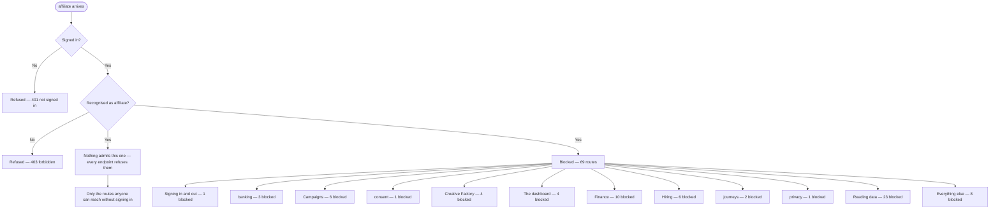

<!-- GENERATED by scripts/journeys/generate.mjs — do not edit by hand. Run `npm run journeys`. -->

# affiliate — actual

What the code **does** today for a signed-in `affiliate`.
Generated from the routing table and the gate on each handler, not from a spec.

> **Who this is, in the code:** src/auth/account-session.mjs — PRINCIPAL_KINDS includes 'affiliate'

## FINDING — this journey reaches nothing

**Not one endpoint in this system admits an `affiliate`.**

An `affiliate` is a real kind of account — they can be issued a session and sign in
(`src/auth/account-session.mjs`). Having signed in, every endpoint refuses them. The only
routes they can reach are the ones anybody can reach without signing in at all: the login
and health routes, and three that check a signature instead of a session.

So the sign-in works and leads nowhere. `src/http/read-api.mjs` describes this exact
failure in its own comments — *"a client or partner could sign in and then read NOTHING,
because every endpoint 401'd them"* — and names it as what the `principals` option was
added to fix. That fix was applied to some kinds and not to this one.

**This is a finding for a human, not something to generate around.** Either endpoints are
missing, or this account kind is not actually in use and should stop being offered.

## In one picture

## What they can reach

**10 of 79 routes.**

| Route | Methods | Who the code lets in |
|---|---|---|
| `/api/auth/login` | GET | anyone |
| `/api/auth/logout` | — | anyone |
| `/api/auth/magic-link` | — | anyone |
| `/api/auth/magic-link-verify` | — | anyone |
| `/api/auth/reset` | POST | anyone |
| `/api/auth/session` | — | anyone |
| `/api/documents/:id` | HEAD | **not a sign-in** — signed link |
| `/api/health` | — | anyone |
| `/api/inngest` | — | **not a sign-in** — Inngest request signing |
| `/api/webhooks/:provider` | — | **not a sign-in** — provider signature |

### Worth knowing

- **Nothing admits an `affiliate` specifically** — see the finding above. Every route listed below is one anybody reaches without signing in.
- **7 routes are genuinely open** — no sign-in needed, reachable by anyone and not by this journey in particular: `/api/auth/login`, `/api/auth/logout`, `/api/auth/magic-link`, `/api/auth/magic-link-verify`, `/api/auth/reset`, `/api/auth/session`, `/api/health`. These are the sign-in routes and the health check.
- **3 routes need no sign-in but are NOT open.** `/api/documents/:id` (signed link), `/api/inngest` (Inngest request signing), `/api/webhooks/:provider` (provider signature). Anyone can call these, but a caller without the right signature is refused.

## What they are blocked from

**69 of 79 routes.**

| Route | Methods | Who the code lets in |
|---|---|---|
| `/api/auth/admin-reset` | POST | owner, admin |
| `/api/banking/accounts` | GET, POST | owner, admin, funding_advisor, closer, inquiry_specialist, setter, sales_manager |
| `/api/banking/revoke` | GET, POST | owner, admin |
| `/api/banking/sync-accounts` | POST | owner, admin, sales_manager |
| `/api/campaigns/action-log` | GET | partner, staff |
| `/api/campaigns/connections` | GET | partner, staff |
| `/api/campaigns/detail` | GET | partner, staff |
| `/api/campaigns/fatigue` | GET | partner, staff |
| `/api/campaigns/list` | GET | partner, staff |
| `/api/campaigns/spend` | GET | partner, staff |
| `/api/consent/capture` | GET, POST | employees: owner, admin, closer, funding_advisor plus: client |
| `/api/creative/approvals` | GET | partner, staff |
| `/api/creative/brand-kits` | GET | partner, staff |
| `/api/creative/jobs` | GET | partner, staff |
| `/api/creative/library` | GET | partner, staff |
| `/api/dashboard/client` | — | staff |
| `/api/dashboard/clients` | — | staff |
| `/api/dashboard/pipeline` | — | staff |
| `/api/dashboard/seed` | — | staff |
| `/api/finance/alerts` | GET, POST | owner, admin, funding_advisor, closer, inquiry_specialist, setter, sales_manager |
| `/api/finance/bank-accounts` | GET, POST | owner, admin, sales_manager |
| `/api/finance/bills` | GET, POST | owner, admin, sales_manager |
| `/api/finance/cards` | GET, POST | owner, admin, sales_manager |
| `/api/finance/cashflow` | GET, POST | owner, admin, sales_manager |
| `/api/finance/entities` | GET, POST | owner, admin, funding_advisor, closer, inquiry_specialist, setter, sales_manager |
| `/api/finance/liabilities` | GET, POST | owner, admin, funding_advisor, closer, inquiry_specialist, setter, sales_manager |
| `/api/finance/model` | POST | owner, admin, funding_advisor, closer, inquiry_specialist, setter, sales_manager |
| `/api/finance/soft-pull` | GET, POST | employees: owner, admin, closer, funding_advisor plus: client |
| `/api/finance/subscriptions` | GET, POST | owner, admin, sales_manager |
| `/api/hiring/application` | GET | owner, admin |
| `/api/hiring/bench` | GET | owner, admin |
| `/api/hiring/candidates` | GET | owner, admin |
| `/api/hiring/decisions` | GET | owner, admin |
| `/api/hiring/funnel` | GET | owner, admin |
| `/api/hiring/postings` | GET | owner, admin |
| `/api/inquiries` | GET, POST | staff |
| `/api/inquiry` | — | inquiry_specialist, admin, owner |
| `/api/journeys` | GET, PUT | owner, admin |
| `/api/journeys/ask` | POST | owner, admin |
| `/api/journeys/run` | POST | owner, admin, sales_manager |
| `/api/message-templates` | POST | owner, admin, funding_advisor, closer, inquiry_specialist, setter, sales_manager |
| `/api/partner-brand` | GET, PUT | owner, admin |
| `/api/pii` | GET, POST | owner, admin, inquiry_specialist, funding_advisor |
| `/api/privacy/erasure` | GET, POST | owner, admin |
| `/api/read/affiliates` | GET | owner, admin, sales_manager |
| `/api/read/agents` | GET | owner, admin, funding_advisor, closer, inquiry_specialist, setter, sales_manager |
| `/api/read/banking-surface` | GET | owner, admin, sales_manager |
| `/api/read/commissions` | GET | owner, admin, sales_manager |
| `/api/read/conversations` | GET | owner, admin, funding_advisor, closer, inquiry_specialist, setter, sales_manager |
| `/api/read/documents` | GET | owner, admin, funding_advisor, closer, inquiry_specialist, setter, sales_manager |
| `/api/read/entitlements` | GET | employees: owner, admin, funding_advisor, closer, inquiry_specialist, setter, sales_manager plus: client |
| `/api/read/failed-events` | GET | owner, admin |
| `/api/read/finance-ask` | POST | owner, admin, funding_advisor, closer, inquiry_specialist, setter, sales_manager |
| `/api/read/finance-command` | GET | owner, admin, funding_advisor, closer, inquiry_specialist, setter, sales_manager |
| `/api/read/finance-os` | GET | owner, admin, funding_advisor, closer, inquiry_specialist, setter, sales_manager |
| `/api/read/funding-rounds` | GET | owner, admin, funding_advisor, closer, inquiry_specialist, setter, sales_manager |
| `/api/read/inquiries` | GET | owner, admin, funding_advisor, closer, inquiry_specialist, setter, sales_manager |
| `/api/read/invoices` | GET | owner, admin, sales_manager |
| `/api/read/message-templates` | GET | owner, admin, funding_advisor, closer, inquiry_specialist, setter, sales_manager |
| `/api/read/money-map` | GET | owner, admin, funding_advisor, closer, inquiry_specialist, setter, sales_manager |
| `/api/read/partners` | GET | employees: owner, admin, sales_manager plus: partner |
| `/api/read/products` | GET | owner, admin, funding_advisor, closer, inquiry_specialist, setter, sales_manager |
| `/api/read/staff` | GET | owner, admin, sales_manager |
| `/api/read/tradelines` | — | owner, admin, funding_advisor, closer, inquiry_specialist, setter, sales_manager |
| `/api/read/transactions` | GET | owner, admin, funding_advisor, closer, inquiry_specialist, setter, sales_manager |
| `/api/read/underwrite` | GET | owner, admin, funding_advisor, closer, inquiry_specialist, setter, sales_manager |
| `/api/read/workflows` | GET | owner, admin, funding_advisor, closer, inquiry_specialist, setter, sales_manager |
| `/api/shifts` | GET, POST | staff |
| `/api/tasks` | GET, PATCH | staff |

## UNVERIFIED

_None — every route's gate was traced to its source._

## How to check this yourself

Every row above comes from two places, and you can open both:

- **Which routes exist:** the `ROUTES` map in `netlify/functions/api.mjs`. A handler
  missing from that map answers 404, so that map is the definition of what exists.
- **Who each one lets in:** the gate written at the top of each `api/…` handler.

Run `npm run journeys` to rebuild this file. `npm test` fails if it is out of date.
