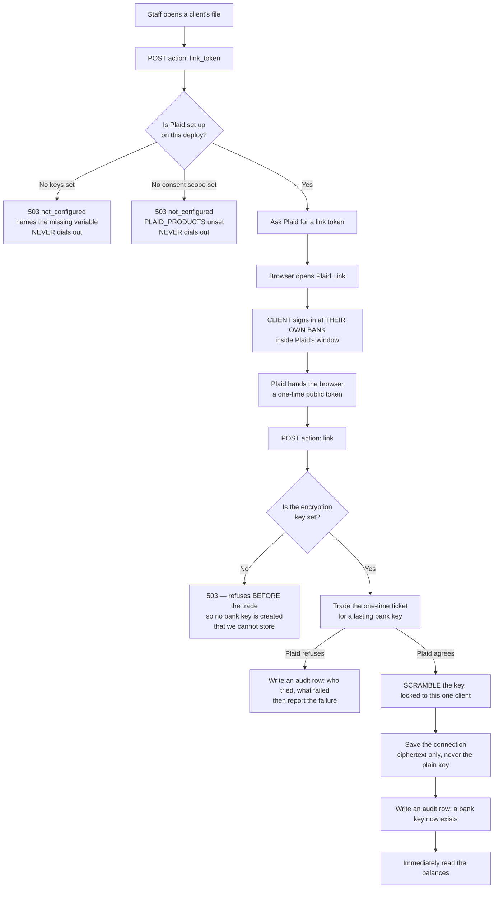
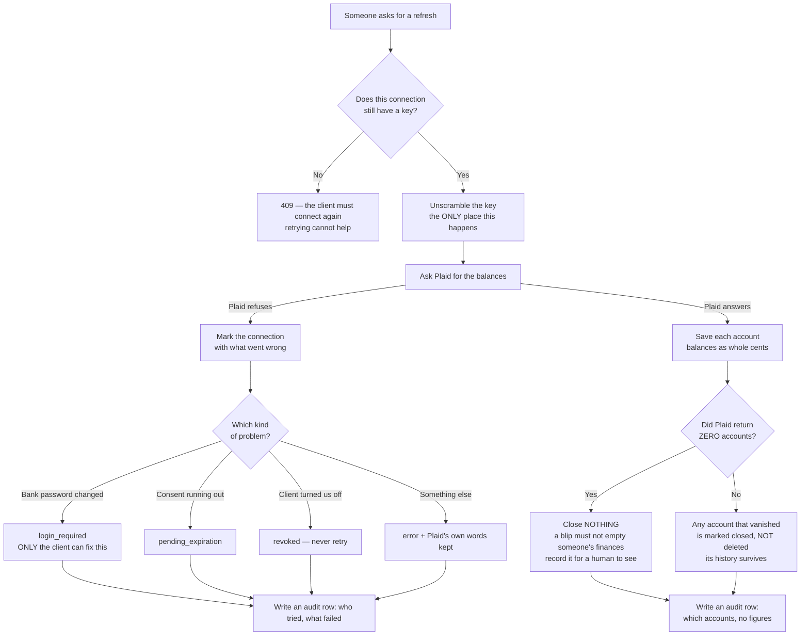
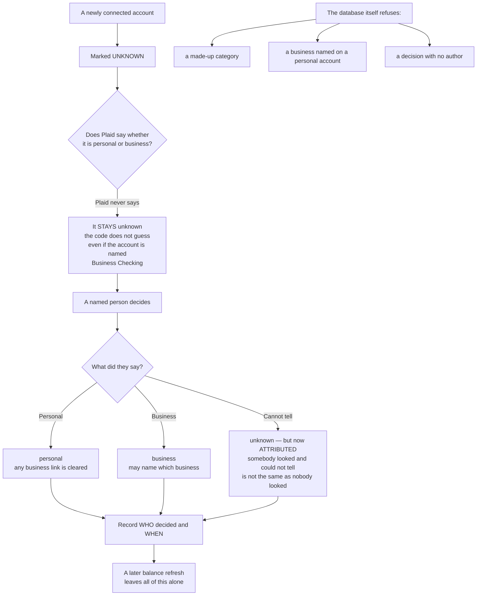
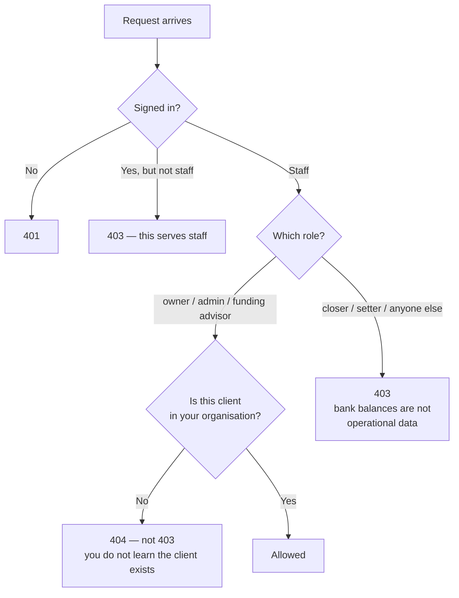
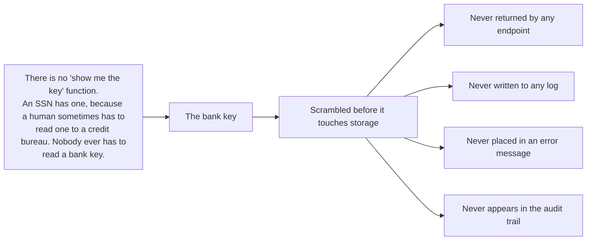

# Bank linking — what the code ACTUALLY does

Generated by tracing `api/banking/plaid.mjs`, `src/banking/index.mjs` and
`src/adapters/plaid.mjs` line by line. Not from a spec, not from memory.

**There is no `banking-intended.md` to check this against.** `CLAUDE.md` §4 lists
eight tracked journeys — client, role-owner, role-sales-manager, role-closer,
role-funding-advisor, role-inquiry-remover, affiliate, white-label — and banking
is not one of them, and `docs/journeys/` did not exist before this file. So the
usual "gaps between intended and actual are findings" check **cannot be run
here**: there is nothing to compare against. That absence is itself the finding.
An intended journey for this flow is hand-authored work and agents do not write
those.

Nothing below is marked `UNVERIFIED`, because every branch drawn here was traced
in the code and every one of them has a test.

---

## 1. The three steps of connecting a bank

The important thing a non-coder should take from this picture: **this platform
never sees the client's bank password.** Step 2 happens entirely between the
client and their own bank, inside Plaid's window. Nothing comes back to us except
a one-time ticket.

**Why the two refusals at the top matter.** Both stop before any request leaves
the building. A deploy with no keys cannot accidentally reach Plaid, and a deploy
where nobody has chosen what to ask the client for cannot open the consent screen
at all.

---

## 2. Reading the balances

**The rule that is easiest to break and hardest to notice:** saving balances
never touches whether an account is personal or business. A refresh that reset
that would silently undo every classification anyone had ever made.

---

## 3. Whose money is it?

**Unknown is a real answer, not a blank to be tidied away.** Anything built on
top of this must handle three answers, not two. Treating unknown as personal is
how a client's private savings ends up filed under their company.

---

## 4. Who can reach any of this

---

## 5. What never leaves

The audit trail records **which** accounts were read — their last four digits,
their type, and whether a balance was present — and never **how much** was in
them. An audit trail is not a second copy of somebody's finances.
