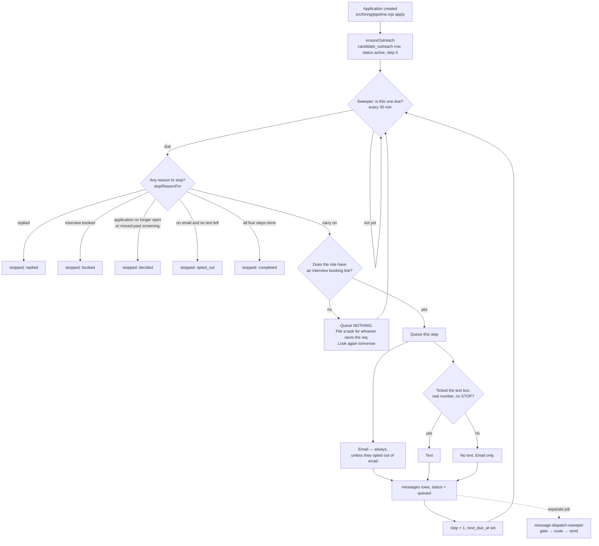

# Candidate outreach — what happens after somebody applies

Generated from code on 2026-09-05. Sources: `db/migrations/295_candidate_outreach.sql`,
`src/hiring/outreach.mjs`, `src/workflows/hiring-outreach-cadence.mjs`.

## In one paragraph

Somebody applies for a job. We email them straight away and, if they ticked the
text box, we text them too. Both messages say the same thing: here is where to
book your interview. If they do nothing, we follow up three more times over ten
days and then stop. The moment they reply, book, ask us to stop, or a person at
Fundhub moves their application, the follow-ups end.

**We never turn anybody down.** Going quiet stops the chasing. It does not close
the application, it does not write a decision, and it does not move anybody in
the pipeline. A person does all of that, and the database refuses to let software
do it (migration 051).

## The states one application moves through

## The four steps

| Step | Goes out | Email | Text |
|---|---|---|---|
| 1 | straight away | `EMAIL-CANDIDATE-OUTREACH-1` | `SMS-CANDIDATE-OUTREACH-1` |
| 2 | 2 days later | `EMAIL-CANDIDATE-OUTREACH-2` | `SMS-CANDIDATE-OUTREACH-2` |
| 3 | 3 days after that | `EMAIL-CANDIDATE-OUTREACH-3` | `SMS-CANDIDATE-OUTREACH-3` |
| 4 | 5 days after that | `EMAIL-CANDIDATE-OUTREACH-4` | `SMS-CANDIDATE-OUTREACH-4` |

Ten days end to end. The gaps live in `CADENCE` in `src/hiring/outreach.mjs`.

## The five exits, and what each one means

| Reason | What happened | Who set it |
|---|---|---|
| `replied` | They answered us | `recordCandidateReply()` — **nothing calls it yet, see below** |
| `booked` | An interview has their name on it | read from `hiring_interview_attendees` on every pass |
| `decided` | A person moved or closed the application | read from `candidate_applications` on every pass |
| `opted_out` | Nothing left to reach them on | `recordCandidateOptOut()` |
| `completed` | All four steps went and they never answered | the cadence itself |

Every one of them is re-checked on every pass, never trusted from a flag. This
thing sleeps for days between steps and all of them can become true while it is
asleep.

## Texting rules

* `candidates.sms_consent` is **false by default**. An applicant who left the box
  unticked gets email and nothing else.
* The database refuses `sms_consent = true` unless the row also carries **when**
  it was given and the **exact wording** they agreed to
  (`candidates_sms_consent_ck`).
* Every text ends with "Reply STOP to opt out", and `src/handlers/comms.mjs`
  already honours STOP.
* Texts are not sent between 8pm and 8am Arizona time. That is the messaging
  gate's rule and it applies to candidates exactly as it does to clients.

## Three things this cannot do yet

1. **Nothing is delivered until the compliance gate allows it.**
   `src/messaging/gate.mjs` blocks any message that has no client attached unless
   its template key is on an allow-list. A candidate is deliberately not a client,
   so all eight keys above need adding to that list. Measured 2026-09-05:
   both channels come back `blocked / recipient_unknown` today, and `allowed`
   with the keys added.
2. **A candidate's reply is recorded nowhere.** Inbound messages are filed against
   a `clients` row and dropped otherwise, and `messages` has no from-address
   column. So "stop on reply" only works when something calls
   `recordCandidateReply()`, and today nothing does.
3. **No role has an interview booking link.** `hiring_roles.interview_booking_url`
   is empty for every role. Until somebody fills it in, the cadence sends nothing
   and files a task saying so. `v_hiring_outreach_gaps` lists them.
