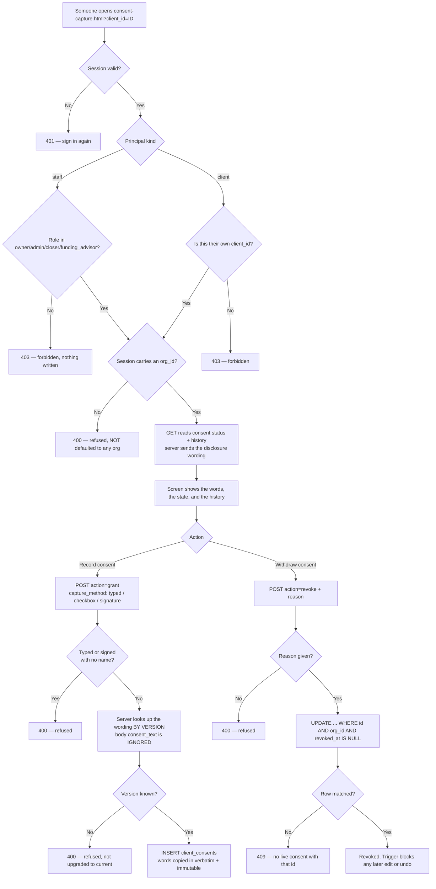
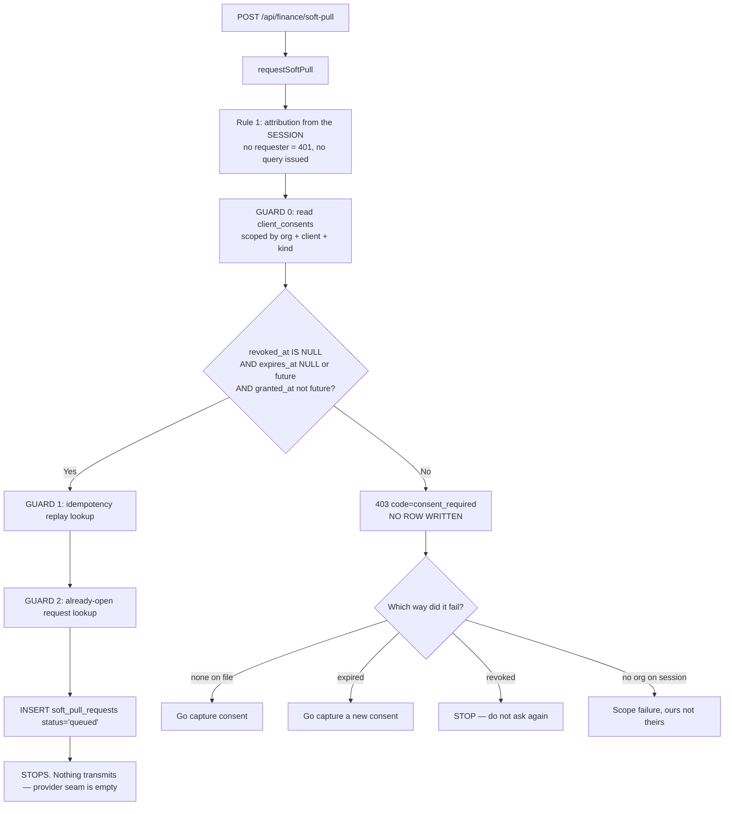

# Client journey — ACTUAL (generated from code)

> **SCOPE WARNING — READ THIS FIRST.**
>
> This file covers **one segment only**: soft-pull consent and the gate it puts
> in front of a credit pull. It was written while building migration 099 and it
> was traced from the code named in each node.
>
> Everything else in the client journey — signup, payment, deliverables, the
> portal at large — is **NOT** covered here and must not be read as absent from
> the product because it is absent from this diagram.
>
> **There is no `client-intended.md`.** `docs/journeys/` did not exist before
> this file; no journey in the tracked list (`client`, `role-owner`,
> `role-sales-manager`, `role-closer`, `role-funding-advisor`,
> `role-inquiry-remover`, `affiliate`, `white-label`) has either an intended or
> an actual file. CLAUDE.md §4 says agents do not author intended journeys, so
> none was invented here. **The gap between intended and actual for this segment
> is therefore unmeasured** — that absence is a finding, not something this file
> resolves.

## Soft-pull consent — what the code does today

Traced from:

- `db/migrations/099_client_consents.sql` — the table
- `src/consent/index.mjs` — `consentStatus` / `hasValidConsent` / `captureConsent` / `revokeConsent`
- `src/consent/disclosures.mjs` — the server-owned wording
- `api/consent/capture.mjs` — the endpoint
- `public/app/consent-capture.html` — the screen
- `src/finance/soft-pulls.mjs` — `requestSoftPull` (GUARD 0)
- `api/finance/soft-pull.mjs` — the pull endpoint

### The gate on the pull path

### Deliberately NOT gated

`fulfilSoftPull()`, `recordPull()` and the CRS ingest path in `src/tradelines/`
are untouched by the gate. A pull that already happened is a fact; refusing to
store or normalise an answer that already arrived would lose the only copy of
what a bureau said about a person. Consent governs whether we may **ask**.

### Verified vs unverified

| Claim | State |
|---|---|
| Gate refuses when no consent exists | Verified — `src/finance/soft-pulls.test.mjs`, and by reverting the gate |
| Revoked consent fails immediately, nothing cached | Verified — unit test asserts two calls, two answers |
| Gate runs before both duplicate guards | Verified — asserted on query order |
| Org comes from session, body/query ignored | Verified — `src/http/consent-capture.test.mjs` |
| Consent wording cannot be set from the request body | Verified — `src/http/consent-capture.test.mjs` |
| CHECK constraints refuse an unattributed/blank consent | Verified against real Postgres 16 — `src/consent/consent.pg.test.mjs`, 27/27 |
| Immutability + one-way revocation triggers | Verified against real Postgres 16 — same suite |
| Migration 099 applies to a virgin database | Verified — full 67-file chain, no errors. **Not yet applied to Supabase** |
| Screen behaviour in a browser | **UNVERIFIED** — no Playwright in this repo |
