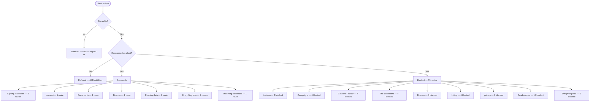

<!-- GENERATED by scripts/journeys/generate.mjs — do not edit by hand. Run `npm run journeys`. -->

# client — actual

What the code **does** today for a signed-in `client`.
Generated from the routing table and the gate on each handler, not from a spec.

> **Who this is, in the code:** src/auth/account-session.mjs — PRINCIPAL_KINDS includes 'client'

## In one picture

## What they can reach

**10 of 65 routes.**

| Route | Methods | Who the code lets in |
|---|---|---|
| `/api/auth/login` | GET | anyone |
| `/api/auth/logout` | — | anyone |
| `/api/auth/session` | — | anyone |
| `/api/consent/capture` | GET, POST | employees: owner, admin, closer, funding_advisor plus: client |
| `/api/documents/:id` | HEAD | **not a sign-in** — signed link |
| `/api/finance/soft-pull` | GET, POST | employees: owner, admin, closer, funding_advisor plus: client |
| `/api/health` | — | anyone |
| `/api/inngest` | — | **not a sign-in** — Inngest request signing |
| `/api/read/entitlements` | GET | employees: owner, admin, funding_advisor, closer, inquiry_specialist, setter plus: client |
| `/api/webhooks/:provider` | — | **not a sign-in** — provider signature |

### Worth knowing

- **4 routes are genuinely open** — no sign-in needed, reachable by anyone and not by this journey in particular: `/api/auth/login`, `/api/auth/logout`, `/api/auth/session`, `/api/health`. These are the sign-in routes and the health check.
- **3 routes need no sign-in but are NOT open.** `/api/documents/:id` (signed link), `/api/inngest` (Inngest request signing), `/api/webhooks/:provider` (provider signature). Anyone can call these, but a caller without the right signature is refused.

## What they are blocked from

**55 of 65 routes.**

| Route | Methods | Who the code lets in |
|---|---|---|
| `/api/banking/accounts` | GET, POST | owner, admin, funding_advisor, closer, inquiry_specialist, setter |
| `/api/banking/revoke` | GET, POST | owner, admin |
| `/api/campaigns/action-log` | GET | partner, staff |
| `/api/campaigns/connections` | GET | partner, staff |
| `/api/campaigns/detail` | GET | partner, staff |
| `/api/campaigns/fatigue` | GET | partner, staff |
| `/api/campaigns/list` | GET | partner, staff |
| `/api/campaigns/spend` | GET | partner, staff |
| `/api/creative/approvals` | GET | partner, staff |
| `/api/creative/brand-kits` | GET | partner, staff |
| `/api/creative/jobs` | GET | partner, staff |
| `/api/creative/library` | GET | partner, staff |
| `/api/dashboard/client` | — | staff |
| `/api/dashboard/clients` | — | staff |
| `/api/dashboard/pipeline` | — | staff |
| `/api/dashboard/seed` | — | staff |
| `/api/finance/alerts` | GET, POST | owner, admin, funding_advisor, closer, inquiry_specialist, setter |
| `/api/finance/bank-accounts` | GET, POST | owner, admin |
| `/api/finance/bills` | GET, POST | owner, admin |
| `/api/finance/cards` | GET, POST | owner, admin |
| `/api/finance/cashflow` | GET, POST | owner, admin |
| `/api/finance/liabilities` | GET, POST | owner, admin, funding_advisor, closer, inquiry_specialist, setter |
| `/api/finance/model` | POST | owner, admin, funding_advisor, closer, inquiry_specialist, setter |
| `/api/finance/subscriptions` | GET, POST | owner, admin |
| `/api/hiring/application` | GET | owner, admin |
| `/api/hiring/bench` | GET | owner, admin |
| `/api/hiring/candidates` | GET | owner, admin |
| `/api/hiring/decisions` | GET | owner, admin |
| `/api/hiring/funnel` | GET | owner, admin |
| `/api/hiring/postings` | GET | owner, admin |
| `/api/inquiries` | GET, POST | staff |
| `/api/inquiry` | — | inquiry_specialist, admin, owner |
| `/api/partner-brand` | GET, PUT | owner, admin |
| `/api/pii` | GET, POST | owner, admin, inquiry_specialist, funding_advisor |
| `/api/privacy/erasure` | GET, POST | owner, admin |
| `/api/read/affiliates` | GET | owner, admin |
| `/api/read/agents` | GET | owner, admin, funding_advisor, closer, inquiry_specialist, setter |
| `/api/read/banking-surface` | GET | owner, admin |
| `/api/read/commissions` | GET | owner, admin |
| `/api/read/conversations` | GET | owner, admin, funding_advisor, closer, inquiry_specialist, setter |
| `/api/read/documents` | GET | owner, admin, funding_advisor, closer, inquiry_specialist, setter |
| `/api/read/failed-events` | GET | owner, admin |
| `/api/read/finance-os` | GET | owner, admin, funding_advisor, closer, inquiry_specialist, setter |
| `/api/read/funding-rounds` | GET | owner, admin, funding_advisor, closer, inquiry_specialist, setter |
| `/api/read/inquiries` | GET | owner, admin, funding_advisor, closer, inquiry_specialist, setter |
| `/api/read/invoices` | GET | owner, admin |
| `/api/read/message-templates` | GET | owner, admin, funding_advisor, closer, inquiry_specialist, setter |
| `/api/read/money-map` | GET | owner, admin, funding_advisor, closer, inquiry_specialist, setter |
| `/api/read/partners` | GET | employees: owner, admin plus: partner |
| `/api/read/products` | GET | owner, admin, funding_advisor, closer, inquiry_specialist, setter |
| `/api/read/staff` | GET | owner, admin |
| `/api/read/tradelines` | — | owner, admin, funding_advisor, closer, inquiry_specialist, setter |
| `/api/read/underwrite` | GET | owner, admin, funding_advisor, closer, inquiry_specialist, setter |
| `/api/shifts` | GET, POST | staff |
| `/api/tasks` | GET, PATCH | staff |

## UNVERIFIED

_None — every route's gate was traced to its source._

## How to check this yourself

Every row above comes from two places, and you can open both:

- **Which routes exist:** the `ROUTES` map in `netlify/functions/api.mjs`. A handler
  missing from that map answers 404, so that map is the definition of what exists.
- **Who each one lets in:** the gate written at the top of each `api/…` handler.

Run `npm run journeys` to rebuild this file. `npm test` fails if it is out of date.
