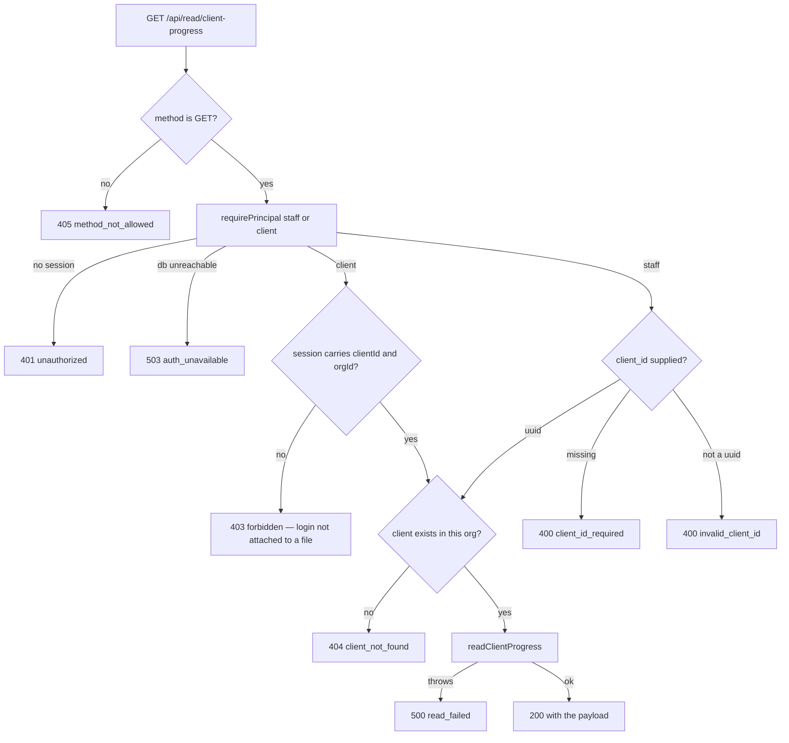
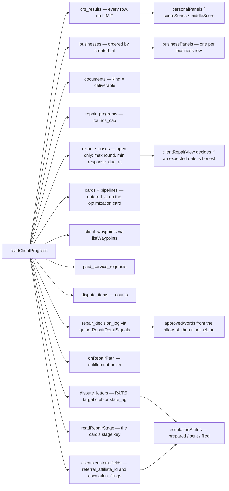

# Client progress read — what the code actually does

Generated from code, not from the plan. Every box below is a real function or a
real query in `src/progress/` and `api/read/client-progress.mjs`. Nothing here is
drawn from the spec.

**Route:** `GET /api/read/client-progress` — routed at `netlify/functions/api.mjs`
under the key `read/client-progress`.

**Who may call it:** `staff` and `client`. A client principal reads the file bound
to its own session; a `client_id` in the query string is never consulted on that
branch. Staff must supply `?client_id=` and get a 400 without one.

This page covers the READ only. The self-serve round's own state machine — quoted
→ awaiting payment → paid → staged → mailed, and its refusals — belongs to the
lane that builds the write path, and is not drawn here because no code in this
branch performs any of those transitions.

---

## The request

## What one call reads

Every read below runs in parallel and every one of them FAILS SOFT: a table that
will not answer costs the caller that one fact and nothing else. The pattern is
`api/read/portal-summary.mjs`'s and the reason is the same — a client whose
decision log is unreadable should lose the timeline, not their scores.

## The three rules the code enforces on the way out

```mermaid
flowchart TD
    subgraph NULL["Unknown survives"]
        N1[bureau with no pull] --> N2[score: null, pulledAt: null]
        N3[no repair program] --> N4[roundCap: null, never 0]
        N5[no card] --> N6[stage.key: null, never intake]
        N7[waypoint with no paid option] --> N8[paidAlternative: null, never a 0 price]
        N9[business score] --> N10[pulledAt ALWAYS null: no pull date is stored]
    end

    subgraph FILED["The timeline can only say what is on the allowlist"]
        F1[repair_decision_log row] --> F2{decision name in TIMELINE_WORDS?}
        F2 -->|yes| F3[the approved words for that name]
        F2 -->|no| F4["progress update"]
        F3 --> F5[timelineLine adds the date]
        F4 --> F5
        F6[phrase added to the list that claims a filing] -.->|dropped at load| F4
    end

    subgraph ESC["R4 and R5 carry three states, and sent is not filed"]
        E1[dispute_letters row, target cfpb or state_ag] --> E2{mailed_at, or status sent/delivered?}
        E2 -->|no| E3["state: prepared"]
        E2 -->|yes| E4["state: sent"]
        E5[custom_fields.escalation_filings] --> E6{client reported a filedAt?}
        E6 -->|no, and nothing writes this today| E4
        E6 -->|yes| E7["state: filed, with filedReportedBy"]
        E8[no letter row for that rung] -.->|no entry at all| E9[escalations omits the round]
    end

    subgraph CAP["Two independent counters"]
        C1[repair_programs.rounds_cap] --> C2[stage.roundCap]
        C3[paid_service_requests.round_no] --> C4[paidServices inFlight]
        C2 -.->|never decremented by| C4
    end
```

**The guard is an ALLOWLIST, and the first version of it was wrong.** The
original guard rewrote a timeline line only when it matched a regulator word AND
a submission verb. Its verb list left out "sent", "mailed", "delivered" and
"posted" — and "mailed" is the word this system actually stores — so a decision
row reading `cfpb_complaint_mailed` went to a client's screen untouched. A
denylist can never be finished, because the string it has to catch is one nobody
has written yet.

So `src/progress/timeline.mjs` no longer filters a rendered line; it CHOOSES the
line. A stored decision name is looked up in `TIMELINE_WORDS`, and only a value
from that map is ever printed. Anything not on the map — every decision name
invented after that file was written — renders as `progress update`. A second
layer scrubs the map itself at load: a phrase that asserts a regulator filing is
dropped, so adding one to the list does not ship it. The timeline names no
regulator at all, in either direction, because a `repair_decision_log` row does
not reliably carry which round it belongs to.

**Rounds 4 and 5 carry three states (owner-set 2026-09-05).** `prepared` — we
built the form. `sent` — it left us on this date, read from the letter row.
`filed` — the client told us, and the payload names who said so. Putting the
envelope in the post is a thing this system records; whether the complaint was
FILED turns on the client's own signature under penalty of perjury, and
`src/metro2/letters/catalog.mjs:57-65` states that nothing here ever hears about
it. **`filed` is false for every client today**: the ping that lets a client
report a filing is wave 4, nothing in this branch or anywhere else in the
repository writes `custom_fields.escalation_filings`, and that was checked by
grep rather than assumed.

**Business scores carry no pull date, and that is the fix.** `pulledAt` on a
business panel used to be `businesses.updated_at`, which a database trigger
rewrites on every edit to the row — so changing a business address silently
repainted the score as freshly pulled. `businesses` has no per-score timestamp
in any column, and none inside `entity_data`, so the honest answer is `null`.
Separately: nothing in this repository writes a business credit score at all
today, so the score itself is also `null` for every real client.

## Field-by-field: where each answer comes from

| Field | Source | Unknown reads as |
|---|---|---|
| `stage.key` | `readRepairStage()` — the optimization card's stage | `null` |
| `stage.roundCurrent` | `MAX(dispute_cases.round)` on open cases, `R3` → `3` | `null` |
| `stage.roundCap` | `repair_programs.rounds_cap` | `null` |
| `stage.roundLabel` | `roundLadderEntry()` | `null` |
| `stage.enteredAt` | `cards.entered_at` | `null` |
| `stage.expectedResponseBy` | `dispute_cases.response_due_at`, shown only when `clientRepairView()` says an expected date is honest for this stage | `null` |
| `stage.waitingOn` | `bureaus` while in transit or awaiting response, else the next step's owner | `null` |
| `scores.personal[]` | `crs_results.result` through `triMerge()`, newest real score per bureau with its own date | `score: null` |
| `scores.business[]` | `businesses.entity_data`, one panel per row, keyed on `businesses.id`. `pulledAt` is ALWAYS `null` — no pull date is stored anywhere | `[]` when no business; `score: null` when no score, which is every client today |
| `movement.middleScore*` | median of three; fewer than three is undefined | `null` |
| `movement.series[]` | one point per pull that produced a score; a tombstoned row draws none | `[]` |
| `movement.itemsRemoved/Disputed` | `dispute_items` counts | `null` if the table will not answer; a real `0` is a real zero |
| `waypoints[]` | `client_waypoints`, `overdue` computed from `due_at` and never stored | `[]` |
| `nextStep` | exactly one open waypoint — the client's first, else FundHub's | `null` when nothing is open |
| `timeline[]` | `repair_decision_log` → the `TIMELINE_WORDS` allowlist → `timelineLine()`. An unknown decision name reads `progress update` | `[]` |
| `escalations[]` | `dispute_letters` rows for R4/R5 with target `cfpb`/`state_ag`, plus `clients.custom_fields.escalation_filings` for the client's own report | `[]` when that rung was never reached; `filed: false` for every client today |
| `deliverables[]` | `documents` where `kind = 'deliverable'` | `[]` |
| `paidServices[]` | prices from `src/waypoints/pricing.mjs`; `inFlight` from an open `paid_service_requests` row | `available: false` |
| `referral` | `clients.custom_fields.referral_affiliate_id` → `affiliates.tracking_id` | `enrolled: false` |

## Known gaps, written down rather than filled

* **`referral` can never be true today.** No schema link exists from a client to
  their own affiliate row: `affiliates` has no `client_id`, `clients` has no
  `affiliate_id`, and `accounts_email_uniq` (044) means one email cannot hold
  both a client and an affiliate account in the same org. The read is wired to
  `custom_fields.referral_affiliate_id` so it starts answering true the moment
  the referral lane writes that link, without this file changing.
* **`shareUrl` is always null.** Nothing in this repository stores the public
  base URL a share link would be built from. The front end knows its own origin
  and can build the link from `code`.
* **`scores.business[].reportDocumentId` is always null.** There is no
  per-business report document. `business_prep_summary` is one per client, so
  pointing every business toggle at the same page would be worse than an honest
  null.
* **The timeline's date and its words can disagree by a day.** `timelineLine()`
  formats in `America/Los_Angeles`, so a decision stored at UTC midnight on the
  4th renders as "Mar 3". The `at` field carries the real UTC timestamp and is
  the authoritative one; the drift is in the existing shared function, not in
  this endpoint.
* **`scores.business[].pulledAt` is always null, and so is the score.** No
  per-business pull timestamp exists in `businesses` or inside `entity_data`.
  Separately, nothing in this repository WRITES a business credit score — every
  reference to `intelliscore`, `commercialScore` or `biz_intelliscore` in
  `src/`, `api/`, `db/` and `public/` is a reader. So the business panel names
  the business and reads `score: null` for every client that exists today.
* **This endpoint reads three of the five business score keys that
  `src/http/client-detail.mjs` reads.** It skips
  `custom_fields.biz_intelliscore` and `custom_fields.intelliscore` and it does
  not surface FSR, because those live on the CLIENT row and there is no honest
  way to attribute one client-level number to one of several businesses on a
  panel that toggles between them. Latent while nothing writes them.
* **A bureau panel and the report it links to can be from different pulls.**
  `reportDocumentId` is the newest credit report on file whichever pull the
  panel's number came from, so a January TransUnion panel can link to the March
  report. Fixing it needs a column linking a report document back to the
  `crs_results` row it was generated from, and none exists.
* **`escalations[].filed` is false for every client.** Nothing writes
  `custom_fields.escalation_filings`; the ping that lets a client report a
  filing is wave 4. The field is wired to a real read so it starts answering the
  moment something writes it.
* **`escalations[].sentAt` is often null on a complaint that really was posted.**
  `recordComplaintFiling()` writes `status = 'sent'` and does not write
  `mailed_at`, so the state reads `sent` and the date reads unknown. A
  `created_at` would be a different fact wearing the right label.
* **`stage.roundCurrent` and `stage.expectedResponseBy` can come from different
  cases.** `dispute_cases` is one row per bureau and the query takes
  `MAX(round)` with `MIN(response_due_at)` across every open row. `round` is a
  text column, so `MAX()` is a lexical comparison — harmless only while the
  ladder stops at R6.
* **Four reads have no LIMIT** — `crs_results`, `documents`, `client_waypoints`
  and `paid_service_requests` — against the rule at `src/http/read-api.mjs:6`.
  `api/read/portal-summary.mjs` already does this for `crs_results`, so it is
  consistent with the neighbour rather than new. Not changed here: adding a cap
  silently truncates a score series, and choosing the cap is a product call.
* **`src/optimize-page/roadmap.mjs:146` still passes `letters: []`**, which pins
  the public optimize page's ladder to "Round 1, current". That file is outside
  this lane's paths and is untouched. This endpoint does not use it — it reads
  the round from `dispute_cases` directly.
