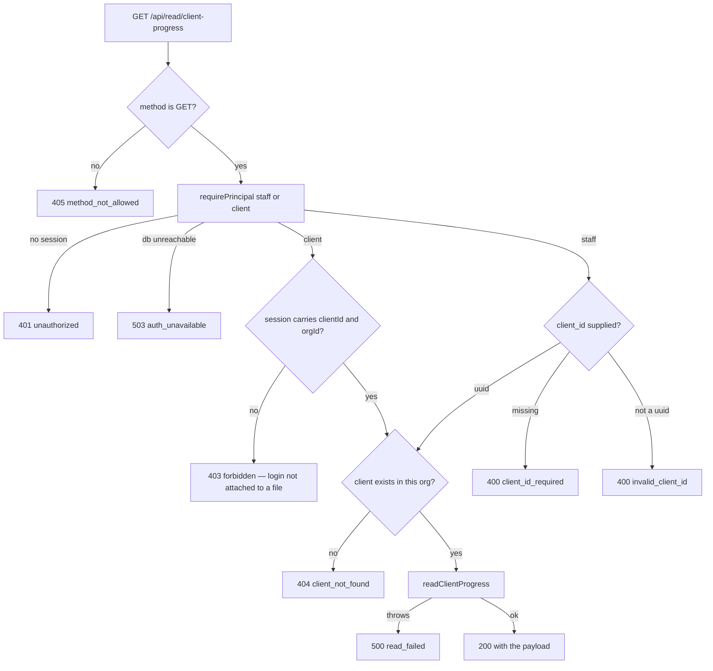
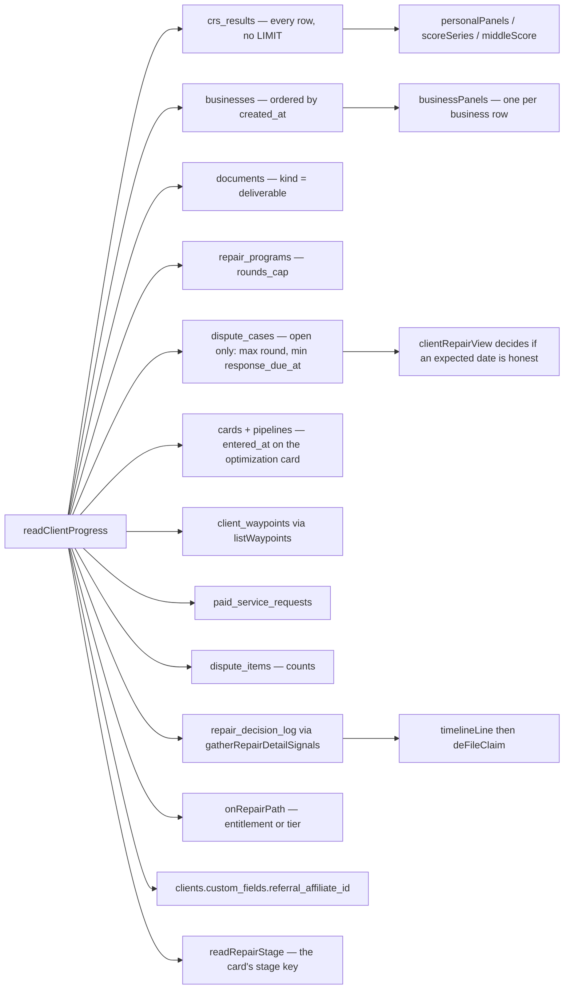
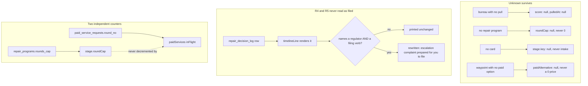

# Client progress read — what the code actually does

Generated from code, not from the plan. Every box below is a real function or a
real query in `src/progress/` and `api/read/client-progress.mjs`. Nothing here is
drawn from the spec.

**Route:** `GET /api/read/client-progress` — routed at `netlify/functions/api.mjs`
under the key `read/client-progress`.

**Who may call it:** `staff` and `client`. A client principal reads the file bound
to its own session; a `client_id` in the query string is never consulted on that
branch. Staff must supply `?client_id=` and get a 400 without one.

This page covers the READ only. The self-serve round's own state machine — quoted
→ awaiting payment → paid → staged → mailed, and its refusals — belongs to the
lane that builds the write path, and is not drawn here because no code in this
branch performs any of those transitions.

---

## The request

## What one call reads

Every read below runs in parallel and every one of them FAILS SOFT: a table that
will not answer costs the caller that one fact and nothing else. The pattern is
`api/read/portal-summary.mjs`'s and the reason is the same — a client whose
decision log is unreadable should lose the timeline, not their scores.

## The three rules the code enforces on the way out

**Why the filing guard is on the rendered line and not on a list of decisions.**
`timelineLine()` de-underscores whatever machine name somebody stored, so the
words a client reads are chosen by whoever writes the next decision string. A
decision nobody has written yet cannot be on an allow-list.
`src/metro2/letters/catalog.mjs:57-65` states the underlying fact: the CFPB and
state attorney general complaints ship to the client undated and unsigned, the
client files them personally, and nothing in this repository ever hears whether
that happened.

## Field-by-field: where each answer comes from

| Field | Source | Unknown reads as |
|---|---|---|
| `stage.key` | `readRepairStage()` — the optimization card's stage | `null` |
| `stage.roundCurrent` | `MAX(dispute_cases.round)` on open cases, `R3` → `3` | `null` |
| `stage.roundCap` | `repair_programs.rounds_cap` | `null` |
| `stage.roundLabel` | `roundLadderEntry()` | `null` |
| `stage.enteredAt` | `cards.entered_at` | `null` |
| `stage.expectedResponseBy` | `dispute_cases.response_due_at`, shown only when `clientRepairView()` says an expected date is honest for this stage | `null` |
| `stage.waitingOn` | `bureaus` while in transit or awaiting response, else the next step's owner | `null` |
| `scores.personal[]` | `crs_results.result` through `triMerge()`, newest real score per bureau with its own date | `score: null` |
| `scores.business[]` | `businesses.entity_data`, one panel per row, keyed on `businesses.id` | `[]` when no business; `score: null` when no score |
| `movement.middleScore*` | median of three; fewer than three is undefined | `null` |
| `movement.series[]` | one point per pull that produced a score; a tombstoned row draws none | `[]` |
| `movement.itemsRemoved/Disputed` | `dispute_items` counts | `null` if the table will not answer; a real `0` is a real zero |
| `waypoints[]` | `client_waypoints`, `overdue` computed from `due_at` and never stored | `[]` |
| `nextStep` | exactly one open waypoint — the client's first, else FundHub's | `null` when nothing is open |
| `timeline[]` | `repair_decision_log` → `timelineLine()` → `deFileClaim()` | `[]` |
| `deliverables[]` | `documents` where `kind = 'deliverable'` | `[]` |
| `paidServices[]` | prices from `src/waypoints/pricing.mjs`; `inFlight` from an open `paid_service_requests` row | `available: false` |
| `referral` | `clients.custom_fields.referral_affiliate_id` → `affiliates.tracking_id` | `enrolled: false` |

## Known gaps, written down rather than filled

* **`referral` can never be true today.** No schema link exists from a client to
  their own affiliate row: `affiliates` has no `client_id`, `clients` has no
  `affiliate_id`, and `accounts_email_uniq` (044) means one email cannot hold
  both a client and an affiliate account in the same org. The read is wired to
  `custom_fields.referral_affiliate_id` so it starts answering true the moment
  the referral lane writes that link, without this file changing.
* **`shareUrl` is always null.** Nothing in this repository stores the public
  base URL a share link would be built from. The front end knows its own origin
  and can build the link from `code`.
* **`scores.business[].reportDocumentId` is always null.** There is no
  per-business report document. `business_prep_summary` is one per client, so
  pointing every business toggle at the same page would be worse than an honest
  null.
* **The timeline's date and its words can disagree by a day.** `timelineLine()`
  formats in `America/Los_Angeles`, so a decision stored at UTC midnight on the
  4th renders as "Mar 3". The `at` field carries the real UTC timestamp and is
  the authoritative one; the drift is in the existing shared function, not in
  this endpoint.
* **`src/optimize-page/roadmap.mjs:146` still passes `letters: []`**, which pins
  the public optimize page's ladder to "Round 1, current". That file is outside
  this lane's paths and is untouched. This endpoint does not use it — it reads
  the round from `dispute_cases` directly.
