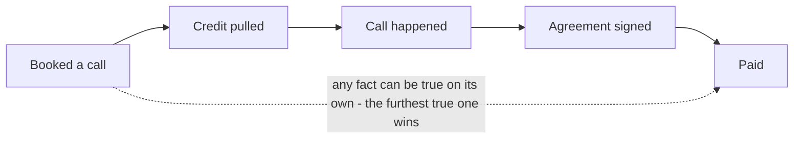
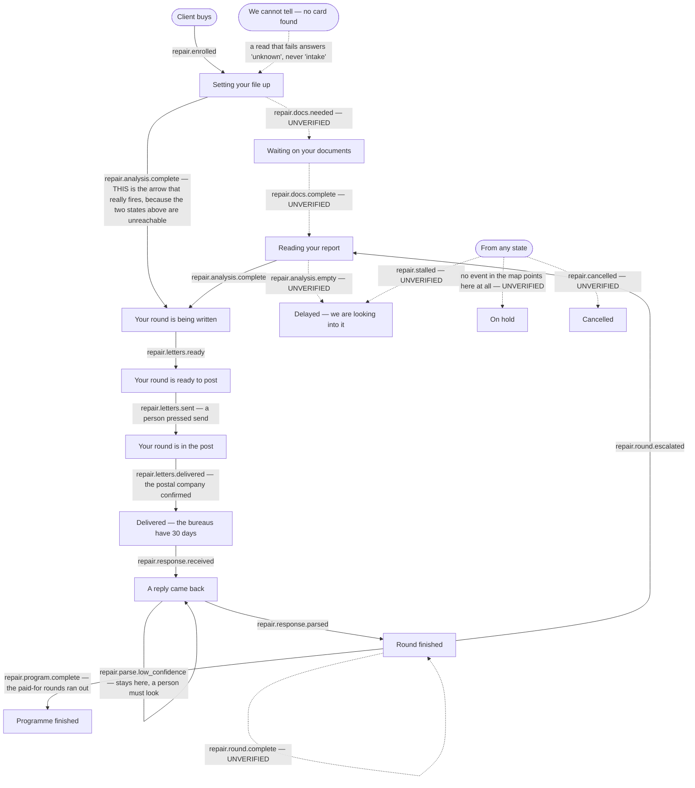

# Client progress — the states a file moves through

**What the code does today**, as the progress page will see it. Hand-written, traced from the code
on 2026-09-05. Not generated: `npm run journeys` builds nine pages from the routing table and this
is not a routing change.

Every arrow below carries the file and line it was read from. **Where a path could not be traced in
the code, the diagram says `UNVERIFIED` on the arrow and section 6 lists it with the reason.** That
is CLAUDE.md §4 and it is not optional here — **six of the sixteen events in the stage table are
fired by nothing that runs in production, and one listed state has no event pointing at it at
all.** Drawing those as working would tell a non-coder the file moves when it does not.

Language note (owner-set): no repair wording appears in anything a client reads on this page. The
work is funding optimisation and capital readiness. Internal names — table names, event names, letter
names — are unchanged and appear below only as proof.

---

## 1. There are three separate ladders, not one

A reader looking for "the client's status" will find three different answers in three different
places, and they are genuinely three different questions. The progress page shows all three.

| Ladder | What it answers | Where it lives |
|---|---|---|
| **A. Sales ladder** | How far through buying is this person | `portalStage()`, `api/read/portal-summary.mjs:284` |
| **B. File ladder** | What is happening to their file right now | `REPAIR_STAGES`, `src/repair/pipeline.mjs:8` |
| **C. Round ladder** | How far up the escalation has each disputed item climbed | `ROUND_LADDER`, `src/metro2/letters/catalog.mjs:87` |

They do not move together. A client can be at the top of ladder A and have never started ladder B.

---

## 2. Ladder A — the sales ladder

`portalStage()` is **not a state machine**. It reads four facts, each from the table that owns it,
and reports the furthest one reached (`api/read/portal-summary.mjs:284-306`). Nothing is derived
from anything else, on purpose: a client can pay before signing, or sign before the credit pull
lands, and a chain of "if this then that" gets those people wrong.

Facts and their sources, all inside `api/read/portal-summary.mjs`:

| Step | The fact underneath it | Read at |
|---|---|---|
| Booked | nothing else is true yet | `:291` default `key = "booked"` |
| Credit pulled | a stored credit pull exists | `:292` |
| Call happened | a `call.completed` event **or** a `call_outcomes` row — either witness will do | `:293`, and the note at `:327-330` |
| Agreement signed | the client's signed agreement date | `:294` |
| Paid | payment posted | `:295` |

---

## 3. Ladder B — what is happening to the file

This is the one the progress page's headline sentence comes from. The client's file sits on one
card, and an **event** moves that card from one state to the next. The full list of states is
`src/repair/pipeline.mjs:8-22`; the event-to-state map is `EVENT_STAGE`,
`src/repair/pipeline.mjs:64-81`.

Client-facing wording for each state already exists and is already tested:
`CLIENT_STAGE_COPY`, `src/repair/portal.mjs:3-17`.

**Solid arrows fire today. Dashed arrows are the ones nothing fires.** `repair.stalled` and
`repair.cancelled` are drawn from "any state" because the map turns an event into a state without
caring where the file was — `EVENT_STAGE`, `src/repair/pipeline.mjs:64-81`, is a lookup, not a
sequence.

### Where each arrow was read from

| Event | Lands on | Written down at | Actually fired by |
|---|---|---|---|
| `repair.enrolled` | intake | `pipeline.mjs:65` | `src/repair/enroll.mjs:111` and `:142` |
| `repair.docs.needed` | awaiting documents | `pipeline.mjs:66` | **nothing in production** — see §6 |
| `repair.docs.complete` | analysis | `pipeline.mjs:67` | **nothing in production** — see §6 |
| `repair.analysis.complete` | round being written | `pipeline.mjs:68` | `src/repair/analyze.mjs:571` |
| `repair.analysis.empty` | delayed | `pipeline.mjs:69` | **nothing** — see §6 |
| `repair.letters.ready` | ready to post | `pipeline.mjs:70` | `src/repair/analyze.mjs:579` |
| `repair.letters.sent` | in the post | `pipeline.mjs:71` | `src/repair/send.mjs:596`, only when at least one letter went (`:593`) |
| `repair.letters.delivered` | bureaus have 30 days | `pipeline.mjs:72` | `src/http/router.mjs:409` |
| `repair.response.received` | a reply came back | `pipeline.mjs:73` | `src/repair/response-agent.mjs:86` and `:93` |
| `repair.response.parsed` | round finished | `pipeline.mjs:74` | `src/repair/parse-loop.mjs:89`, `:150`; `src/metro2/inbound/confirm.mjs:133` |
| `repair.parse.low_confidence` | stays on "a reply came back" | `pipeline.mjs:75` | `src/repair/parse-loop.mjs:73` |
| `repair.round.complete` | round finished | `pipeline.mjs:76` | **nothing** — see §6 |
| `repair.round.escalated` | back to reading the report | `pipeline.mjs:77` | `src/metro2/inbound/confirm.mjs:152` |
| `repair.program.complete` | programme finished | `pipeline.mjs:78` | `src/metro2/rounds/program-cap.mjs:67` |
| `repair.stalled` | delayed | `pipeline.mjs:79` | **nothing** — see §6 |
| `repair.cancelled` | cancelled | `pipeline.mjs:80` | **nothing** — see §6 |

### Two arrows worth reading twice

**Delivery is not automatic in the obvious way.** `repair.letters.delivered` only fires when the
postal provider's webhook arrives, the inquiry-removal lookup misses first, **and** the provider's
own id for that envelope is found on a stored letter row (`src/http/router.mjs:398-406`). No stored
row, no id match, no arrow — the file sits on "in the post" forever and nothing complains. The
comment at `src/http/router.mjs:390-394` records that this used to miss every single time.

**"We cannot tell" is a real answer and must reach the screen.** `readRepairStage()` returns `null`
when there is no card, no organisation, or the read failed
(`src/repair/pipeline.mjs:33-56`). The comment there is explicit that unknown must never be shown
as "intake", because the alternative is dragging a client who is five rounds in back to the start.

---

## 4. Ladder C — how far up the escalation each item has climbed

Six rungs. Each disputed item climbs on its own; they are not all on the same rung.
`ROUND_LADDER`, `src/metro2/letters/catalog.mjs:87-96`.

| Rung | What is actually sent | Who it goes to |
|---|---|---|
| 1 | First formal challenge | The credit bureau |
| 2 | Show us how you verified it | The credit bureau |
| 3 | Final notice — delete what you cannot verify | The credit bureau |
| 4 | Federal regulator complaint | The client files it personally |
| 5 | State attorney general complaint | The client files it personally |
| 6 | Final notice, sent again | The credit bureau |

The three outcomes on the right can happen on **any** rung, and the cap can bite on **any** rung —
which rung is the last one depends on the plan. A trial plan pays for two rungs, a full plan for six
(`nextRound`, `src/metro2/rounds/state.mjs:27-33`).

Read from `applyItemOutcome`, `src/metro2/rounds/state.mjs:112-142`:

* **Removed** — `:117`. **Corrected** — `:118`. **Not answered** — `:119`.
* **They said it is correct** — `:120`. The item then tries to climb one rung (`nextRound`, `:27`).
* **No rungs left on the plan** — `:121-129`. The item closes and is flagged `blocked_at_cap`.
  That flag is what turns a trial client into an upsell (`src/metro2/rounds/program-cap.mjs:19-38`).
* **The one crossing a machine may not make** — `:130-138`. Climbing into rung 4, 5 or 6 requires
  `humanConfirmed`, which arrives false unless a real person passes it. Without it the item **stays
  where it is**, marked as waiting for a person, and lands on the exceptions queue. Nothing is lost;
  the decision is handed over. The reasoning is written out in full at `src/metro2/rounds/state.mjs:56-89`
  and it is owner-set: rungs 4 and 5 are sworn under penalty of perjury, so a machine reading a
  scanned letter must not be what decides a person swears to something.
* **Rungs 1→2 and 2→3 are automatic** and can happen with nobody in the loop
  (`src/repair/parse-loop.mjs:79-93`; the reasoning at `src/metro2/rounds/state.mjs:62-73`).

### Rungs 4 and 5 can NEVER be shown as done

**No table, column, endpoint or workflow in this repository ever hears whether a federal regulator
complaint or a state attorney general complaint was actually filed.**
`src/metro2/letters/catalog.mjs:57-65` states this in the code itself.

The complaints are shipped to the client as documents, undated and unsigned, behind a cover sheet.
The client fills in the date, signs it by hand and files it themselves. Nothing comes back.

So the progress page may say: **"Your regulator complaint is ready for you to file."**
It may **never** say: filed, submitted, lodged, or under review. Reaching rung 4 means the paperwork
was produced. It does not mean anything was sent.

---

## 5. What the progress page shows for the round ladder today

`buildRoundPlan()` (`src/repair/round-plan.mjs:57-92`) turns the six rungs into a plan with a status
on each: `current`, `written`, `held`, `later`, or `blocked_at_cap` (`round-plan.mjs:77-81`).

**It is pinned.** The only page-facing caller, `src/optimize-page/roadmap.mjs:144-148`, passes
`letters: []` — an empty list of letters already written. With no letters, `latestWrittenRound()`
returns nothing (`round-plan.mjs:14-26`), so rung 1 is always `current` and rungs 2 to 6 are always
`later`, for every client, forever. A client three rounds in sees the same picture as one who
started yesterday.

That is a defect, not a design. It is named in the plan as work for the endpoint lane; this page
records it so the diagram is not read as describing something that works.

---

## 6. Every arrow marked UNVERIFIED, and why

| Arrow | Why it could not be traced |
|---|---|
| `repair.docs.needed` → waiting on your documents | The function that emits it, `announceRepairDocState` (`src/repair/handlers.mjs:70-107`), exists and is tested — but a search of `src/`, `api/` and `netlify/` finds **no caller outside `src/repair/doc-stage.test.mjs`**. Nothing in production calls it, so no client has ever entered this state. |
| `repair.docs.complete` → reading your report | Same function, same line (`src/repair/handlers.mjs:81`), same absence of a caller. |
| `repair.analysis.empty` → delayed | The name appears only in the canonical event list (`src/events/canonical.mjs:99`), the registration list (`src/repair/register.mjs:11`), the map (`pipeline.mjs:69`) and a **consumer** (`src/repair/handlers.mjs:185`). Nothing emits it. When the analyser finds nothing to dispute it returns `{ ok: false, reason: "no_violations" }` (`src/repair/analyze.mjs:360`) and the card does not move at all. |
| `repair.round.complete` → round finished | Appears only in `src/events/canonical.mjs:111`, `src/repair/register.mjs:19` and the map (`pipeline.mjs:76`). No emitter. In practice `repair.response.parsed` reaches the same state. |
| `repair.stalled` → delayed | `src/metro2/diy/deliver.mjs:61` **returns the string** `"repair.stalled"` as part of a result object. It does not emit an event, and nothing reads that field and emits one. The consumer at `src/repair/handlers.mjs:185-186` is real and would work; nothing calls it with this name. |
| `repair.cancelled` → cancelled | Appears only in `src/events/canonical.mjs:115`, `src/repair/register.mjs:23` and the map (`pipeline.mjs:80`). No emitter anywhere. |
| anything → on hold | `on_hold` is a listed state (`src/repair/pipeline.mjs:19`) with client copy already written (`src/repair/portal.mjs:15`), and **no event in `EVENT_STAGE` maps to it**. Nothing in the code puts a file there. |

Seven arrows, landing on six distinct states — waiting on documents, reading your report, delayed,
round finished, cancelled, on hold. `CLIENT_STAGE_COPY` (`src/repair/portal.mjs:3-17`) already has
client wording for all six. That is how a screen comes to promise something the machinery underneath
has never once done.

---

## 7. The gap between this and the intended journey

`docs/journeys/client-intended.md` is route-level: it covers which screens a client can reach and
what gates each one. It says nothing about these three ladders, so **no intended step is
contradicted by anything on this page**. The seven unverified arrows above are gaps between what the
stage table declares and what the code fires — they are findings, and they are reported rather than
quietly reconciled (CLAUDE.md §4).
