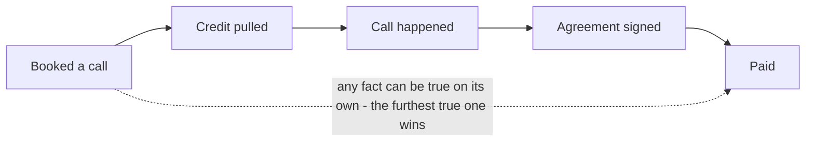
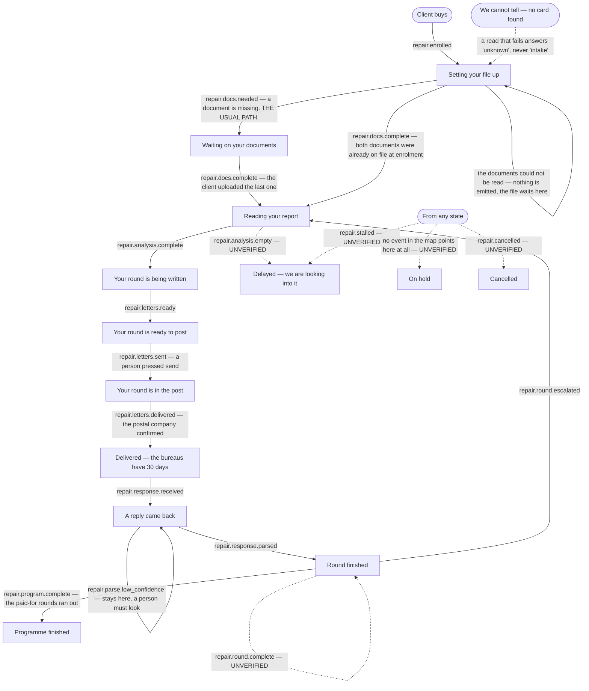
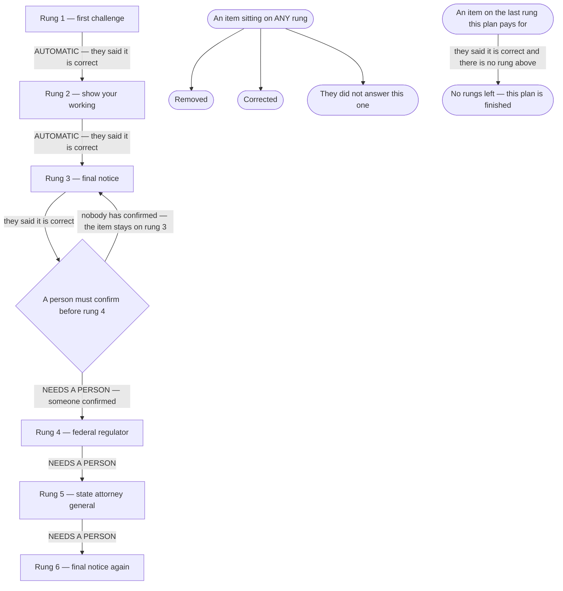
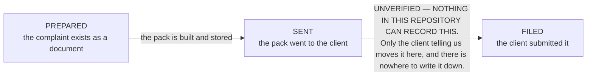

# Client progress — the states a file moves through

**What the code does today**, as the progress page will see it. Hand-written, traced from the code
on 2026-09-05. Not generated: `npm run journeys` builds nine pages from the routing table and this
is not a routing change.

Every arrow below carries the file and line it was read from. **Where a path could not be traced in
the code, the diagram says `UNVERIFIED` on the arrow and section 6 lists it with the reason.** That
is CLAUDE.md §4 and it is not optional here — **four of the sixteen events in the stage table are
fired by nothing that runs in production, and one listed state has no event pointing at it at
all.** Drawing those as working would tell a non-coder the file moves when it does not.

### Correction, 2026-09-05 — the first version of this page got its headline wrong

An earlier version of this page said **six** events were dead, and named `repair.docs.needed` and
`repair.docs.complete` among them. **That was false.** Both fire. Every client who enrols passes
through one of them, and it is the busiest path in the file that emits them.

The mistake was reading a stale comment instead of the code under it.
`src/repair/handlers.mjs:14-31` still says "NOTHING EMITTED EITHER EVENT … These two functions are
the missing emitter". That sentence describes the world **before** the same file fixed it. The
emitter now has two live callers, in that very file.

Every other claim on this page has since been re-checked against the branch this page ships on,
by grepping and by running the handler — not against `origin/main`, where the old sentence was
still true. The re-checked claims, and what changed, are listed in §8.

Language note (owner-set): no repair wording appears in anything a client reads on this page. The
work is funding optimisation and capital readiness. Internal names — table names, event names, letter
names — are unchanged and appear below only as proof.

---

## 1. There are three separate ladders, not one

A reader looking for "the client's status" will find three different answers in three different
places, and they are genuinely three different questions. The progress page shows all three.

| Ladder | What it answers | Where it lives |
|---|---|---|
| **A. Sales ladder** | How far through buying is this person | `portalStage()`, `api/read/portal-summary.mjs:284` |
| **B. File ladder** | What is happening to their file right now | `REPAIR_STAGES`, `src/repair/pipeline.mjs:8` |
| **C. Round ladder** | How far up the escalation has each disputed item climbed | `ROUND_LADDER`, `src/metro2/letters/catalog.mjs:87` |

They do not move together. A client can be at the top of ladder A and have never started ladder B.

---

## 2. Ladder A — the sales ladder

`portalStage()` is **not a state machine**. It reads four facts, each from the table that owns it,
and reports the furthest one reached (`api/read/portal-summary.mjs:284-306`). Nothing is derived
from anything else, on purpose: a client can pay before signing, or sign before the credit pull
lands, and a chain of "if this then that" gets those people wrong.

Facts and their sources, all inside `api/read/portal-summary.mjs`:

| Step | The fact underneath it | Read at |
|---|---|---|
| Booked | nothing else is true yet | `:291` default `key = "booked"` |
| Credit pulled | a stored credit pull exists | `:292` |
| Call happened | a `call.completed` event **or** a `call_outcomes` row — either witness will do | `:293`, and the note at `:327-330` |
| Agreement signed | the client's signed agreement date | `:294` |
| Paid | payment posted | `:295` |

---

## 3. Ladder B — what is happening to the file

This is the one the progress page's headline sentence comes from. The client's file sits on one
card, and an **event** moves that card from one state to the next. The full list of states is
`src/repair/pipeline.mjs:8-22`; the event-to-state map is `EVENT_STAGE`,
`src/repair/pipeline.mjs:64-81`.

Client-facing wording for each state already exists and is already tested:
`CLIENT_STAGE_COPY`, `src/repair/portal.mjs:3-17`.

**Solid arrows fire today. A dashed arrow labelled `UNVERIFIED` is one nothing fires** — there are
five of them, and §6 gives the reason for each. The one other dashed arrow, from "we cannot tell"
into intake, is a **note rather than a transition**: it marks the answer that must never be turned
into a stage, and it is explained under §3's third heading.

`repair.stalled` and
`repair.cancelled` are drawn from "any state" because the map turns an event into a state without
caring where the file was — `EVENT_STAGE`, `src/repair/pipeline.mjs:64-81`, is a lookup, not a
sequence.

### Where each arrow was read from

| Event | Lands on | Written down at | Actually fired by |
|---|---|---|---|
| `repair.enrolled` | intake | `pipeline.mjs:65` | `src/repair/enroll.mjs:111` and `:142` |
| `repair.docs.needed` | awaiting documents | `pipeline.mjs:66` | `src/repair/handlers.mjs:216` → `:81` → `:92`, on every `repair.enrolled` where a document is missing |
| `repair.docs.complete` | analysis | `pipeline.mjs:67` | `src/repair/handlers.mjs:137` on an upload, and `:216` when both documents were already on file |
| `repair.analysis.complete` | round being written | `pipeline.mjs:68` | `src/repair/analyze.mjs:571` |
| `repair.analysis.empty` | delayed | `pipeline.mjs:69` | **nothing** — see §6 |
| `repair.letters.ready` | ready to post | `pipeline.mjs:70` | `src/repair/analyze.mjs:579` |
| `repair.letters.sent` | in the post | `pipeline.mjs:71` | `src/repair/send.mjs:596`, only when at least one letter went (`:593`) |
| `repair.letters.delivered` | bureaus have 30 days | `pipeline.mjs:72` | `src/http/router.mjs:409` |
| `repair.response.received` | a reply came back | `pipeline.mjs:73` | `src/repair/response-agent.mjs:86` and `:93` |
| `repair.response.parsed` | round finished | `pipeline.mjs:74` | `src/repair/parse-loop.mjs:89`, `:150`; `src/metro2/inbound/confirm.mjs:133` |
| `repair.parse.low_confidence` | stays on "a reply came back" | `pipeline.mjs:75` | `src/repair/parse-loop.mjs:73` |
| `repair.round.complete` | round finished | `pipeline.mjs:76` | **nothing** — see §6 |
| `repair.round.escalated` | back to reading the report | `pipeline.mjs:77` | `src/metro2/inbound/confirm.mjs:152` |
| `repair.program.complete` | programme finished | `pipeline.mjs:78` | `src/metro2/rounds/program-cap.mjs:67` |
| `repair.stalled` | delayed | `pipeline.mjs:79` | **nothing** — see §6 |
| `repair.cancelled` | cancelled | `pipeline.mjs:80` | **nothing** — see §6 |

### Three arrows worth reading twice

**The documents stage is the default landing spot, not a dead end.** Enrolling a client does two
things, not one. The card moves to intake, and then the very same handler asks "has this person
sent us their ID and their proof of address?" — `src/repair/handlers.mjs:215-221`. The answer picks
the event: `repair.docs.needed` if anything is missing, `repair.docs.complete` if both are already
there (`:81`). The card then moves again (`:103`). An upload later ends the stage the same way,
through `onRepairDocsReceived` (`:137`), which the bus calls on `docs.received`
(`src/repair/register.mjs:39`, reached from `src/workflows/index.mjs:1-2`).

**Measured by running the handler on this branch**, not read off the page. Fake database, real
`onRepairEvent` and real `onRepairDocsReceived`:

| What was driven | What came back |
|---|---|
| `repair.enrolled`, no documents on file | emitted `repair.docs.needed`, missing `["id_document","proof_of_address"]`, card landed on **awaiting_documents** |
| `repair.enrolled`, both documents already on file | emitted `repair.docs.complete`, card landed on **analysis** — the documents stage is skipped |
| `docs.received`, both documents now on file | emitted `repair.docs.complete`, card landed on **analysis** |
| `docs.received` while the file is at `in_transit` | refused — `stage_not_waiting_on_documents`. A round-5 client uploading something is not dragged backwards (`:132-134`) |
| the document read throws | nothing emitted — `documents_unreadable` (`:79`). The card stays where it is. Unknown stays unknown |

That last row is the one that matters for the screen: **a database that will not answer must never
be rendered as "you have not sent your ID"** (`src/repair/handlers.mjs:37-39`).

**Delivery is not automatic in the obvious way.** `repair.letters.delivered` only fires when the
postal provider's webhook arrives, the inquiry-removal lookup misses first, **and** the provider's
own id for that envelope is found on a stored letter row (`src/http/router.mjs:398-406`). No stored
row, no id match, no arrow — the file sits on "in the post" forever and nothing complains. The
comment at `src/http/router.mjs:390-394` records that this used to miss every single time.

**"We cannot tell" is a real answer and must reach the screen.** `readRepairStage()` returns `null`
when there is no card, no organisation, or the read failed
(`src/repair/pipeline.mjs:33-56`). The comment there is explicit that unknown must never be shown
as "intake", because the alternative is dragging a client who is five rounds in back to the start.

---

## 4. Ladder C — how far up the escalation each item has climbed

Six rungs. Each disputed item climbs on its own; they are not all on the same rung.
`ROUND_LADDER`, `src/metro2/letters/catalog.mjs:87-96`.

| Rung | What is actually sent | Who it goes to |
|---|---|---|
| 1 | First formal challenge | The credit bureau |
| 2 | Show us how you verified it | The credit bureau |
| 3 | Final notice — delete what you cannot verify | The credit bureau |
| 4 | Federal regulator complaint | The client files it personally |
| 5 | State attorney general complaint | The client files it personally |
| 6 | Final notice, sent again | The credit bureau |

The three outcomes on the right can happen on **any** rung, and the cap can bite on **any** rung —
which rung is the last one depends on the plan. A trial plan pays for two rungs, a full plan for six
(`nextRound`, `src/metro2/rounds/state.mjs:27-33`).

Read from `applyItemOutcome`, `src/metro2/rounds/state.mjs:112-142`:

* **Removed** — `:117`. **Corrected** — `:118`. **Not answered** — `:119`.
* **They said it is correct** — `:120`. The item then tries to climb one rung (`nextRound`, `:27`).
* **No rungs left on the plan** — `:121-129`. The item closes and is flagged `blocked_at_cap`.
  That flag is what turns a trial client into an upsell (`src/metro2/rounds/program-cap.mjs:19-38`).
* **The one crossing a machine may not make** — `:130-138`. Climbing into rung 4, 5 or 6 requires
  `humanConfirmed`, which arrives false unless a real person passes it. Without it the item **stays
  where it is**, marked as waiting for a person, and lands on the exceptions queue. Nothing is lost;
  the decision is handed over. The reasoning is written out in full at `src/metro2/rounds/state.mjs:56-89`
  and it is owner-set: rungs 4 and 5 are sworn under penalty of perjury, so a machine reading a
  scanned letter must not be what decides a person swears to something.
* **Rungs 1→2 and 2→3 are automatic** and can happen with nobody in the loop
  (`src/repair/parse-loop.mjs:79-93`; the reasoning at `src/metro2/rounds/state.mjs:62-73`).

### Rungs 4 and 5 carry three states, and only the client can reach the third

**Owner-set, 2026-09-05.** Rungs 4 and 5 are not done/not-done. They move through **prepared →
sent → filed**, and **only the client telling us moves anything to filed**.

| State | What it means | What the code actually records |
|---|---|---|
| **Prepared** | The complaint has been written into the pack, undated and unsigned | `src/metro2/diy/package.mjs:396` (federal regulator) and `:402` (state attorney general), inside the folder at `:360` behind the cover sheet at `:386` |
| **Sent** | The pack was produced and stored for the client | `src/metro2/diy/deliver.mjs:75-82` stamps `diy_package_ready_at` and returns the stored document rows. This records the **pack**, not either complaint on its own — there is no per-complaint sent flag |
| **Filed** | The client signed it and submitted it to the regulator | **Nothing.** No table, no column, no endpoint, no workflow. A search of `src/`, `api/` and `db/migrations` for `complaint_filed`, `filed_at`, `ag_filed` and `complaint_sent` returns **no results at all** |

`src/metro2/letters/catalog.mjs:56-68` states the absence in the code itself, and calls it a
finding rather than a gap to fill.

The complaints ship undated and unsigned. The client fills in the date, hand-signs the perjury
declaration and files them personally. **Nothing comes back.**

So the progress page may say: **"Your regulator complaint is ready for you to file."**
It may **never** say: filed, submitted, lodged, or under review. Reaching rung 4 means the paperwork
was produced. It does not mean anything was filed.

---

## 5. What the progress page shows for the round ladder today

`buildRoundPlan()` (`src/repair/round-plan.mjs:57-92`) turns the six rungs into a plan with a status
on each: `current`, `written`, `held`, `later`, or `blocked_at_cap` (`round-plan.mjs:77-81`).

**It has two callers, and only one of them is broken.** Corrected 2026-09-05 — an earlier version
of this page said "the only page-facing caller", and that was wrong.

| Caller | What it passes for `letters` | Result |
|---|---|---|
| `src/optimize-page/roadmap.mjs:144-148` | `letters: []`, hardcoded, and `roundsCap: 6`, hardcoded | **PINNED.** With no letters, `latestWrittenRound()` returns nothing (`round-plan.mjs:14-26`), so rung 1 is always `current` and rungs 2 to 6 are always `later`, for every client, forever |
| `src/repair/cases.mjs:244-248` | the client's real letter rows (`:232-241`) and the real `rounds_cap` from their file | **Correct.** This one moves with the client |

So the defect is real but it is **scoped to the optimize page**, not to every screen. The staff
detail screen reads through `src/repair/cases.mjs`, which is reached by
`api/read/repair-cases.mjs:7`, and it shows the true ladder. A client three rounds in sees the same
picture as one who started yesterday **on the optimize page only**.

That is a defect, not a design. It is named in the plan as work for the endpoint lane; this page
records it so the diagram is not read as describing something that works.

---

## 6. Every arrow marked UNVERIFIED, and why

Two rows that used to be in this table have been **removed as false** — `repair.docs.needed` and
`repair.docs.complete` both fire. See the correction at the top of this page and the measured table
in §3.

| Arrow | Why it could not be traced |
|---|---|
| `repair.analysis.empty` → delayed | The name appears only in the canonical event list (`src/events/canonical.mjs:99`), the registration list (`src/repair/register.mjs:11`), the map (`pipeline.mjs:69`) and a **consumer** (`src/repair/handlers.mjs:185`). Nothing emits it. When the analyser finds nothing to dispute it returns `{ ok: false, reason: "no_violations" }` (`src/repair/analyze.mjs:360`) and the card does not move at all. |
| `repair.round.complete` → round finished | Appears only in `src/events/canonical.mjs:111`, `src/repair/register.mjs:19` and the map (`pipeline.mjs:76`). No emitter. In practice `repair.response.parsed` reaches the same state. |
| `repair.stalled` → delayed | `src/metro2/diy/deliver.mjs:61` **returns the string** `"repair.stalled"` as part of a result object. It does not emit an event, and nothing reads that field and emits one. The consumer at `src/repair/handlers.mjs:185-186` is real and would work; nothing calls it with this name. |
| `repair.cancelled` → cancelled | Appears only in `src/events/canonical.mjs:115`, `src/repair/register.mjs:23` and the map (`pipeline.mjs:80`). No emitter anywhere. |
| anything → on hold | `on_hold` is a listed state (`src/repair/pipeline.mjs:19`) with client copy already written (`src/repair/portal.mjs:15`), and **no event in `EVENT_STAGE` maps to it**. Nothing in the code puts a file there. |

**Five arrows, landing on four distinct states** — delayed, round finished, cancelled, on hold.
`CLIENT_STAGE_COPY` (`src/repair/portal.mjs:3-17`) already has client wording for all four. That is
how a screen comes to promise something the machinery underneath has never once done.

**Counted, not estimated.** Four of the sixteen events in `EVENT_STAGE`
(`src/repair/pipeline.mjs:64-80`) have no emitter: `repair.analysis.empty`,
`repair.round.complete`, `repair.stalled`, `repair.cancelled`. The other twelve all fire — each one
has a live caller named in the §3 table. `on_hold` is the one listed state
(`src/repair/pipeline.mjs:19`) that no event maps to, which makes five dashed arrows in total.

---

## 7. The gap between this and the intended journey

`docs/journeys/client-intended.md` is route-level: it covers which screens a client can reach and
what gates each one. It says nothing about these three ladders, so **no intended step is
contradicted by anything on this page**. The five unverified arrows above are gaps between what the
stage table declares and what the code fires — they are findings, and they are reported rather than
quietly reconciled (CLAUDE.md §4).

---

## 8. What was re-checked on 2026-09-05, and against what

The first version of this page was written partly from reading and partly from a stale comment.
Every claim has now been re-checked against **the branch this page ships on**, not `origin/main`.
That distinction is the whole cause of the original error: the documents emitter was added on this
branch, and on `origin/main` the old sentence was true.

**Re-checked by RUNNING the code** (fake database, real handlers, five probes — results in §3):

* `repair.enrolled` puts a client into `awaiting_documents` — **was drawn wrong, now correct**
* an upload moves them to `analysis` — **was drawn wrong, now correct**
* a client who already has both documents skips the stage — **was not drawn at all, now drawn**
* an upload from a client at `in_transit` is refused — **was not drawn at all, now drawn**
* an unreadable document read emits nothing — **was not drawn at all, now drawn**

**Re-checked by grep, and confirmed still true:**

* four events have no emitter: `repair.analysis.empty`, `repair.round.complete`, `repair.stalled`,
  `repair.cancelled`
* `on_hold` has no event pointing at it
* nothing records a regulator or attorney general complaint being filed
* `CLIENT_STAGE_COPY` and `clientRepairView` have no callers outside their own file

**Re-checked line by line, and confirmed exact** — every "actually fired by" citation in the §3
table, `portalStage` and its four fact reads, `ROUND_LADDER`, `applyItemOutcome` and its cap and
human-confirmation branches, `nextRound`, and the delivery webhook chain.

**Found wrong and corrected in this pass:**

| Claim | What was wrong |
|---|---|
| "six of the sixteen events are fired by nothing" | It is **four**. Two of the six fire on every enrolment |
| the two documents arrows drawn dashed and `UNVERIFIED` | Both fire. Now solid, with the callers named |
| a solid `intake → round being written` arrow labelled "THIS is the arrow that really fires, because the two states above are unreachable" | The arrow was **invented** and its stated reason was false. **Deleted** |
| "the only page-facing caller" of `buildRoundPlan` | There are **two**. `src/repair/cases.mjs:244` passes real letters and is not pinned |
| "seven arrows, landing on six distinct states" | Five arrows, four states |

**Still not done:** the Mermaid blocks on this page have not been rendered. No Mermaid renderer is
installed in this repository and no dependency was added to get one. They were checked for balanced
quotes, brackets and `subgraph`/`end` pairs only. Whether they draw correctly on GitHub is unproven.
