# decline-autopsy — actual

> **2026-08-31 — first build.** The $27 Decline Autopsy exists in code:
> checkout, the upload boundary, scoring through the existing underwriting
> engine, the report, and the buyer's own delete button.
>
> **There is no `decline-autopsy-intended.md`.** CLAUDE.md §4 says the intended
> journey is hand-authored and an agent does not write it. So this file has
> nothing to be compared against yet, and that absence is the finding — it is
> listed under "Gaps" at the bottom rather than papered over by an agent writing
> both sides of the comparison.

Traced from `api/public/decline-autopsy.mjs`, `api/public/decline-autopsy-upload.mjs`,
`api/public/decline-autopsy-report.mjs`, `src/autopsy/*.mjs`,
`db/migrations/275_decline_autopsy.sql` and the `ROUTES` map in
`netlify/functions/api.mjs`. Not from the spec.

## In one picture

```mermaid
flowchart TD
    AD["A broker clicks an ad"] --> SALES["GET /api/public/decline-autopsy"]
    SALES --> TERMS["price 2700 cents, row cap 25, field list,<br/>the attestation wording, and the five promises.<br/>NO EARNINGS FIGURE ANYWHERE"]

    TERMS --> BUY["POST /api/public/decline-autopsy — email"]
    BUY --> CFG{"FANBASIS_CHECKOUT_API_KEY configured?"}
    CFG -->|No| C503["503. NEVER an invented payment link"]
    CFG -->|Yes| ROW["decline_autopsy_uploads row written,<br/>random autopsy_ref minted"]
    ROW --> MINT["createCheckoutSession on the EXISTING Commas<br/>catalog title. No new title is created"]
    MINT --> PAYS["broker pays $27"]

    PAYS --> CONF["POST /api/public/decline-autopsy {action: confirm, ref}"]
    CONF --> PAID["paid_at stamped — idempotent"]

    PAID --> UP["POST /api/public/decline-autopsy-upload"]
    UP --> G1{"autopsy exists, and paid_at set?"}
    G1 -->|"No — unpaid"| E402["402. PAY FIRST, UPLOAD SECOND.<br/>Nothing is written"]
    G1 -->|Yes| G2{"attestation ticked AND a name typed?"}
    G2 -->|No| E400A["400 attestation_required. Nothing is written"]
    G2 -->|Yes| G3{"a file? size cap + CSV sniff on the BYTES"}
    G3 -->|"fails"| E400B["400. Nothing is written"]
    G3 -->|"passes / no file"| PARSE

    PARSE["parse — src/autopsy/parse.mjs"] --> H["column names matching name / ssn / dob /<br/>address / email / phone / mobile / account / note<br/>are DROPPED and COUNTED"]
    H --> V{"any surviving cell looks like<br/>an SSN, an e-mail or a phone?"}
    V -->|Yes| REFUSE["400 personal_details_found — names the column and row.<br/>*** THE WHOLE UPLOAD IS REFUSED.<br/>NOTHING REACHED STORAGE OR THE DATABASE ***"]
    V -->|No| WRITE

    WRITE["attestation stamped on the autopsy row<br/>(NOT in client_consents)"] --> BLOB["raw file put in blob storage"]
    BLOB --> SCORE["score — src/autopsy/score.mjs"]
    SCORE --> ENG["one reduced bureau shape into the SAME<br/>computeUnderwrite from src/underwrite/engine.mjs"]
    ENG --> LEND["matchLenders for state + bureau eligibility"]
    LEND --> BUCKET{"bucket"}
    BUCKET --> B1["fundable now"]
    BUCKET --> B2["fundable after repair"]
    BUCKET --> B3["not fundable through our stack"]
    BUCKET --> B4["not enough information —<br/>capacity stays NULL, never 0"]

    B1 --> SAVE["rows written to decline_autopsy_rows"]
    B2 --> SAVE
    B3 --> SAVE
    B4 --> SAVE
    SAVE --> DEL["*** the raw file is DELETED from blob storage,<br/>raw_deleted_at stamped. We keep the cleaned rows,<br/>not what arrived ***"]
    DEL --> LINK["report link signed with HMAC, 30-day expiry"]

    LINK --> REP["GET /api/public/decline-autopsy-report?org&ref&exp&sig"]
    REP --> SIG{"signature valid AND not expired?"}
    SIG -->|No| R404["404 — the SAME answer as an unknown ref,<br/>so the endpoint cannot enumerate buyers"]
    SIG -->|Yes| PANELS["disclosure at the top, then six panels"]

    PANELS --> P1["1 the four counts, the fourth as prominent as the rest"]
    PANELS --> P2["2 money row by row, keyed by the BROKER'S OWN label.<br/>A NULL shows an em dash, never $0.00"]
    PANELS --> P3["3 decline reasons grouped"]
    PANELS --> P4["4 lender eligibility as COUNTS — the list never leaves"]
    PANELS --> P5["5 the arithmetic, every figure labelled an estimate,<br/>totals EXCLUDE the unknown rows and say how many"]
    PANELS --> P6["6 two doors"]

    P6 --> DA["Partner — POST /api/public/partner-apply, track white_label"]
    P6 --> DB2["Affiliate — POST /api/public/partner-apply, track affiliate"]

    REP --> DELBTN["DELETE same URL — 'delete my upload'"]
    DELBTN --> HARD["rows and attachment HARD DELETED.<br/>The purchase record is KEPT with deleted_at + a reason:<br/>a $27 sale is a financial record"]
```

## Traced paths

### The three routes

`netlify/functions/api.mjs` maps three **flat** keys. The keys are flat on
purpose: the adapter routes `documents/` and `webhooks/` by prefix, and a key
shaped `public/decline-autopsy/upload` invites the exact sub-path confusion the
`documents/` branch already caused once.

| Route key | Handler | Auth |
|---|---|---|
| `public/decline-autopsy` | `api/public/decline-autopsy.mjs` | none — a stranger from an ad |
| `public/decline-autopsy-upload` | `api/public/decline-autopsy-upload.mjs` | none; the paid `autopsy_ref` is the credential |
| `public/decline-autopsy-report` | `api/public/decline-autopsy-report.mjs` | none; the HMAC signature is the credential |

`src/http/decline-autopsy.pg.test.mjs` calls the adapter, not the handlers, so a
missing map entry fails the test rather than shipping a 404.

### Identity never crosses the boundary

Two layers, in this order, both in `src/autopsy/fields.mjs` and
`src/autopsy/parse.mjs`:

1. **Header rejection.** A column whose name contains `name`, `ssn`, `social`,
   `dob`, `birth`, `address`, `email`, `phone`, `mobile`, `account`, `note` or
   `comment` is dropped before its values are read. The count comes back to the
   broker and is stored in `columns_dropped`.
2. **Value rejection.** A surviving cell matching an SSN shape, an e-mail shape
   or a 10/11-digit phone shape refuses the **whole upload** with a plain-English
   message naming the column and the row. A bare 9-digit run counts as an SSN —
   deliberate over-refusal; numeric fields (revenue, limits, counts) are exempt
   and validated as numbers instead.

Both happen **before** anything is written. A refused upload leaves nothing
behind: no blob, no row, no attestation stamp.

The table shape is the part a future caller cannot bypass.
`decline_autopsy_rows` has **no** name, SSN, date-of-birth, address, e-mail,
phone or account column, and **no `client_id`**. There is nothing to leak,
nothing to mail, and nothing to match against another dataset.

### No credit pull, anywhere on this path

Nothing in these three handlers touches `src/handlers/diagnostic-soft-pull.mjs`,
`src/workflows/c-00-crs-soft-pull-request.mjs`, `src/finance/soft-pulls.mjs` or
the soft-pull ledger. Nothing creates a `clients` row. The report says so on its
face in `footer.no_credit_pull`.

### Scoring reuses the engine; it does not re-implement it

`src/autopsy/score.mjs` builds ONE minimal bureau shape — FICO band midpoint,
utilisation, and a single synthesised revolving tradeline from the limit and
the month it opened — and feeds it to the same `computeUnderwrite`
(`src/underwrite/engine.mjs` → `src/underwrite/vendor/underwriter.cjs`). Business
capacity comes from `businessAgeMultiplier`, lender eligibility from
`matchLenders`, and every cents figure from `src/commissions/money.mjs`.

**Every assumption is stored next to the number it produced**, in the row's
`assumptions` column, and printed in the report.

**NULL survives end to end.** A row missing the FICO band, the revolving limit or
the opened month gets `estimated_capacity_cents = NULL`, lands in "not enough
information", and is excluded from every total with the excluded count and the
row labels printed. `src/autopsy/store.mjs` converts int8 columns back to numbers
on read **without** turning a NULL into 0 — `Number(null)` is `0`, and that is
the exact collapse the whole feature is written to prevent.

### The $27 never splits

`decline-autopsy` is absent from `FUNDING_PRODUCT_CODES` and
`REPAIR_PRODUCT_CODES` in `src/affiliates/economics.mjs`, so it is excluded by
default. No `affiliate_commission_rules` row and no `partner_revenue` row is
created from an autopsy purchase. `src/autopsy/report.test.mjs` and
`src/http/decline-autopsy.pg.test.mjs` both fail if that changes.

### Retention: registered, counted, never purged

`db/migrations/275_decline_autopsy.sql` adds a sixth data class,
`broker_upload_rows`, to the `retention_policy` CHECK, and a third `action`
value, `retain`. The default org's row is seeded with `action = 'retain'`,
`retain_days = NULL`, signed off as owner. `loadPolicy()` reports `retainDays` as
**absent**, so `scripts/retention-purge.mjs` skips the class and removes nothing.
The gaps view was replaced so a signed-off `retain` class does not report as an
undecided gap forever — a report that always shows a false alarm is a report
nobody reads.

Rows disappear two ways, both stamping a reason: the buyer's delete button, and a
refund (which calls the same code).

## Gaps between this and the spec

Named, not silently reconciled.

| # | Gap |
|---|---|
| 1 | **`docs/journeys/decline-autopsy-intended.md` does not exist.** It is hand-authored by a human (CLAUDE.md §4). Until it does, there is nothing to compare this against. |
| 2 | **No front-end.** `public/funnel/decline-autopsy/` was not built — no sales page, upload page or report page, and therefore no Playwright check. The three endpoints are complete and tested; nothing renders them. |
| 3 | **No `DECLINE_AUTOPSY` entry in `src/config/offers.mjs`.** That file was owned by another workflow in the same batch. `autopsyPriceCents()` already reads `getOffer("DECLINE_AUTOPSY")` first and falls back to the constant in `src/autopsy/fields.mjs`, so adding the entry needs no code change here. |
| 4 | **The Commas catalog title is the existing default**, not a new one. `api/public/optimize.mjs` forbids inventing or creating a catalog title, and the repo cannot say which titles exist. Spec Q1 — a human must look. |
| 5 | **The refund path is not wired.** §7.3's "a refund also deletes the upload" has the delete function (`deleteUpload`) but no payment-webhook caller. |
| 6 | **No e-mail confirms a delete.** Outbound transmission is permitted in `src/messaging/providers/*` and nowhere else, and `sendTemplated` only queues a row for the dispatcher. Not wired. |
| 7 | **PDF turn-down letters are not accepted as attachments.** v1 takes CSV and typed rows only. No PDF text extraction exists in this repo and adding one is a new dependency. |
| 8 | **Nothing in production writes `partner_revenue`.** This offer can recruit partners and affiliates; it cannot pay them automatically. Spec §4.1, Q7 — carried, not fixed here. |
| 9 | **Spec Q6 is now measured, and the answer changes the design.** `computeUnderwrite` on a broker's field list alone returns ZERO capacity for every row, because with no tradeline detail there is no seasoned revolving limit. So the field list here accepts two extra non-identifying numbers — `highest_revolving_limit_usd` and `revolving_opened_month` — and a row without both is reported as "not enough information" rather than as a measured zero. |
| 10 | **Drift found in `src/underwrite/engine.mjs`'s header.** Its note (2) says the engine collapses unknown counts to zero and that "an unknown reads as a clean file". The vendored file does the opposite for negatives, late payments, inquiries and utilisation — `measuredCount`/`measuredPct` keep them NULL — so `fundable` is FALSE on an unknown, not true. `numOrZero` applies to tradeline limit/balance only. Recorded in `src/autopsy/score.mjs` and pinned by three tests in `src/autopsy/score.test.mjs`. The vendored file was not patched: that would forfeit the byte-identical upstream refresh. |
