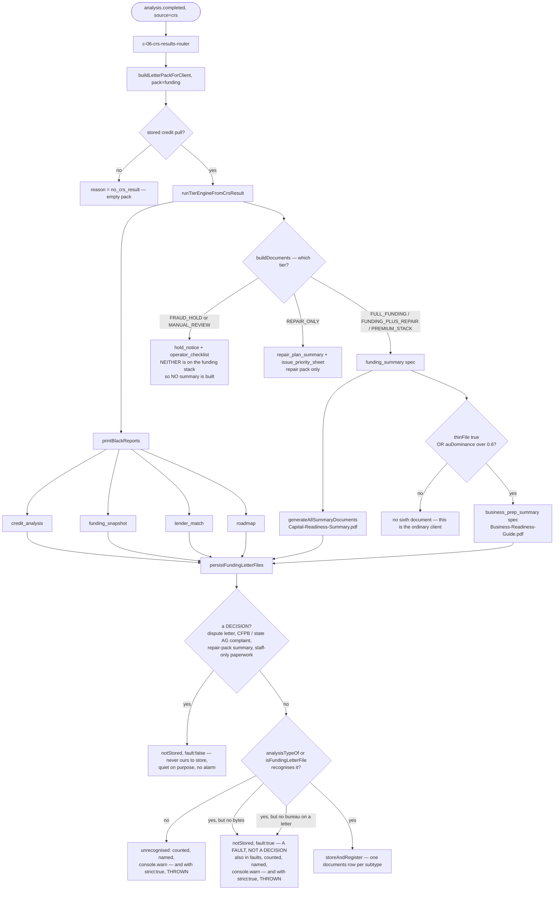
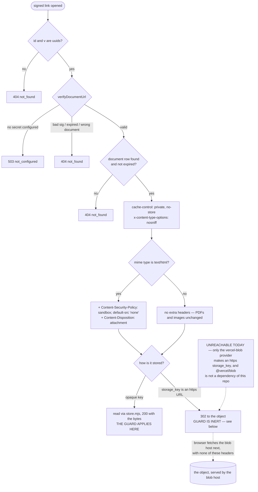

# deliverables — actual

What the code **does** today when a funding pack is built, saved, and later opened.

Hand-written, not generated: the nine pages under `npm run journeys` are produced from the
routing table, and none of this is a routing change. Traced from the code and then **run** on a
scratch Postgres on 2026-09-05. Anything below that was not watched happen says so.

Related: `docs/DELIVERABLES-AND-REPAIR-TRUTH.md` (which printer actually runs, and why).

---

## 1. Building and saving the funding pack

`analysis.completed` → workflow C-06 → `buildLetterPackForClient(db, { clientId, pack: "funding" })`
→ `persistFundingLetterFiles(...)` → rows in `documents`.

**How many ANALYSIS documents a funding pack carries is NOT a fixed number.**

* An **ordinary** funding client gets **five**.
* A **thin-file or authorized-user-dominant** client gets **six** — the extra one is the Business
  Readiness Guide.

**Five and six count the analysis documents only — they are not the client's whole row count.**
A pack can also carry per-bureau inquiry-removal and personal-info letters, and the same saver
writes each of those to `documents` too, under `FUNDING_LETTER_SUBTYPE` (one row per client, type
and bureau). It walks past Metro 2 dispute letters on purpose. So the analysis count is five or
six; the total number of rows is that plus however many funding letters the pack carried.
Every pack built for this page carried zero letters — see "Things this page does NOT claim".

Four of the analysis documents are printed by the black-report printer. The other one or two come from a different
generator, and BOTH of those were being dropped by the saver (F46). The sixth is gated by the
vendor at `vendor/underwriteiq-full/api/lite/crs/build-documents.js:162-168`: it is added only
when `consumerSignals.tradelines.thinFile` is true or `consumerSignals.tradelines.auDominance` is
over 0.6.



### The rows, named

| pack file `type` | `documents.subtype` | `documents.title` | when |
|---|---|---|---|
| `credit_analysis` | `credit_analysis_report` | Credit Analysis Report | always |
| `funding_snapshot` | `funding_snapshot` | Funding Snapshot | always |
| `lender_match` | `bank_lender_match_list` | Bank and Lender Match List | always |
| `roadmap` | `credit_optimization_roadmap` | Credit Optimization Roadmap | always |
| `funding_summary` | `funding_summary` | Capital Readiness Summary | every funding tier |
| `business_prep_summary` | `business_prep_summary` | Business Readiness Guide | thin-file or AU-dominant only |

"Always" in the first four rows and "every funding tier" in the fifth both mean **inside the
three funding tiers**. A `FRAUD_HOLD` or `MANUAL_REVIEW` client gets `hold_notice` and
`operator_checklist` instead and no summary at all — see "Things this page does NOT claim" below.
In practice C-06 never reaches the saver for those two, because `FUNDING_TIERS`
(`src/config/product-path.mjs:6`) excludes them.

The last two rows are the fix. `FUNDING_ANALYSIS_SUBTYPE` in
`src/underwrite/funding-letter-pdf.mjs` listed only the first four, so `analysisTypeOf()` returned
null for both summaries and the loop skipped them without a word. The delivery email
(`src/messaging/templates/u02-funding-delivery.html:40`) promises the Capital Readiness Summary as
item 5.

`subtype` is not constrained by the database (`src/documents/kinds.mjs` header says so
explicitly), so neither needed a migration.

### The root cause was the silence, not the missing keys

One unguarded `continue` — `if (!isLetter && !analysisType) continue;` — swallowed every file the
map did not know, with no log and no counter. That is why the same defect was found twice: fixing
the fifth left the sixth vanishing at the identical line.

Every file handed to `persistFundingLetterFiles` now lands in exactly one of three buckets, and
they always add up to the number of files in:

| bucket | meaning |
|---|---|
| `stored` | a row was written |
| `notStored` | no row was written, and the reason is on the entry. **Each entry also says whether that reason is a decision or a fault** — see the next table |
| `unrecognised` | the saver has never heard of it. Counted, named, and written to the log with `console.warn`. Passing `strict: true` makes it throw instead |

There is a fourth field, `faults`, and it is **not** a fourth bucket — it repeats the `notStored`
entries that are faults, so a caller that only wants the bad news does not have to filter. It is
never counted in the total.

### A decision and a fault are not the same thing

Round two of this fix put all six not-stored reasons under one heading — "a deliberate exclusion".
Two of them are not exclusions at all. They are a document the client should have had and did not
get. Filing a bug under "deliberate" is the same dressing-a-drop-as-a-decision that hid the fifth
and sixth documents in the first place, so the two kinds are now visibly different: every
`notStored` entry carries `fault: true` or `fault: false`, and `NOT_STORED_FAULT` in
`src/underwrite/funding-letter-pdf.mjs` is the list.

| reason | decision or fault | what the code does |
|---|---|---|
| `dispute_letter` | **decision** — a Metro 2 round letter is not on the funding stack | recorded in `notStored`, quiet |
| `escalation_complaint` | **decision** — the client files CFPB and state AG complaints | recorded in `notStored`, quiet |
| `repair_pack_summary` | **decision** — belongs to the repair pack | recorded in `notStored`, quiet |
| `internal_document` | **decision** — staff-only paperwork | recorded in `notStored`, quiet |
| `empty_file` | **FAULT** — a deliverable the saver recognised, which arrived with no bytes | `notStored` with `fault: true`, repeated in `faults`, named in a `console.warn`, and **thrown** under `strict: true` |
| `letter_missing_bureau_or_type` | **FAULT** — a real funding letter whose bureau could not be read | same as above |

### What is still quiet, said plainly

The saver no longer drops a file without saying so, with one deliberate exception and two limits
outside this module. Written out rather than rounded up to "impossible":

* **The four decisions above are silent, and that is correct.** They are in `notStored` for anyone
  who reads the return value; they get no log line because nothing went wrong.
* **In production the loud half reaches the Netlify function log and nothing else.** The only
  caller — `src/workflows/c-06-crs-results-router.mjs:123` — reads `persisted?.stored?.length` and
  throws away `notStored`, `faults` and `unrecognised`, and no caller passes `strict: true`. So a
  fault is recorded and logged, but it does not reach a screen, a counter or an alert. Wiring it
  into the workflow result is a handoff; that file is outside this change.
* **The printer upstream still has the original defect.** `collectPrinted()` in
  `src/underwrite/black-report-pdf.mjs` skips a printed file that is empty or does not start with
  `%PDF` using a bare `continue`, with no counter and no log, before the saver ever sees it. If
  that fires, the client gets three analysis documents instead of four and every number downstream
  still looks consistent. Same failure class, different file, deliberately not touched here.

So: a seventh document added to the pack tomorrow cannot vanish **inside the saver** the way these
two did. It can still vanish in the printer above it, and a fault the saver does report still has
nowhere to go but the log.

### Every refusal path, watched happen

One file of each kind the saver can refuse, handed to the **real** `persistFundingLetterFiles`
against scratch Postgres `fundhub_fixr2` (all migrations applied to an empty database) on
2026-09-05. Eight files in, eight accounted for, one row written:

| file handed in | bucket it landed in | what was recorded |
|---|---|---|
| `Capital-Readiness-Summary.pdf` (`funding_summary`) | `stored` | one `documents` row, subtype `funding_summary` |
| `ex_round1.pdf` (`dispute`) | `notStored` | `{"reason":"dispute_letter","fault":false}` — no log |
| `cfpb-complaint.pdf` (`cfpb_complaint`) | `notStored` | `{"reason":"escalation_complaint","fault":false}` — no log |
| `Optimization-Plan-Summary.pdf` (`repair_plan_summary`) | `notStored` | `{"reason":"repair_pack_summary","fault":false}` — no log |
| `operator_checklist.pdf` (`operator_checklist`) | `notStored` | `{"reason":"internal_document","fault":false}` — no log |
| `Business-Readiness-Guide.pdf`, **no bytes** | `notStored` **and** `faults` | `{"reason":"empty_file","fault":true}` — logged, and thrown under `strict` |
| `personal_info_zz.pdf`, **no bureau** | `notStored` **and** `faults` | `{"reason":"letter_missing_bureau_or_type","fault":true}` — logged, and thrown under `strict` |
| `Lender-Pitch-Deck.pdf` (`lender_pitch_deck`) | `unrecognised` | counted, named, logged, and thrown under `strict` |

The two log lines that run printed, exactly:

```
[funding-letter-pdf] 1 file(s) NOT SAVED — the saver does not recognise them: Lender-Pitch-Deck.pdf (type lender_pitch_deck)
[funding-letter-pdf] 2 file(s) NOT SAVED — recognised, but the saver could not store them: Business-Readiness-Guide.pdf (empty_file), personal_info_zz.pdf (letter_missing_bureau_or_type)
```

Two lines, not one: an unrecognised file and a recognised-but-unstorable one are different
problems and are reported separately. `stored` + `notStored` + `unrecognised` came back 8 of 8,
and `documents` held exactly `["funding_summary"]`.

The same batch with `strict: true` threw on the first fault rather than returning:

```
persistFundingLetterFiles: Business-Readiness-Guide.pdf (type business_prep_summary) was recognised but could not be stored — empty_file. This is a document the client should have had.
```

and each fault on its own also threw, so neither is hidden behind the other:

```
persistFundingLetterFiles: personal_info_zz.pdf (type personal_info) was recognised but could not be stored — letter_missing_bureau_or_type. This is a document the client should have had.
```

**MEASURED, not asserted.** Scratch Postgres `fundhub_fixr1`, 239 migrations applied to an empty
database, real `buildLetterPackForClient`, real `persistFundingLetterFiles`, both clients carrying
the repo's own `academy` simulated credit file (`scripts/sim/push-credit.mjs`, tiers
`FULL_FUNDING`). The AU-dominant client is that same file with nine of its twelve tradelines
flipped to `accountOwnershipType: "AuthorizedUser"`, giving `auDominance` 0.75:

| client | analysis files in the pack | rows in `documents` before | after |
|---|---|---|---|
| ordinary | 5 | 4 | **5** |
| authorized-user-dominant | 6 | 5 | **6** |

After the fix the AU-dominant client's six subtypes are `bank_lender_match_list`,
`business_prep_summary`, `credit_analysis_report`, `credit_optimization_roadmap`,
`funding_snapshot`, `funding_summary`, and `unrecognised` is empty for both clients.

Handed a file it does not know — a made-up `lender_pitch_deck` — the saver stored the rest, logged
`[funding-letter-pdf] 1 file(s) NOT SAVED — the saver does not recognise them:
Lender-Pitch-Deck.pdf (type lender_pitch_deck)`, and returned it in `unrecognised`. With
`strict: true` the same call threw. Both watched happen on 2026-09-05.

The standing test is `src/underwrite/funding-letter-pdf.pg.test.mjs` (both client classes) plus
`src/underwrite/funding-letter-pdf.test.mjs` (the buckets, the decision-versus-fault split, both
log lines, `strict`, and the whole-batch drop) — 39 cases in the unit file.

### Things this page does NOT claim

* **Nothing here says a real client has ever received these.** `docs/workflows/manual-walkthrough-2026-09-03.md`
  records F42: zero deliverable documents for any client, all time, on the live database. That is
  a separate defect and this change does not touch it.
* **A `MANUAL_REVIEW` client gets no Capital Readiness Summary at all**, because `buildDocuments()`
  emits `hold_notice` and `operator_checklist` for that tier and neither is on the funding stack.
  That is existing behaviour, watched happen, and not changed here.
* **The funding-letter half of the saver is not exercised by any pack here.** Every pack built for
  this page carried analysis documents and nothing else. Watched on 2026-09-05, scratch Postgres
  `fundhub_fixr2`, the real `buildLetterPackForClient` over the `academy` file (FULL_FUNDING):
  pack types came back exactly `["credit_analysis","funding_snapshot","lender_match","roadmap",
  "funding_summary"]` — no `inquiry_removal`, no `personal_info`. So the `FUNDING_LETTER_SUBTYPE`
  rows described above are read from the code, not from a run. That is pre-existing and unchanged
  by this work; it is written down because it is the reason the row counts here are analysis-only.
* **Which printer made the four is a separate question** — see
  `docs/DELIVERABLES-AND-REPAIR-TRUTH.md` §1 and the `engine` field on each row's metadata.

---

## 2. Opening a saved document — and why stored HTML is now downloaded

`GET /api/documents/<id>?v=&exp=&sig=` (`api/documents/[id].mjs`). Reached by a **prefix** branch
in `netlify/functions/api.mjs`, not by a `ROUTES` key. **Auth is the HMAC signature, not a
session** — a link in an email has to work for someone who is not signed in.



**The guard does not cover the 302 branch.** Headers set on a redirect describe the redirect
itself. The browser then makes a second, separate request to the blob host, and that response
carries whatever the blob host sends — no `Content-Security-Policy`, no `Content-Disposition`. So
an HTML document served that way would still render, on the blob host's origin.

Two things make that harmless right now, and both have to stay true:

1. That branch fires only when `storage_key` is itself an `https` URL, which only the
   `vercelBlobProvider` produces (`src/documents/store.mjs:243`).
2. `@vercel/blob` is **not a dependency of this repo** — `src/documents/store.mjs:207` says so and
   `package.json` confirms it. The provider throws on load.

If that provider is ever installed, the guard has to move onto the object: set the content type
and disposition at upload time, or stream the bytes through this route instead of redirecting.

### Why the guard exists

Contracts are stored as `text/html` (`src/contracts/send.mjs:50`, `CONTRACT_MIME`). Before this
commit the route served that content type with no `Content-Disposition`, so a stored contract
**rendered as a page on the app's own origin**. Three facts line up behind that:

1. `src/lib/render-template.mjs:46` is `return String(val);` — merge fields go into the contract
   body with no escaping, across 252 CRM fields.
2. The session token sits in `localStorage` as `fh_token`
   (`public/app/client-portal.html:2049`), readable by any same-origin script.
3. Staff open these links too (`public/app/documents.html:585`).

So one hostile string typed into a CRM field turned "open the contract" into session theft. There
is no Content-Security-Policy anywhere else in this repository.

**Only `text/html` is affected.** PDFs and images still open inline in a new tab, which is what
every screen linking here expects.

### What changes for a person, and what does not

| Path | Before | After |
|---|---|---|
| Client signs a contract at `/contract.html` | body arrives as JSON from `/api/contracts/sign` | **unchanged** — this route is not involved |
| Staff open a PDF from Documents | opens in a new tab | **unchanged** |
| Client opens a PDF from the portal Files tab | opens in a new tab | **unchanged** |
| Staff open a stored HTML contract from Documents | rendered as a page on the app origin | the browser saves the `.html` file instead |

The last row is the only behaviour change, and it is the point. Signing never used this route. It
describes the byte-streaming path, which is the only storage path this repo can actually reach —
see the 302 note above.

Standing test: `src/http/documents-html-guard.pg.test.mjs` — ten cases, run against real Postgres
and the real Netlify handler. With the two guard calls removed, three of them fail; that negative
control was run on 2026-09-05.
