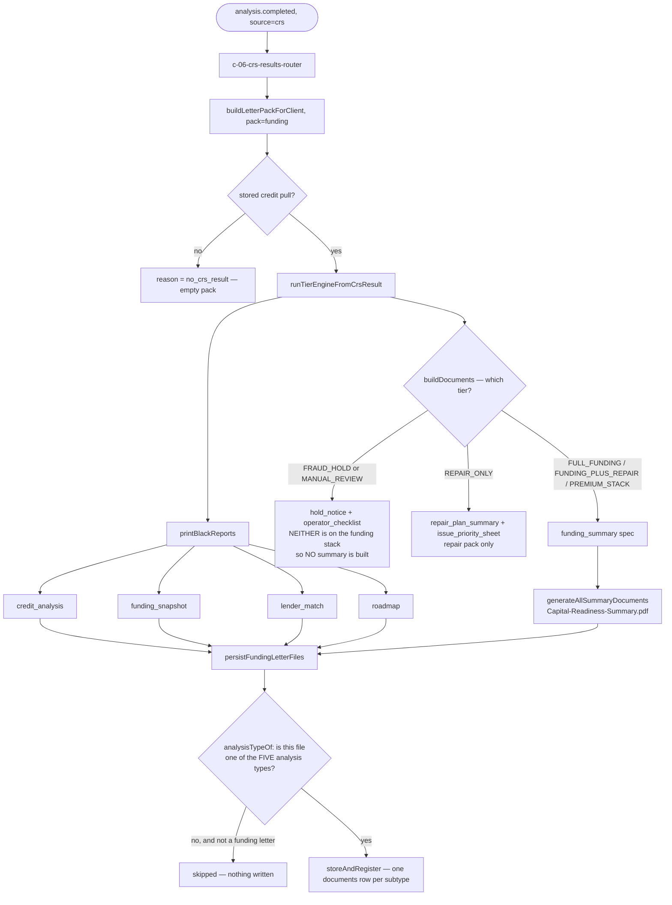
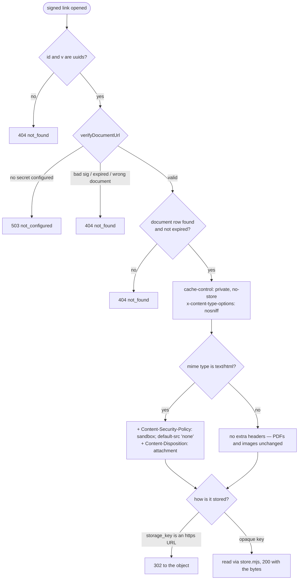

# deliverables — actual

What the code **does** today when a funding pack is built, saved, and later opened.

Hand-written, not generated: the nine pages under `npm run journeys` are produced from the
routing table, and none of this is a routing change. Traced from the code and then **run** on a
scratch Postgres on 2026-09-05. Anything below that was not watched happen says so.

Related: `docs/DELIVERABLES-AND-REPAIR-TRUTH.md` (which printer actually runs, and why).

---

## 1. Building and saving the funding pack

`analysis.completed` → workflow C-06 → `buildLetterPackForClient(db, { clientId, pack: "funding" })`
→ `persistFundingLetterFiles(...)` → rows in `documents`.

**Five analysis documents go in, and as of this commit five come out.** Four are printed by the
black-report printer. The fifth is printed by a different generator and used to be dropped by the
saver (F46).

### The five rows, named

| pack file `type` | `documents.subtype` | `documents.title` |
|---|---|---|
| `credit_analysis` | `credit_analysis_report` | Credit Analysis Report |
| `funding_snapshot` | `funding_snapshot` | Funding Snapshot |
| `lender_match` | `bank_lender_match_list` | Bank and Lender Match List |
| `roadmap` | `credit_optimization_roadmap` | Credit Optimization Roadmap |
| `funding_summary` | `funding_summary` | Capital Readiness Summary |

The last row is the fix. `FUNDING_ANALYSIS_SUBTYPE` in `src/underwrite/funding-letter-pdf.mjs`
listed only the first four, so `analysisTypeOf()` returned null for the Capital Readiness Summary
and the loop skipped it without a word. The delivery email
(`src/messaging/templates/u02-funding-delivery.html:40`) promises it as item 5.

`subtype` is not constrained by the database (`src/documents/kinds.mjs` header says so
explicitly), so the fifth needed no migration.

**MEASURED, not asserted.** Scratch Postgres, 239 migrations applied to an empty database, a
client carrying the repo's own `academy` simulated credit file (`scripts/sim/push-credit.mjs`,
tiers `FULL_FUNDING`), real `buildLetterPackForClient`, real `persistFundingLetterFiles`:

* before the change — pack carried 5 analysis files, `documents` held **4** rows
* after the change — pack carried 5 analysis files, `documents` held **5** rows, subtypes
  `bank_lender_match_list`, `credit_analysis_report`, `credit_optimization_roadmap`,
  `funding_snapshot`, `funding_summary`

The standing test is `src/underwrite/funding-letter-pdf.pg.test.mjs`.

### Things this page does NOT claim

* **Nothing here says a real client has ever received these.** `docs/workflows/manual-walkthrough-2026-09-03.md`
  records F42: zero deliverable documents for any client, all time, on the live database. That is
  a separate defect and this change does not touch it.
* **A `MANUAL_REVIEW` client gets no Capital Readiness Summary at all**, because `buildDocuments()`
  emits `hold_notice` and `operator_checklist` for that tier and neither is on the funding stack.
  That is existing behaviour, watched happen, and not changed here.
* **Which printer made the four is a separate question** — see
  `docs/DELIVERABLES-AND-REPAIR-TRUTH.md` §1 and the `engine` field on each row's metadata.

---

## 2. Opening a saved document — and why stored HTML is now downloaded

`GET /api/documents/<id>?v=&exp=&sig=` (`api/documents/[id].mjs`). Reached by a **prefix** branch
in `netlify/functions/api.mjs`, not by a `ROUTES` key. **Auth is the HMAC signature, not a
session** — a link in an email has to work for someone who is not signed in.

### Why the guard exists

Contracts are stored as `text/html` (`src/contracts/send.mjs:50`, `CONTRACT_MIME`). Before this
commit the route served that content type with no `Content-Disposition`, so a stored contract
**rendered as a page on the app's own origin**. Three facts line up behind that:

1. `src/lib/render-template.mjs:46` is `return String(val);` — merge fields go into the contract
   body with no escaping, across 252 CRM fields.
2. The session token sits in `localStorage` as `fh_token`
   (`public/app/client-portal.html:2049`), readable by any same-origin script.
3. Staff open these links too (`public/app/documents.html:585`).

So one hostile string typed into a CRM field turned "open the contract" into session theft. There
is no Content-Security-Policy anywhere else in this repository.

**Only `text/html` is affected.** PDFs and images still open inline in a new tab, which is what
every screen linking here expects.

### What changes for a person, and what does not

| Path | Before | After |
|---|---|---|
| Client signs a contract at `/contract.html` | body arrives as JSON from `/api/contracts/sign` | **unchanged** — this route is not involved |
| Staff open a PDF from Documents | opens in a new tab | **unchanged** |
| Client opens a PDF from the portal Files tab | opens in a new tab | **unchanged** |
| Staff open a stored HTML contract from Documents | rendered as a page on the app origin | the browser saves the `.html` file instead |

The last row is the only behaviour change, and it is the point. Signing never used this route.

Standing test: `src/http/documents-html-guard.pg.test.mjs` — ten cases, run against real Postgres
and the real Netlify handler. With the two guard calls removed, three of them fail; that negative
control was run on 2026-09-05.
