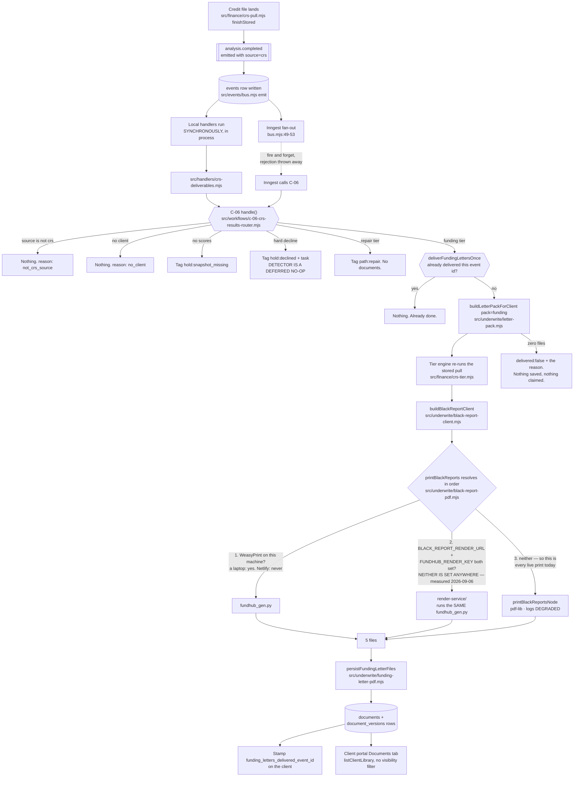
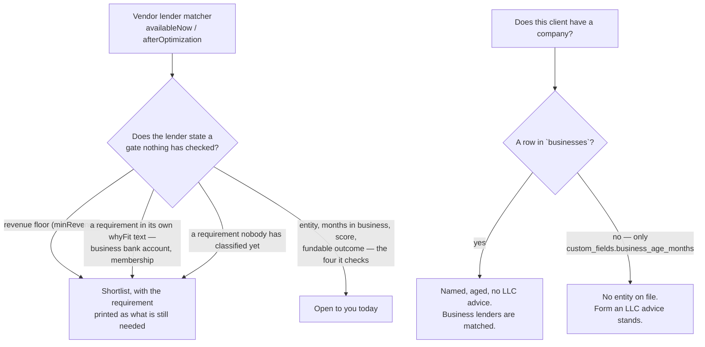
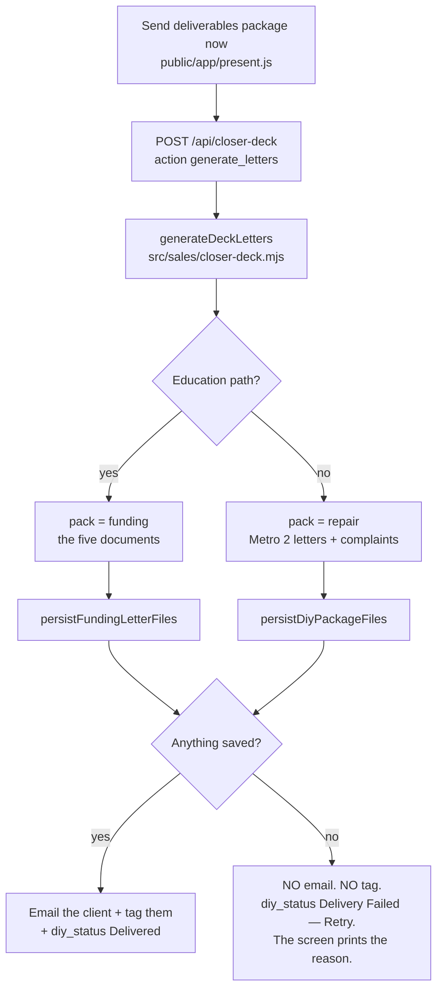

# Deliverables flow — how a credit pull becomes five documents in the portal

Generated from the code on 2026-09-04, branch `fix/r2-w10-deliverables`.
Not a spec. If you cannot trace a box to a line of code, it is marked
`UNVERIFIED`.

**COMPLIANCE REVIEW REQUIRED** (CLAUDE.md §7) — credit-repair messaging and
projected-score adjacent. Marker only.

## The states a client's deliverables move through

## The five documents

| File | documents.subtype | Built by |
|---|---|---|
| `Credit-Analysis-Report.pdf` | `credit_analysis_report` | the printer |
| `Funding-Snapshot.pdf` | `funding_snapshot` | the printer |
| `Bank-Lender-Match-List.pdf` | `bank_lender_match_list` | the printer |
| `Credit-Optimization-Roadmap.pdf` | `credit_optimization_roadmap` | the printer |
| `Capital-Readiness-Summary.pdf` | `capital_readiness_summary` | the vendor summary generator |

The fifth was built and then dropped by the saver until 2026-09-04 (F46).

### Which printer production uses — one half proven, one half NOT

Read both halves. The second one is not settled and must not be quoted as if it
were.

**PROVEN, from the code, re-read 2026-09-06.** `resolveRenderService()`
(`src/underwrite/black-report-pdf.mjs`) returns `null` unless **both**
`BLACK_REPORT_RENDER_URL` and `FUNDHUB_RENDER_KEY` are set. With it null the
remote step cannot be taken, and `printBlackReports` falls through to the pdf-lib
printer and logs `reason=render_service_not_configured`. That is a fact about
this repository and anyone can check it by opening the file.

**NOT PROVEN — what those two variables actually hold on the live site.** An
earlier version of this section printed a `netlify env:list --context production`
result as measurement. A reviewer could not reproduce it, and neither can any
agent working here: `api.netlify.com` is blocked by the network policy
(`CLAUDE.md` §11), so the CLI fails at `CONNECT` before a request is sent. The
env half is therefore **unverified**, and nothing in this repository should state
which printer production uses as though it had been measured.

**What follows from that, and it is the only thing that matters for a fix.**
Because we cannot say which printer prints a live document, **every defect must
be repaired in all three**. That is not caution; it is the direct cause of the
round-3 finding, where a defect was closed in two printers and shipped in the
third. `render-service/README.md` step 7 is the two commands that would switch
the render service on; until someone with Netlify access runs them and reports
back, the question stays open.

### THREE renderers, not two

Enumerated from the filesystem, not from memory. The earlier enumeration grepped
for one family's marker (`Total paydown to reach`) inside `src/`, which is how a
renderer outside `src/` could have been missed; this one searched `src/`,
`scripts/`, `api/`, `public/`, `vendor/`, `db/` and `render-service/` for the
paydown arithmetic itself (`* 0.1`) as well as the prose:

| Renderer | What it makes | Reached by |
|---|---|---|
| `scripts/black-reports/fundhub_gen.py` | the designed PDFs | a laptop with WeasyPrint, and `render-service/`, which copies this same file into its image (`render-service/Dockerfile:47`) and shells out to it (`render-service/wsgi.py:75`) |
| `src/underwrite/black-report-node.mjs` | the short pdf-lib PDFs | the fall-through path whenever the render service is not configured |
| `src/deliverables/*.mjs` | the same four documents as hosted WEB PAGES | not wired into the live document path yet |

**Five things that look like a fourth and are not.** Each was opened and read,
not assumed:

* `render-service/` — copies and shells out to `fundhub_gen.py`. It **is**
  printer 1, in a container.
* `vendor/underwriteiq-crs/optimization-findings.js` and its byte-identical twin
  `vendor/underwriteiq-full/api/lite/crs/optimization-findings.js` — the vendor
  **engine**, not a printer. It does take 10% of a limit (`:121`, `:146`, `:167`)
  but its per-card finding is gated on `tl.effectiveLimit > 0` (`:115`) and its
  two overall findings on `cs.utilization.pct != null`, which is null when the
  total limit is 0. It invents no $0 target.
* `src/optimize-page/roadmap.mjs` — a JSON endpoint for the public `/optimize`
  page. It passes the mapper's own `row[5]` through (`:153`) and computes no
  target of its own.
* `src/waypoints/definitions.mjs` — the Month 1 paydown checklist that arrived
  with migrations 360-363. Its target is `limitCents > 0 ? … : null` (`:235`,
  `:324`), so a limit reported as $0 produces no waypoint. Correct already.
* `docs/workflows/gold-deliverables-v5/` and `src/deliverables/fixtures/*.json` —
  captured OUTPUT and reference material. Nothing imports them at runtime.

**A defect fixed in one of the three and live in another is not fixed.** The
guards, described exactly:

* `src/deliverables/port-parity.test.mjs` and `src/deliverables/no-limit.test.mjs`
  compare the WEB PAGES to the PYTHON's own captured output character for
  character, on two client fixtures. That is **two** printers, whole documents.
* `src/deliverables/three-printer-wording.test.mjs` brings in the **third**. It
  cannot diff whole documents against the pdf-lib printer, because that printer
  draws text into a PDF and has no HTML body — so it locks the SENTENCES this
  work is about, byte for byte, in all three at once: the reason a card has no
  target, the paydown sentence, the "no 10% total" sentence, and the closing
  page's opening line. It also fails if any of eleven named hardcoded claims
  reappears in any of the three.
* `src/underwrite/output-baseline.test.mjs` pins the sha of `fundhub_gen.py` and
  the extracted text of all four pdf-lib PDFs, and
  `src/deliverables/fixtures/zero-limit-python-bodies.json` carries that same sha,
  so a change to the Python that is not recaptured
  (`python3 scripts/black-reports/recapture-fixtures.py`) fails rather than
  drifting quietly.

## Five rules that decide what these documents SAY

* **"Open to you today" means every gate the lender states is met.** The vendor
  matcher checks four things — entity, months in business, score, and a fundable
  outcome. It never reads `minRevenue`, though four of its lenders state one, and
  it never reads the requirements two more state in words: Fundbox wants a
  business bank account, Navy Federal wants membership. This product records none
  of the three, so those six are held in the shortlist with the requirement
  named. Unknown is not met, and unknown is never printed as zero. A requirement
  the classifier has not seen is treated as unverified too, so a vendor edit
  holds a lender back rather than over-promising it.
* **THE LIMIT CELL HAS THREE STATES, AND ZERO IS NOT NULL.** A credit limit is
  one of three things and each has a different honest answer:

  | The file says | Is there a 10% target? | What the client is told |
  |---|---|---|
  | a positive number | yes | "Pay CHASE from $4,500 down to $1,000" |
  | the number **$0** | no | "The credit limit reported for this card is $0" |
  | nothing at all | no | "No credit limit is reported for this card" |

  Until 2026-09-06 the code asked only *"is it null?"*, so a limit **reported as
  $0** — a known value, not a missing one — went through the arithmetic and
  produced `round(0 × 0.1) = 0`, printed as an instruction: *"Pay SECURED CARD
  from $900 down to $0."* It appeared in three of the four web pages and in all
  four bodies of the WeasyPrint printer, three lines under the same card's own
  row, which correctly printed dashes.

  The repair is **not** to route a reported zero into the missing-limit sentence.
  Telling the holder of a card whose limit **is** reported, as $0, that "no credit
  limit is reported for this card" is a second false sentence about the same
  account. The two states share the OUTCOME — no target — and not the WORDS. The
  overall sentence says *"No open card on this file reports a credit limit **above
  $0**"*, which is true of both. Locked by
  `src/deliverables/zero-limit.test.mjs` and
  `src/deliverables/three-printer-wording.test.mjs`.

* **EVERY SENTENCE IS BUILT FROM THIS CLIENT'S OWN ROWS, OR IT DOES NOT APPEAR.**
  Absence of data produces no claim — not an invented one and not a hardcoded
  one. Until 2026-09-06 the roadmap opened, for every client: *"You have a
  mortgage. You have paid-off auto loans. You have a clean TransUnion."* Rendered
  against a file with `mortgages: []`, `installments: []` and one AMEX, every
  clause was false, in a document the client pays for. Eleven such literals were
  found and each one is now derived or gone: the opening paragraph, the closing
  "two things holding you back", the Month 3 score projection ("TransUnion
  holding at 725"), "Pay down your two revolving cards", "After full repair —
  charge-offs removed, lates addressed", the authorized-user paragraph printed
  under an EMPTY table, "No business entity on file" printed for a client whose
  file names one, four of the five "what does not affect your funding" lines,
  "Those three moves alone…" printed under a list of one move, "You are fundable
  right now" / "You qualify for a personal loan right now" for a client whose
  pre-approval is nothing, and the last page of all four documents — "You have
  clean bureaus ready for funding now" — printed to a client whose every bureau
  this system had just marked DIRTY.

  A related, smaller rule: **a bare dash belongs in a table cell, never inside a
  sentence.** `llc_fee` and `score_targets` are initialised in
  `black-report-client.mjs` and never assigned anywhere in this repository, so
  the roadmap read *"…with the Secretary of State for -."* and its whole month-6
  column was four blank cells. No fee on the file, no fee clause; and the
  month-6 column now says "Set at your next pull" in all three printers.

* **A card with no reported credit limit has no paydown target, anywhere.** There
  is no 10% of a limit the file does not have, so the paydown table, the 6-month
  checklist, the fastest-wins list and the application-order rule all say the
  limit is unknown instead of naming a figure. The 6-month checklist said "down
  to under 10% of its limit" until 2026-09-06 while the table two pages earlier
  said "-".
* **A TOTAL BUILT FROM UNKNOWNS IS UNKNOWN.** The vendor engine sums
  `effectiveLimit || 0` (`derive-consumer-signals.js:186`), so a file whose open
  cards report no limit gives it a total limit of **0**, and 10% of 0 is 0.
  Until 2026-09-06 `buildBlackReportClient` took that 0 at face value, so
  `util_target_balance` was $0 and `balance - 0` was the client's WHOLE balance:
  the roadmap printed "Total paydown to reach 10% utilization: $5,200" three
  lines under the same card's row that correctly printed dashes. The mapper now
  leaves both `util_total_limit` and `util_target_balance` null, and every
  overall figure — the utilization bar, the "get total balances to $X" callout,
  the "#1 problem" verdict, the utilization penalty sentence — asks first and
  prints nothing rather than a number nobody has. Where SOME cards report a limit
  and some do not, the total is real for the ones it covers and says out loud how
  many it does not: "1 card on this file reports no limit, so nothing for it is
  in this number." Proof: `docs/workflows/w10-pack-2026-09-04/no-limit/`.
* **A company is a `businesses` row.** That is the owner's F15 rule, reused here
  rather than restated. A client whose only company fact is
  `clients.custom_fields.business_age_months` — the sim academy profile is one —
  has no entity as far as these documents are concerned and is still advised to
  form one.

## The other door: the presenter's deck

Before 2026-09-04 both branches asked for the repair pack, and the email went out
whether or not anything existed (F41).

## What is NOT in this picture

* **A hard-decline detector.** `isHardDecline` is a named no-op until CRS
  onboarding lands. The branch around it is wired end to end.
* **A projected credit score.** Nothing in this repository computes one. The
  documents print the engine's projected pre-approval instead.
* **A retry when the Inngest fan-out fails.** It still fails silently. The
  deliverables no longer depend on it; every other workflow still does.

## Gap against the intended journeys

`docs/journeys/client-intended.md` is a route-permission map. It carries no
deliverables flow, so there was nothing to reconcile and no step was invented to
match the code. No route was added, no route's principal gate moved, and
`npm run journeys` produced no diff on any of the eight pages — what changed is
what one existing endpoint's data path *does*, which that generator does not
model.
