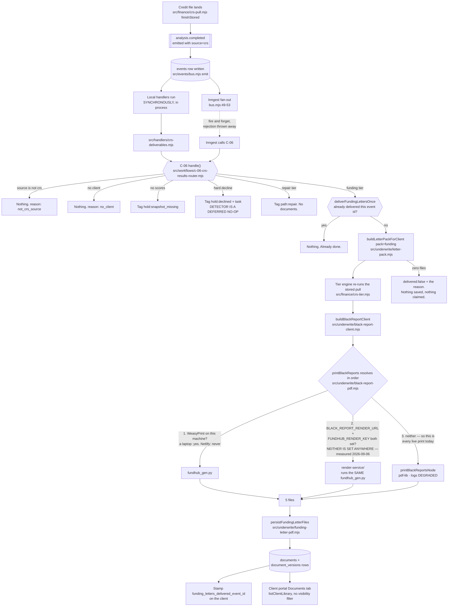
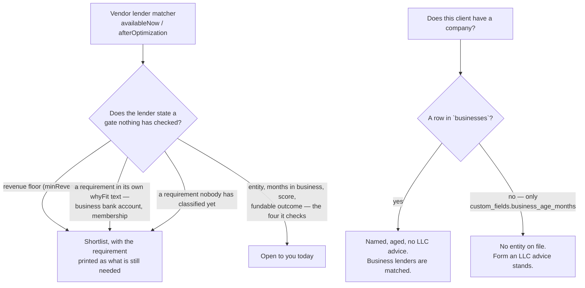
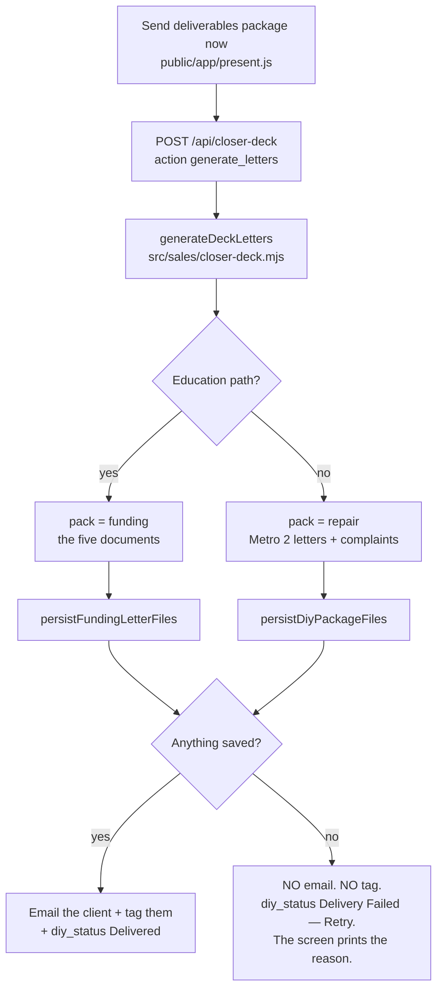

# Deliverables flow — how a credit pull becomes five documents in the portal

Generated from the code on 2026-09-04, branch `fix/r2-w10-deliverables`.
Not a spec. If you cannot trace a box to a line of code, it is marked
`UNVERIFIED`.

**COMPLIANCE REVIEW REQUIRED** (CLAUDE.md §7) — credit-repair messaging and
projected-score adjacent. Marker only.

## The states a client's deliverables move through

## The five documents

| File | documents.subtype | Built by |
|---|---|---|
| `Credit-Analysis-Report.pdf` | `credit_analysis_report` | the printer |
| `Funding-Snapshot.pdf` | `funding_snapshot` | the printer |
| `Bank-Lender-Match-List.pdf` | `bank_lender_match_list` | the printer |
| `Credit-Optimization-Roadmap.pdf` | `credit_optimization_roadmap` | the printer |
| `Capital-Readiness-Summary.pdf` | `capital_readiness_summary` | the vendor summary generator |

The fifth was built and then dropped by the saver until 2026-09-04 (F46).

### Which printer production actually uses, measured not assumed

`netlify env:list --context production --plain | cut -d= -f1` on 2026-09-06
returns 82 names. Neither `BLACK_REPORT_RENDER_URL` nor `FUNDHUB_RENDER_KEY` is
one of them, and the same is true of deploy-preview, branch-deploy and dev. So
`resolveRenderService()` returns null on Netlify, step 2 above cannot be taken,
and every live print is the pdf-lib printer with
`reason=render_service_not_configured` in the function log and `engine=pdf-lib`
on the stored document row. The designed WeasyPrint documents are not what a
client receives today. `render-service/README.md` step 7 is the two commands
that change that.

### THREE renderers, not two

Enumerated from the filesystem, not from memory —
`grep -rln "Total paydown to reach" .` excluding `node_modules` and `.git`:

| Renderer | What it makes | Reached by |
|---|---|---|
| `scripts/black-reports/fundhub_gen.py` | the designed PDFs | a laptop with WeasyPrint, and `render-service/`, which copies this same file into its image (`render-service/Dockerfile:51`) and shells out to it |
| `src/underwrite/black-report-node.mjs` | the short pdf-lib PDFs | every live print today |
| `src/deliverables/*.mjs` | the same four documents as hosted WEB PAGES | not wired into the live document path yet |

`render-service/` is **not** a fourth renderer. The two remaining hits are a
captured document (`docs/workflows/gold-deliverables-v5/compare/`) and a captured
body (`src/deliverables/fixtures/python-bodies.json`), neither of which renders
anything.

A defect fixed in one of the three and live in another is not fixed.
`src/deliverables/port-parity.test.mjs` and the no-limit half of
`src/deliverables/no-limit.test.mjs` compare the web pages to the Python's own
output character for character, and
`src/underwrite/output-baseline.test.mjs` pins the sha of the Python file, so
none of the three can move on its own without a test going red.

## Three rules that decide what these documents SAY

* **"Open to you today" means every gate the lender states is met.** The vendor
  matcher checks four things — entity, months in business, score, and a fundable
  outcome. It never reads `minRevenue`, though four of its lenders state one, and
  it never reads the requirements two more state in words: Fundbox wants a
  business bank account, Navy Federal wants membership. This product records none
  of the three, so those six are held in the shortlist with the requirement
  named. Unknown is not met, and unknown is never printed as zero. A requirement
  the classifier has not seen is treated as unverified too, so a vendor edit
  holds a lender back rather than over-promising it.
* **A card with no reported credit limit has no paydown target, anywhere.** There
  is no 10% of a limit the file does not have, so the paydown table, the 6-month
  checklist, the fastest-wins list and the application-order rule all say the
  limit is unknown instead of naming a figure. The 6-month checklist said "down
  to under 10% of its limit" until 2026-09-06 while the table two pages earlier
  said "-".
* **A TOTAL BUILT FROM UNKNOWNS IS UNKNOWN.** The vendor engine sums
  `effectiveLimit || 0` (`derive-consumer-signals.js:186`), so a file whose open
  cards report no limit gives it a total limit of **0**, and 10% of 0 is 0.
  Until 2026-09-06 `buildBlackReportClient` took that 0 at face value, so
  `util_target_balance` was $0 and `balance - 0` was the client's WHOLE balance:
  the roadmap printed "Total paydown to reach 10% utilization: $5,200" three
  lines under the same card's row that correctly printed dashes. The mapper now
  leaves both `util_total_limit` and `util_target_balance` null, and every
  overall figure — the utilization bar, the "get total balances to $X" callout,
  the "#1 problem" verdict, the utilization penalty sentence — asks first and
  prints nothing rather than a number nobody has. Where SOME cards report a limit
  and some do not, the total is real for the ones it covers and says out loud how
  many it does not: "1 card on this file reports no limit, so nothing for it is
  in this number." Proof: `docs/workflows/w10-pack-2026-09-04/no-limit/`.
* **A company is a `businesses` row.** That is the owner's F15 rule, reused here
  rather than restated. A client whose only company fact is
  `clients.custom_fields.business_age_months` — the sim academy profile is one —
  has no entity as far as these documents are concerned and is still advised to
  form one.

## The other door: the presenter's deck

Before 2026-09-04 both branches asked for the repair pack, and the email went out
whether or not anything existed (F41).

## What is NOT in this picture

* **A hard-decline detector.** `isHardDecline` is a named no-op until CRS
  onboarding lands. The branch around it is wired end to end.
* **A projected credit score.** Nothing in this repository computes one. The
  documents print the engine's projected pre-approval instead.
* **A retry when the Inngest fan-out fails.** It still fails silently. The
  deliverables no longer depend on it; every other workflow still does.

## Gap against the intended journeys

`docs/journeys/client-intended.md` is a route-permission map. It carries no
deliverables flow, so there was nothing to reconcile and no step was invented to
match the code. No route was added, no route's principal gate moved, and
`npm run journeys` produced no diff on any of the eight pages — what changed is
what one existing endpoint's data path *does*, which that generator does not
model.
