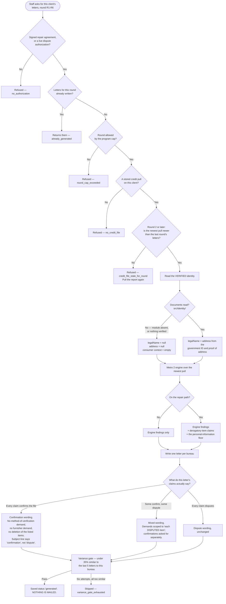

# dispute-rounds — actual

What the code **does** today when a staff member asks for a client's dispute letters.
Traced from `src/repair/analyze.mjs`, `src/metro2/**` and `src/metro2/letters/prompts.mjs`.
Not from a spec, and not from memory.

COMPLIANCE REVIEW REQUIRED — dispute logic and credit-repair messaging.

## The one picture



## Where the one name and the one address come from

`src/repair/analyze.mjs` `loadVerifiedIdentity()` loads `src/identity/` dynamically and
takes `{ legalName, address, dateOfBirth, source, verifiedAt }` from it. That module is
built from the government ID and the proof of address the client uploaded, after an agent
has read both images and confirmed the two addresses match.

Nothing else may supply it. Not `clients.first_name`, not `pii_identity.addresses[0]`, not
the letterhead's company-address fallback. A missing module, a missing export, a throw or a
malformed answer all resolve to **null**, and null means unknown:

| | With a verified identity | Without one |
|---|---|---|
| Name claim in the letter | Yes — keep this one name | **None at all** |
| Address claim | Yes — keep this one address | **None at all** |
| M2-032 name variants | Can fire | Cannot fire |
| M2-033 date of birth | Can fire | Cannot fire |
| M2-034 employment | Can fire when a source supplies employers | Cannot fire |
| A clean file on the repair path | Produces a confirmation letter | Produces nothing — `identity_not_verified` |

CHANGED 2026-09-06, last row. It used to answer `no_violations`, which the Repair desk
prints as "the credit file looks clean — nothing to dispute". On a client whose ID has not
been read that sentence is false in the way that matters: the file may be spotless or a
wreck, and what is missing is the identity read. `identity_not_verified` says so, and the
desk copy tells the Specialist to get the ID. Only clients ON the repair path get this
answer — off it there is no floor to be missing an input for, and `no_violations` is still
the honest word.

ALSO 2026-09-06: `src/repair/analyze.mjs` was looking for the identity module at three
paths that do not exist. `src/identity/verified.mjs` is where it landed, and every import
threw, so on EVERY real client the whole right-hand column above was what actually
happened — no name claim, no address claim, three engine rules dark — while the left-hand
column was what the tests showed, because every test injected the module by hand. Proved by
running it, fixed by naming the real path, and pinned by a test that uses no override.

Before 2026-09-04 the three rules in the last block could not fire **at all**, for anybody:
`src/metro2/normalize.mjs` marks every `context.consumer` field not-visible because nothing
in a credit report carries it, and `src/metro2/diy/from-crs.mjs` never overrode that. So the
only personal-information rule that ever ran was M2-031, "delete addresses older than two
reporting cycles" — age-based cleanup, not the identity-based cleanup the product sells.
`src/metro2/diy/consumer-context.mjs` is the piece that was missing.

## One name claim per bureau, never two

M2-032 (`src/metro2/checks/personal-info.mjs`) and the floor's own name claim
(`src/metro2/diy/personal-info-floor.mjs`) say the same thing. Where M2-032 fires for a
bureau, the floor's name claim stands down for that bureau —
`mergePersonalInfoClaims()`. The address and inquiry halves are untouched: M2-031 is an
age rule about former addresses and asserts something different.

## The six rounds

| Round | Document | Bureau-letter prose |
|---|---|---|
| R1 | First dispute | Own pool — 30-day reinvestigation |
| R2 | Method-of-verification demand | Own pool — MOV + furnisher contacts |
| R3 | Final notice | Own pool — 15-day deletion demand |
| R4 | CFPB complaint (separate document) | Own pool, **R3's authority** |
| R5 | State AG complaint (separate document) | Own pool, **R3's authority** |
| R6 | Final notice reissued | Own pool, **R3's authority** |

`promptPoolRound()` still answers "which of the three letter SHAPES is this" and still says
R4, R5 and R6 are all final notices — `src/underwrite/prior-outcome.mjs` and
`src/repair/round-plan.mjs` read that answer and it has not moved. What is new is
`prosePoolRound()`, which answers the narrower question of which six openings and six
closings the writer draws from.

**Why they needed their own words.** Until 2026-09-04 R4, R5 and R6 returned R3's pool
outright, so a Round 4 letter was a Round 3 letter word for word, and the variance gate
refused it. Measured on origin/main, real Postgres, the production sim seed, a repair
client with a damaged file, rounds run in order:

```
R1 -> 5 letters   R2 -> 3 letters   R3 -> 3 letters
R4 -> 0 letters   R5 -> 0 letters   R6 -> 0 letters
```

Every bureau `variance_gate_exhausted`. The ladder stopped at three, silently, for every
client and every file shape. After: **R1 through R6 all write three bureau letters**, for a
spotless file, a clean file and a damaged file alike.

## Gaps between this and the intended journey

* No `-intended.md` file describes the dispute rounds. This page therefore reports what the
  code does and invents no target for it.
* `src/identity/` does not exist in this branch. Every path above that depends on it is
  written, guarded and tested against a stand-in; the live behaviour today is the
  "without one" column of the table above.
* **Still not fixed.** A letter carrying nothing but Metro 2 claims — no
  personal-information claims at all, which is what a client with no verified identity and
  no unmatched inquiries gets — loses Round 5 or Round 6 to the variance gate about half
  the time. Measured 2026-09-04: 169 of 180 rounds written across ten clients and three
  claim shapes, with all eleven losses in that one shape. Pinned in
  `src/metro2/letters/letter-honesty.test.mjs`.
* **Still not fixed.** Stored letters carry no date line: `src/repair/analyze.mjs` passes
  neither `date` nor `undated` to the writer, so `buildLetterText` prints an empty first
  line. Pre-existing on `origin/main` and out of this lane's scope.
