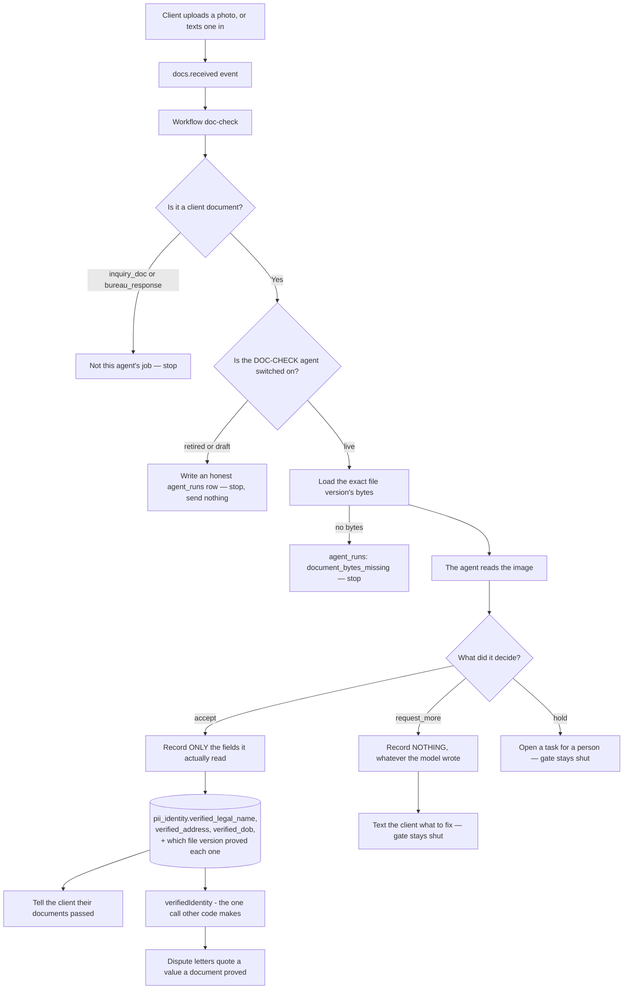

<!-- Hand-authored from the code in src/handlers/doc-check.mjs and
     src/identity/verified.mjs, 2026-09-04. Traced line by line, not from a spec. -->

# The identity chain — from a photo of an ID to the name on a dispute letter

## The problem this closes

The client photographs their government ID and a utility bill. The DOC-CHECK
agent reads both images and decides whether the two addresses match. It is the
only thing in the whole system that ever sees those pictures.

Until 2026-09-04 it never said what it read. Its answer was only accept /
request_more / hold. So the dispute letters had nothing verified to quote and
fell back to two values nobody had ever checked against a document:

* `clients.first_name` + `clients.last_name`, typed by a closer during a sales
  call, which has never carried a middle name.
* `pii_identity.addresses[0]`, the first item of a list nothing validates. That
  is how a letter once told a credit bureau a client's **business** address was
  their home address.

The agent now returns the name, the address and the date of birth it read, and
those land on the client with the exact file version they came from.

## The states a record moves through



## The rules the code enforces

| Rule | Where |
|---|---|
| Only an **accept** records anything. A document the agent refused has proved nothing, however much of it the model managed to read. | `routeDocCheckOutcome`, `src/handlers/doc-check.mjs` |
| A field the agent did not report is **NULL**. Never blank, never zero, never a value borrowed from the client record. | `recordVerifiedIdentity`, `src/identity/verified.mjs` |
| A word standing in for a missing value — "N/A", "none", "not legible" — reads as NULL, not as a name. | `cleanString`, same file |
| A date of birth is stored only when it is unambiguous. `02-04-85` could be 4 February or 2 April, so it stays NULL. | `normalizeDateOfBirth`, same file |
| A new upload adds what it proved and does not erase what an earlier one proved. A licence gives the name and birthday; a utility bill gives the current address. | the upsert's `COALESCE`, same file |
| Every field carries the document **version** that proved it, so the claim can be re-checked later. | `verified_field_sources` |
| `verifiedIdentity()` returns nulls for a client nothing has proved. A null is never a reason to fall back to the closer-typed name. | `verifiedIdentity`, same file |

## The one function everything else calls

```
import { verifiedIdentity } from "../identity/verified.mjs";

const id = await verifiedIdentity(db, { orgId, clientId });
// { legalName, address, dateOfBirth, source, verifiedAt, fieldSources }
// every field null until a document proved it
```

## Still open

Nothing consumes `verifiedIdentity()` yet. The dispute-letter builders still
read `clients.first_name` and `pii_identity.addresses[0]`. Swapping them over is
a separate change in files this one does not own.
