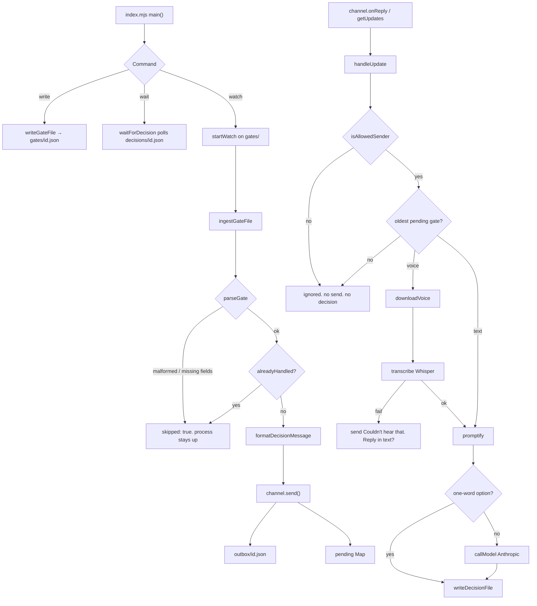

# gate-relay — actual

What the code does today. Traced from `scripts/gate-relay/`, not from the spec.

## Entry

- Process: `node scripts/gate-relay/index.mjs` (npm script `gate-relay`)
- Loads `.env` only when started as the main file, via `scripts/load-env.mjs`
- Commands: `watch` (default), `write`, `wait`

## Files on disk

All under `.fundhub-relay/` (gitignored):

| Path | Writer | Reader |
|---|---|---|
| `gates/<id>.json` | a skill, or `write` | `ingestGateFile` |
| `outbox/<id>.json` | `markSent` after a successful send | `alreadyHandled` — blocks a second push |
| `decisions/<id>.json` | `handleUpdate` after a good reply | `wait` / `readDecisionFile` |
| `telegram-offset` | watch loop | next `getUpdates` offset |

The relay does not write anything under `src/`, `public/`, `api/`, or `netlify/`.

## Channel

- `createChannel()` in `scripts/gate-relay/channel.mjs`
- Default kind: `telegram` (`GATE_RELAY_CHANNEL` can select `sms`)
- Telegram: `sendMessage`, `getUpdates` (long poll), `getFile` for voice notes
- SMS / Twilio: `createSmsChannel()` — `send` and `onReply` throw "not wired"
- Sender check: `isAllowedSender` compares `message.from.id` to `TELEGRAM_USER_ID` as strings

## Clean-up

- `scripts/gate-relay/promptify.mjs`
- One-word match against `options` skips the model (`lightPass`)
- Otherwise `callModel` from `src/agents/model.mjs` (existing Anthropic helper)
- Voice: OpenAI Whisper at `https://api.openai.com/v1/audio/transcriptions`
- Whisper failure: Telegram text `Couldn't hear that. Reply in text?` (`COPY.transcribeFail`). No decision file.

## Proven live (2026-08-17)

- Gate `live-prove-1` → Telegram message at 11:01 → voice note → Whisper raw `Go` → decision `GO` written at 11:02. Evidence: `docs/workflows/build-evidence/gate-relay/live-prove-1-decision.json`.

## Still stubbed

- SMS: stub only, by design.
