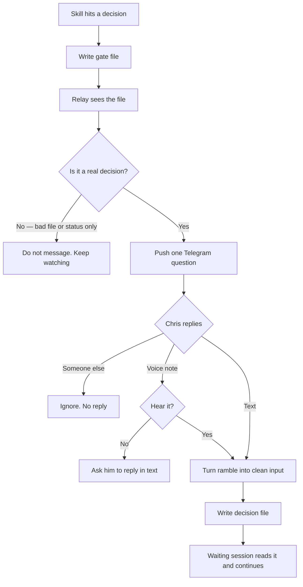

# gate-relay — intended

What should happen when the build machine needs a decision from Chris and he is not at the IDE.

This is a Mac messenger, not a Fundhub screen. It never edits app code. It never talks to clients. It never keeps a chat history.

Builder wrote this file. Chris approving it is the signature that it is true.

## In one picture

## Who this is for

Chris only. Every inbound Telegram message is checked against his Telegram user id. Anyone else is ignored. No reply. No log of what they said.

## The message rule

Every message is a decision, never a status update.

- Ends in a question he can answer in one word
- Plain English. No jargon. No file paths. No agent names
- If it does not need a decision, it does not send

Good: "Plan ready — affiliate dashboard, 1 role, 4 files. Reply GO or QUESTIONS."
Bad: "Agent 3 completed subtask 7 of 12."

If he gets more than a handful of messages in one build, the rule is being broken.

## Observable ground truth — each step

### 1. A skill needs a decision

**Should:** The skill writes `.fundhub-relay/gates/<id>.json` with `question`, `options`, `context`, and `session`. Then it waits on `.fundhub-relay/decisions/<id>.json`.

**How you know:** The gate file is on disk. The waiting command is `node scripts/gate-relay/index.mjs wait <id>`.

### 2. The relay sees the file

**Should:** The watcher reads the file. A bad file does not crash it and does not text Chris. A file that was already sent is not sent again.

**How you know:** A garbage file in `gates/` leaves the process running. Telegram stays quiet.

### 3. Telegram gets one decision-shaped message

**Should:** Chris's phone shows the question and the one-word choices. `context` and `session` stay on disk — they are not in the text.

**How you know:** You can answer with one word from the lock screen.

### 4. Chris replies — text or voice

**Should:** Text goes through a light clean-up (one word like GO is used as-is). A voice note is downloaded, turned into words, then cleaned the same way. Raw ramble is not what the waiting agent sees.

**How you know:** The decision file has `raw` (what he said), `promptified` (the clean version), `answer` (the one-word choice), and `timestamp`.

### 5. Voice fails out loud, not in silence

**Should:** If the voice note cannot be heard, Telegram asks "Couldn't hear that. Reply in text?" The decision file is not written. The gate stays open.

**How you know:** That exact sentence arrives. You can still answer in text.

### 6. Unknown sender

**Should:** A message from anyone who is not Chris is ignored. No Telegram reply. No decision file.

**How you know:** Only his user id in `TELEGRAM_USER_ID` can close a gate.

### 7. The waiting session continues

**Should:** `wait` prints the decision JSON and exits. The skill proceeds. The relay does not edit any app file.

**How you know:** `git status` has no app-code change from the relay process. Only the gitignored decision file appeared.

## Channel swap — Twilio later (do not lose this)

Today the phone channel is **Telegram**. The eventual preferred channel is **SMS via Twilio**. Twilio is not working right now, so it is not wired.

The relay talks to the phone through one adapter with two jobs:

- `send(message)` — push a decision to Chris
- `onReply(handler)` — take his reply

Telegram implements both. SMS is a stub that throws "not wired".

When Twilio works: implement those two functions on the SMS adapter. Do not rewrite the watcher, the clean-up step, or the gate files. Do not plug this into the client texting code (`src/messaging/providers/twilio.mjs`). That texts clients. This texts Chris.

## Secrets

Bot token, chat id, and user id live in `.env`. Never committed. Never logged.

Voice transcripts live in `.fundhub-relay/decisions/` which is gitignored, so spoken words do not land in git.

## Explicitly not this

- A chat assistant or a personality
- Saved conversation history
- A third-party agent framework
- Write access to app code, payments, GHL, live client data, or secrets
- Scheduling / cron
- SMS until Twilio is working
