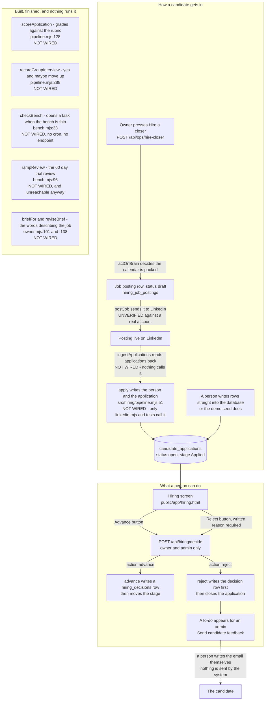

# hiring — actual

> **Traced by hand from the code, not generated by `npm run journeys`.**
> That generator only builds the eight role-reachability pages listed in
> [README.md](./README.md); hiring is not one of them, so this file will not be
> overwritten and will not be kept current for you. It describes the code as it sat
> on disk at **16:30 on 2026-09-05**, on top of commit `91508b71`. That timestamp is
> load-bearing — other work sessions were writing hiring code into this same checkout
> while this page was being traced. See
> [What is landing right now](#what-is-landing-right-now).
>
> **There is no `hiring-intended.md`.** Nobody has written down what hiring is
> supposed to do, so there is nothing to compare this against. Everything below is
> what the code does. Where the code and its own comments disagree, the code wins and
> the disagreement is listed as a finding.

The short version: **the hiring system can look at candidates and it can decide about
them. It cannot find them, talk to them, book them, or score them.** A person has to
put every candidate in by hand, and every single move through the funnel is a person
pressing a button.

The state diagram on its own is [hiring-flow.md](./hiring-flow.md).

## What is landing right now

**Read this before you trust the findings at the bottom.** While this page was being
written, other sessions were adding hiring code to this same checkout. These files were
on disk, not yet committed, at 16:30 on 2026-09-05:

| File on disk | What it is plainly aimed at | Which finding below it changes |
|---|---|---|
| `api/hiring/apply.mjs` (routed as `hiring/apply`) and `src/hiring/apply-public.mjs` | A public careers door: strangers can list the open roles and send one application | Findings **5** and **10** — this is the first live caller of `apply()`, and it reads the role brief |
| `src/hiring/outreach.mjs` and `src/workflows/hiring-outreach-cadence.mjs` | Contacting candidates on a schedule | Finding **1** |
| `src/hiring/booking.mjs` and `db/migrations/296_hiring_booking.sql` | Booking interviews | Finding **2** |
| `src/workflows/hiring-bench-sweeper.mjs` | Putting the bench monitor on a timer | Finding **7** |

**I did not read, run or verify any of them.** They were being edited as I looked, so
describing their behaviour here would be documenting a moving target. They are listed
so that a finding below which says "nothing does this" is read as *nothing did this at
16:30 on 2026-09-05*, not as a claim about tomorrow. **Whoever lands that work owns
re-tracing this page.**

One knock-on worth naming: adding the `hiring/apply` route took the platform from 217
routes to 218, which makes the eight generated journey pages and `README.md` stale.
`node --test scripts/journeys/generate.test.mjs` fails for that reason and not because
of anything on this page. Running `npm run journeys` would rewrite those eight files
mid-landing, so it was deliberately not run here.

## The whole thing in one picture

Solid arrows are things running code does. **Dashed arrows are code that exists and
nothing calls.** Boxes marked `NOT WIRED` are finished functions with no caller
outside a test file.



## Who can do what

| Surface | What it is | Who gets in |
|---|---|---|
| `GET /api/hiring/candidates` | The board — every application, filtered by stage | `owner`, `admin` (`ROLE_SETS.HIRING`) |
| `GET /api/hiring/application?id=` | One candidate's full record: answers, every score, interviews, every decision | `owner`, `admin` |
| `GET /api/hiring/decisions` | The decision log — who decided what, and whether a person decided it | `owner`, `admin` |
| `GET /api/hiring/funnel` | Counts by stage and by where the candidate came from | `owner`, `admin` |
| `GET /api/hiring/bench` | How many warm candidates each role has against its target | `owner`, `admin` |
| `GET /api/hiring/postings` | Job adverts, without the description or the external id | `owner`, `admin` |
| **`POST /api/hiring/decide`** | **The only write.** Advance or reject | `owner`, `admin`, gate written out in full at `api/hiring/decide.mjs:44` |
| `POST /api/ops/hire-closer` | Puts a closer advert on LinkedIn when the calendar is packed | `owner`, `admin` |

All eight are in the hardcoded `ROUTES` map in `netlify/functions/api.mjs`, so they
answer in production. A handler missing from that map answers `404`, which is the trap
`CLAUDE.md` §12 names. The six read endpoints answer `405` to anything but a `GET`.

**Who decided is never a request field.** `api/hiring/decide.mjs:33` refuses a body
that carries `decided_by`, `decided_by_staff_id` or `org_id` with a `400`. The
deciding person comes off the signed-in session and nowhere else.

## The rule that holds: no candidate is ever rejected by software

This one is real, and it is enforced in four separate places rather than promised in a
comment:

1. `reject()` throws without a staff id and throws without a written reason —
   `src/hiring/pipeline.mjs:216` and `:222`.
2. The endpoint refuses `action: reject` with no reason — `api/hiring/decide.mjs:80`.
3. The database refuses a `reject` decision row with no human and no reason —
   `hiring_decisions_human_ck`, `051_hiring.sql:529`.
4. The database refuses to close the application at all unless a decision row already
   exists naming a human — `trg_application_terminal`, `051_hiring.sql:567`.

The grader is walled off from this on purpose. `grade()` returns advice strings, and
`recommendationIsAdvisory()` at `src/hiring/grading.mjs:244` throws if anyone ever
tries to make one of those strings mean "no". Protected characteristics are stripped
before storage, not merely ignored — `scoreable()` at `grading.mjs:87`.

## What actually runs today, in order

1. **A candidate appears.** Somebody writes rows into `candidates` and
   `candidate_applications` by hand, or the demo seed does
   (`src/demo/seed-ui-coverage.mjs:203`). There is no application form anywhere in
   this repository, and no endpoint that accepts one.
2. **An owner or admin opens the hiring screen** and reads the application.
3. **They press Advance,** picking the next stage from a dropdown. The dropdown only
   moves forward and stops at Hired.
4. **Or they press Reject** and type a reason. A to-do lands in the admin queue saying
   to send the candidate feedback. **A person writes that email. The system sends
   nothing.**
5. Every advance and every rejection writes a permanent row in `hiring_decisions`.
   Those rows and the score rows cannot be deleted — `hiring_no_delete()`,
   `051_hiring.sql:422`.

That is the entire live path.

## Findings — what is missing, in plain words

These are gaps between what the code contains and what a working hiring process needs.
None of them is drawn in the diagram as if it exists.

**1. Nobody is ever contacted.** *(Being addressed right now — see
[What is landing right now](#what-is-landing-right-now).)* No email, no text, no calendar invite reaches a
candidate at any point. `candidate_notified_at` is a column two endpoints read and
**nothing ever writes**. A rejected candidate gets a to-do about them in a staff queue
and nothing else.

**2. No interview is ever booked.** *(Being addressed right now.)* The only `INSERT` into `hiring_interviews` in the
whole repository is in `src/hiring/hiring.pg.test.mjs:340`. The group-interview logic
(`recordGroupInterview`) is written, tested and never called by anything that runs.

**3. Nothing is ever scored.** `apply()` says in its own comment that it scores the
application against the active rubric. It does not — there is no call to `grade()` or
`scoreApplication()` in it. **Measured on a scratch database on 2026-09-05: `apply()`
wrote zero score rows.** And `scoreApplication()` itself has no caller outside tests.
So the rubrics, the bands, the flags and the whole audit apparatus have never produced
a single row in normal use.

**4. Three of the five rubric stages have no rubric.** `hiring_rubrics` allows five
stage keys (`051_hiring.sql:318`) and `051` seeds only two of them: `applied` and
`group_interview`. `screening`, `one_on_one` and `mock_call` are permitted with nothing
behind them, so scoring at any of those three throws `no active rubric for stage`. A
1:1 interview — the stage the bench is counted from — cannot be scored at all.

**5. `apply()` — the whole inbound path — has no live caller.** *(Being addressed
right now: a public `hiring/apply` route was added to the route map while this page was
being written.)* It is reached only from
`src/hiring/linkedin.mjs:175` (`ingestApplications`, which nothing calls) and from
tests. So the redelivery guard, the protected-field stripping and the find-or-create
person logic are all correct and all dormant.

**6. Hired is a dead end, and it takes the 60-day trial with it.** Moving an
application to `hired` sets its status to `hired`; `advance()` then refuses every later
move because the application is no longer `open`. **Measured on a scratch database on
2026-09-05:** advancing applied → screening → group interview → 1:1 → offer → hired all
succeeded, then onboarding, ramp and performing were each refused with
`advance: application is hired, not open`. The screen already knows and stops its
dropdown at Hired (`public/app/hiring.html:2213`). The consequence: `rampReview()` looks
for open applications sitting in `ramp`, and no application can ever be there, so the
60-day trial review can never fire for anyone.

**7. Nothing is on a timer.** *(Being addressed right now for the bench.)* `checkBench()` and `rampReview()` are complete, tested
functions with no cron entry in `src/workflows/index.mjs` and no endpoint. The
"always-on recruiting" the design is built around is not on. `GET /api/hiring/bench`
shows the shortfall on a screen; it does not open the task that makes anyone act.

**8. The new routing rule is only half connected.** Migration 294 and
`src/hiring/owner.mjs` resolve who owns a hiring req — a named person, then the
standing rule (`owner_role`), then the owner. Only `checkBench()` uses it. The two
to-dos created in `src/hiring/pipeline.mjs` (candidate feedback at `:271`, group
interview "no" at `:315`) and the one in `rampReview()` at `bench.mjs:116` still
hardcode `assigneeRole: "admin"`. Same work, two different destinations.

**9. `hiring_manager_staff_id` is still written by nothing.** Four places read it. No
code path sets it. Every bench alert therefore routes to a role queue with no
individual name on it, which `checkBench()` honestly reports as `unrouted: true`.

**10. The job briefs are empty and there is no way to fill one in.** *(A reader is
landing right now; the writing path and the text itself are still absent.)* `role_brief`,
`briefFor()` and `reviseBrief()` all exist. No endpoint calls them and no screen shows
them. Absence noted, not filled: **no brief text has been written for any role, and I
have not invented one.**

**11. Scorecards and pay have structure but no numbers.** `052_config_defaults.sql`
gave the closer and setter roles a scorecard shape and a comp shape in which **every
target and every figure is `null`**, with a note in the row saying the real documents
were not available. `v_hiring_config_gaps` reports these. **Absence noted, not filled:
no targets, no base, no commission percentage and no OTE exist for any role, and I have
not invented any.** An offer cannot be generated until a human supplies them.

**12. The bias-audit tables are unused.** `053_eeo_selfid.sql` builds voluntary
self-identification with a token so the answers can never be joined back to a person.
**No code anywhere reads or writes any of those tables.** The survey is never sent, so
the demographic side of an adverse-impact review has no data in it.

**13. Three states exist that nothing enters.** `withdrawn` (a stage, a status value
and a `withdraw` decision type), and the decision types `offer_accepted`,
`offer_declined` and `hold`. `api/hiring/decisions.mjs:27` offers all of them as
filters. Nothing writes any of them.

**14. `advance()` will move an application backwards.** It accepts any forward-stage
key with no check that the new stage is later than the current one, so an offer can be
sent back to screening through the endpoint. The screen never offers it, but the
endpoint allows it.

## Marked `UNVERIFIED`

* **The LinkedIn advert actually posting.** `postJob()` builds and sends a request, but
  `051_hiring.sql:575` says the payload shapes have never been checked against a real
  Talent Solutions account, and `postCloserLinkedIn()` returns `not_configured`
  whenever no connection row exists. I could not verify from the code that a real
  advert has ever gone up, only that the code path is complete.
* **Whether the hiring screen is reachable from the live navigation for an admin.** I
  read the screen and its calls; I did not sign in and click.


---

## Addendum — the public apply door landed (2026-09-05, careers lane)

Appended rather than woven in, so the trace above stays a record of what was true at
16:30 and this stays a record of what changed after it. **The page above is otherwise
accurate; only the two items named here moved.**

`api/hiring/apply.mjs`, `src/hiring/apply-public.mjs` and `public/careers.html` are now
on disk, routed, and proved against a real Postgres (36 tests, 36 pass, 0 skipped) and
through the real Netlify handler on a local server.

**Finding 5 is now closed.** `apply()` has a live caller. The path is:

```
Stranger on /careers.html
  → GET  /api/hiring/apply        lists open roles (key, name, role_brief) — no auth
  → POST /api/hiring/apply        one application — no auth
  → src/hiring/apply-public.mjs   validate, cap, throttle, drop bots, refuse
                                  protected characteristics
  → src/hiring/pipeline.mjs apply()
  → candidates + candidate_applications, stage `applied`, status `open`
  → STOPS.
```

So the diagram's `NOT WIRED - only linkedin.mjs and tests call it` note on `APPLYFN` is
out of date; everything else in that diagram still holds.

**Finding 10 is partly addressed and mostly not.** The careers page reads
`hiring_roles.role_brief` and renders it. Every brief is still empty, so what the page
actually shows under each job title is "No written description yet." That is the honest
render of an empty column, not a fix for it.

**Findings 1, 2, 3 and 7 are untouched by this lane.** Nothing here contacts a
candidate, books an interview, produces a score, or puts anything on a timer. An
application arrives and sits in `applied` until a person opens the hiring board — there
is no task and no message, deliberately, because wiring one was outside this lane.

`npm run journeys` HAS now been run: the eight generated pages and `README.md` are
regenerated at 218 routes and `scripts/journeys/generate.test.mjs` is green again.

Full write-up, including the four gaps this lane found and could not close without
inventing something: `docs/workflows/careers-lane-2026-09-05.md`.
