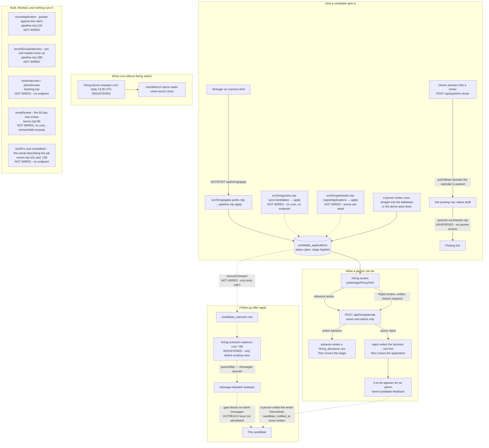

# hiring — actual

> **Traced by hand from the code, not generated by `npm run journeys`.**
> That generator only builds the eight role-reachability pages listed in
> [README.md](./README.md); hiring is not one of them, so this file will not be
> overwritten and will not be kept current for you. It describes the code as it sat
> on disk at **18:55 on 2026-09-05**, on top of commit `bcba67a2`.
>
> **There is no `hiring-intended.md`.** Nobody has written down what hiring is
> supposed to do, so there is nothing to compare this against. Everything below is
> what the code does. Where the code and its own comments disagree, the code wins and
> the disagreement is listed as a finding.

The short version: **a stranger can apply, the bench monitor runs on a clock, and a
person can advance or reject on the hiring board.** Outreach, scoring, interview
booking, Zoho sync, and most of the post-hire funnel are built as modules but not
connected to anything that runs in normal use.

The state diagram on its own is [hiring-flow.md](./hiring-flow.md).

## The whole thing in one picture

Solid arrows are things running code does. **Dashed arrows are code that exists and
nothing calls.** Boxes marked `NOT WIRED` are finished functions with no caller
outside a test file.

## Who can do what

| Surface | What it is | Who gets in |
|---|---|---|
| `GET /api/hiring/apply` | Open roles list (key, name, brief) | **No auth** — public careers door |
| `POST /api/hiring/apply` | One application → `apply()`, stage `applied` | **No auth** — public careers door |
| `GET /api/hiring/candidates` | The board — every application, filtered by stage | `owner`, `admin` (`ROLE_SETS.HIRING`) |
| `GET /api/hiring/application?id=` | One candidate's full record: answers, every score, interviews, every decision | `owner`, `admin` |
| `GET /api/hiring/decisions` | The decision log — who decided what, and whether a person decided it | `owner`, `admin` |
| `GET /api/hiring/funnel` | Counts by stage and by where the candidate came from | `owner`, `admin` |
| `GET /api/hiring/bench` | How many warm candidates each role has against its target | `owner`, `admin` |
| `GET /api/hiring/postings` | Job adverts, without the description or the external id | `owner`, `admin` |
| **`POST /api/hiring/decide`** | **The only staff write.** Advance or reject | `owner`, `admin`, gate written out in full at `api/hiring/decide.mjs:44` |
| `POST /api/ops/hire-closer` | Packed-calendar task + LinkedIn closer job via `linkedin.mjs postJob` | `owner`, `admin` |

All nine hiring routes are in the hardcoded `ROUTES` map in `netlify/functions/api.mjs`.
The six read endpoints answer `405` to anything but a `GET`.

**Who decided is never a request field.** `api/hiring/decide.mjs:33` refuses a body
that carries `decided_by`, `decided_by_staff_id` or `org_id` with a `400`. The
deciding person comes off the signed-in session and nowhere else.

## The rule that holds: no candidate is ever rejected by software

This one is real, and it is enforced in four separate places rather than promised in a
comment:

1. `reject()` throws without a staff id and throws without a written reason —
   `src/hiring/pipeline.mjs:216` and `:222`.
2. The endpoint refuses `action: reject` with no reason — `api/hiring/decide.mjs:80`.
3. The database refuses a `reject` decision row with no human and no reason —
   `hiring_decisions_human_ck`, `051_hiring.sql:529`.
4. The database refuses to close the application at all unless a decision row already
   exists naming a human — `trg_application_terminal`, `051_hiring.sql:567`.

The grader is walled off from this on purpose. `grade()` returns advice strings, and
`recommendationIsAdvisory()` at `src/hiring/grading.mjs:244` throws if anyone ever
tries to make one of those strings mean "no". Protected characteristics are stripped
before storage, not merely ignored — `scoreable()` at `grading.mjs:87`.

## What actually runs today, in order

1. **A candidate appears.** Through `POST /api/hiring/apply` (public careers form),
   by hand into the database, through the demo seed, or — when wired — through
   `src/hiring/zoho.mjs syncCandidates`. Nothing scores them and nothing advances them.
2. **The bench sweeper runs daily** (`src/workflows/hiring-bench-sweeper.mjs`, cron
   `30 13 * * *`). It calls `checkBench()` per org and opens a task when a role is
   below its bench target. It contacts no candidate and posts no job.
3. **The outreach sweeper runs every 30 minutes**
   (`src/workflows/hiring-outreach-cadence.mjs`). It drains `candidate_outreach` rows
   that are due. **No production path creates those rows** — see finding 1.
4. **An owner or admin opens the hiring screen** and reads the application.
5. **They press Advance,** picking the next stage from a dropdown. The dropdown only
   moves forward and stops at Hired.
6. **Or they press Reject** and type a reason. A to-do lands in the admin queue saying
   to send the candidate feedback. **A person writes that email. `candidate_notified_at`
   is never written by any code path.**
7. Every advance and every rejection writes a permanent row in `hiring_decisions`.
   Those rows and the score rows cannot be deleted — `hiring_no_delete()`,
   `051_hiring.sql:422`.

That is the entire live path.

## Findings — what is missing, in plain words

These are gaps between what the code contains and what a working hiring process needs.
None of them is drawn in the diagram as if it exists.

**1. Outreach is built but not started.** `src/hiring/outreach.mjs` and
`src/workflows/hiring-outreach-cadence.mjs` are registered and tested. **`ensureOutreach()`
is called only from `src/hiring/outreach.pg.test.mjs`** — neither `apply-public.mjs`,
`pipeline.mjs apply()`, nor `zoho.mjs ingestOne()` starts a cadence. So the sweeper runs
but has nothing to drain for a new applicant. Even when a row exists, **`src/messaging/gate.mjs`
blocks messages with no `client_id` unless the template key is on
`PARTNER_WELCOME_KEYS` / `PARTNER_WELCOME_SMS_KEYS**, and the eight
`EMAIL-CANDIDATE-OUTREACH-*` / `SMS-CANDIDATE-OUTREACH-*` keys are not on those lists.
`recordCandidateReply()` exists but **nothing calls it** — inbound replies are filed
against `clients` rows in `src/handlers/comms.mjs` and dropped otherwise. Every role's
`interview_booking_url` is empty, so `queueStep()` sends nothing and files a task.

**2. Interview booking has no door.** `src/hiring/booking.mjs` (`bookInterview`,
`joinInterview`, `listOpenInterviews`, `hostConflicts`) is complete and tested.
**There is no `api/hiring/*` route for it** and `public/app/hiring.html` does not call
it. The only `INSERT INTO hiring_interviews` outside tests is inside `booking.mjs`
itself. `recordGroupInterview()` is likewise test-only.

**3. Nothing is ever scored.** `apply()`'s header says it scores against the active
rubric. It does not — there is no call to `grade()` or `scoreApplication()` in it.
**Measured on a scratch database on 2026-09-05: `apply()` wrote zero score rows.**
`scoreApplication()` has no caller outside tests.

**4. Three of the five rubric stages have no rubric.** `hiring_rubrics` allows five
stage keys (`051_hiring.sql:318`) and `051` seeds only two: `applied` and
`group_interview`. `screening`, `one_on_one` and `mock_call` are permitted with nothing
behind them, so scoring at any of those three throws `no active rubric for stage`.

**5. CLOSED — `apply()` has a live caller.** `public/careers.html` →
`GET/POST /api/hiring/apply` → `src/hiring/apply-public.mjs` → `pipeline.mjs apply()`.
Applications land in `applied`, status `open`, with `answers = '{}'`.

**6. Hired is a dead end, and it takes the 60-day trial with it.** Moving to `hired`
sets status to `hired`; `advance()` then refuses every later move because the
application is no longer `open`. The screen stops its dropdown at Hired
(`public/app/hiring.html:2213`). `rampReview()` reads open applications in `ramp` and
no application can ever be there.

**7. PARTIALLY CLOSED — one timer, not two.** `checkBench()` is on a clock via
`hiring-bench-sweeper.mjs` (daily 13:30 UTC, registered in `src/workflows/index.mjs`).
**`rampReview()` has no cron entry and no endpoint.**

**8. Routing is half connected.** Migration 294 and `src/hiring/owner.mjs` resolve who
owns a hiring req. `checkBench()` and outreach's `askForBookingLink()` use
`assigneeFor()`. The to-dos in `src/hiring/pipeline.mjs` (candidate feedback at `:271`,
group interview "no" at `:315`) and `rampReview()` at `bench.mjs:116` still hardcode
`assigneeRole: "admin"`.

**9. `hiring_manager_staff_id` is still written by nothing.** Four places read it. No
code path sets it. Bench alerts and booking's `resolveHost()` therefore route to a role
queue with no individual name.

**10. Job briefs are empty and there is no HTTP way to fill one in.** `role_brief`,
`briefFor()` and `reviseBrief()` exist. **`reviseBrief()` is reachable only from tests**
(`src/hiring/owner.pg.test.mjs`, `src/hiring/zoho.pg.test.mjs`). The careers page reads
`hiring_roles.role_brief` and renders "No written description yet" for every role.
`src/hiring/zoho.mjs postJob()` refuses to post when the brief is empty.

**11. Scorecards and pay have structure but no numbers.** `052_config_defaults.sql`
seeded closer and setter scorecard and comp shapes with **every target and figure `null`**.
`v_hiring_config_gaps` reports these. **Absence noted, not filled.**

**12. The bias-audit tables are unused.** `053_eeo_selfid.sql` builds voluntary
self-identification with a token so answers cannot be joined back to a person.
**No code anywhere reads or writes any of those tables.**

**13. Three states exist that nothing enters.** `withdrawn`, and the decision types
`offer_accepted`, `offer_declined` and `hold`. `api/hiring/decisions.mjs:27` offers all
of them as filters. Nothing writes any of them.

**14. `advance()` will move an application backwards.** It accepts any forward-stage
key with no check that the new stage is later than the current one. The screen never
offers it, but the endpoint allows it.

**15. Zoho Recruit is built but not scheduled.** `src/hiring/zoho.mjs` (`postJob`,
`closeJob`, `syncCandidates`) is tested against Postgres. **It is not registered in
`src/workflows/index.mjs` and has no API route.** Owner-set 2026-09-05: Zoho is the
LinkedIn pipeline; `src/hiring/linkedin.mjs` is dead code kept as a record.

**16. Nobody is told an application arrived.** `apply()` opens the row and stops. No
task, no message. `src/hiring/apply-public.mjs` documents this as a deliberate gap.

**17. Per-IP apply burst limit is in-memory only.** `src/hiring/apply-public.mjs`
`checkIpRate()` resets on cold start and is not shared between function instances.
Per-email and org-wide limits are durable.

## Marked `UNVERIFIED`

* **Whether outreach messages actually leave the building once the gate is fixed.**
  The cadence queues `messages` rows; `src/messaging/dispatch.mjs` sends them under
  `messaging_settings.outbound_enabled`. I traced the queue path; I did not send a live
  candidate message.
* **Whether the hiring screen is reachable from the live navigation for an admin.**
  `public/app/sidebar.fragment.html` lists `hiring.html` under Admin.
  `src/http/app-nav-reachability.test.mjs` pins it to owner/admin. I did not sign in
  and click.
* **LinkedIn posting through `POST /api/ops/hire-closer`.** `postCloserLinkedIn()`
  returns `not_configured` when no connection row exists. Owner-set: LinkedIn API access
  is closed; this path is legacy.

## Related journey pages

* [hiring-flow.md](./hiring-flow.md) — state diagram only
* [candidate-outreach-flow.md](./candidate-outreach-flow.md) — outreach cadence detail
  (generated 2026-09-05; note that `ensureOutreach` is still unwired from apply)

---

## Addendum — Google Calendar free/busy (2026-09-05, post-PR-336 Lane 1)

`src/hiring/calendar-freebusy.mjs` reads the host's Google Workspace primary calendar
via `POST calendar/v3/freeBusy` (scope `calendar.readonly`, service account +
domain-wide delegation, outbound through `transmit()` INTERNAL fence).

`bookInterview()` in `src/hiring/booking.mjs` now refuses a 1:1 booking unless **both**
hold:

1. No overlapping row in `hiring_interviews` for that host (unchanged), and
2. Google Calendar returns no busy block for `[scheduled_for, scheduled_for + duration)`.

**Fail closed:** if credentials are missing, the token exchange fails, or freeBusy is
unreadable → `CALENDAR_UNREADABLE` (503) and nothing is written. If the calendar shows
busy → `HOST_BUSY` (409) with `detail.calendarBusy`.

**Still blind:** client sales calls in `bookings` (no staff column), working hours/time
off tables, and events on calendars outside the host's Google primary calendar.

**Live dependency:** Workspace Admin must add `https://www.googleapis.com/auth/calendar.readonly`
to the existing Company Brain service account client ID (domain-wide delegation). Env:
`GOOGLE_DRIVE_SERVICE_ACCOUNT_JSON` (already on Netlify).

`joinInterview()` is unchanged — it joins a session the host already committed to in
`hiring_interviews`, so no free/busy check there.

Manifest: `docs/workflows/hiring-post-336-2026-09-05.md`.

---

## Addendum — Google Calendar free/busy (2026-09-05, post-PR-336 Lane 1)

`src/hiring/calendar-freebusy.mjs` reads the host's Google Workspace primary calendar
via `POST calendar/v3/freeBusy` (scope `calendar.readonly`, service account +
domain-wide delegation, outbound through `transmit()` INTERNAL fence).

`bookInterview()` in `src/hiring/booking.mjs` now refuses a 1:1 booking unless **both**
the `hiring_interviews` exclusion constraint would allow it **and** the host's calendar
has no busy block in that window. **Fail closed:** if the calendar cannot be read
(`CALENDAR_UNREADABLE`, HTTP 503), nothing is written. Joining a pre-scheduled group
session (`joinInterview`) still does not free/busy check — the host already committed.

**Finding 2 is partly addressed:** booking logic exists and now respects real calendar
busy time, but there is still no HTTP endpoint or screen caller for `bookInterview`
outside tests.

**Workspace admin step (live prove):** add
`https://www.googleapis.com/auth/calendar.readonly` to the existing Company Brain
service account in Domain-wide delegation. Manifest:
`docs/workflows/hiring-post-336-2026-09-05.md`.
