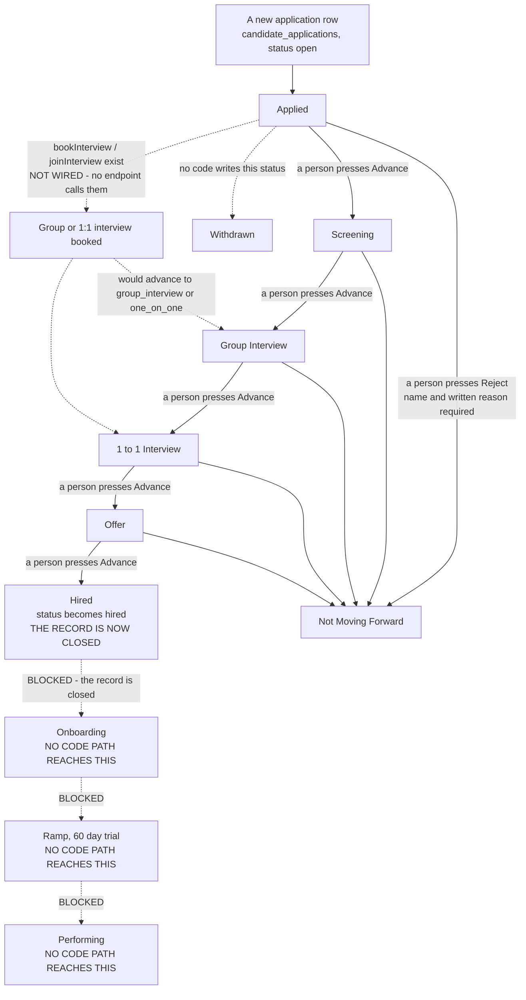

# hiring-flow — the states a candidate moves through

The one-page state diagram `CLAUDE.md` §3a step 4 asks for. It answers one question:
**what states does an application sit in, and what event moves it out of each one.**

Traced by hand from the code at **18:55 on 2026-09-05**, on top of commit `bcba67a2`,
from
`db/migrations/051_hiring.sql`, `db/migrations/294_hiring_role_brief_and_owner.sql`,
`db/migrations/295_candidate_outreach.sql`, `db/migrations/296_hiring_booking.sql`,
`src/hiring/pipeline.mjs`, `src/hiring/bench.mjs`, `src/hiring/booking.mjs`,
`src/hiring/outreach.mjs`, `api/hiring/decide.mjs` and `public/app/hiring.html`.
Nothing here is drawn from a spec. Items marked `UNVERIFIED` on the longer page are
not repeated here.

The longer page — who can reach what, what is wired, what is not — is
[hiring-actual.md](./hiring-actual.md).

## In one picture

Solid arrows are moves the code can actually make today. **Dashed arrows do not happen**
— either the move is refused outright, or the database allows it and no code performs it.
Each dashed arrow says which.

`BLOCKED` means the move is refused, not merely unused: `advance()` turns down any
application whose status is not `open`, and the move into `hired` sets the status to
`hired`. Measured on a scratch database on 2026-09-05 — see
[hiring-actual.md](./hiring-actual.md).

## The states, and the event that moves each one

| State | Where it lives | What fires the move out of it |
|---|---|---|
| **Applied** | `candidate_applications.stage_id` → the `applied` row in `pipeline_stages` | An owner or admin presses **Advance** on the hiring screen. That is `POST /api/hiring/decide` with `action: advance`, handled by `api/hiring/decide.mjs:62`, which calls `advance()` at `src/hiring/pipeline.mjs:168`. A stranger may also arrive here through `POST /api/hiring/apply` → `src/hiring/apply-public.mjs` → `apply()` — that path does not advance the stage. |
| **Screening** | same column, `screening` stage | Same event. Nothing screens automatically; no rubric is seeded for this stage, so nothing can be scored here either. |
| **Group Interview** | same column, `group_interview` stage | Same event. `recordGroupInterview()` at `src/hiring/pipeline.mjs:288` would move a yes or a maybe here on its own, but **nothing calls it** outside `src/hiring/hiring.pg.test.mjs`. `bookInterview()` / `joinInterview()` in `src/hiring/booking.mjs` would advance here when `kind = group`, but **no endpoint or screen calls them**. |
| **1 to 1 Interview** | same column, `one_on_one` stage | Same event. This stage and `offer` are the two the bench is counted from — `v_hiring_bench`, `051_hiring.sql:687`. `bookInterview()` / `joinInterview()` would advance here when `kind = one_on_one`, but **nothing calls them** outside tests. |
| **Offer** | same column, `offer` stage | Same event. Moving here writes a `hiring_decisions` row with `decision = 'offer'`, and the database requires a named human on it — `hiring_decisions_offer_ck`, `051_hiring.sql:533`. |
| **Hired** | same column, `hired` stage, **and** `candidate_applications.status = 'hired'` | **Nothing.** This is the end of the line. `advance()` refuses any application that is not `open` (`pipeline.mjs:180`) and this move set the status to `hired` (`pipeline.mjs:199`). The screen knows and stops its dropdown here (`public/app/hiring.html:2213`). |
| **Onboarding / Ramp / Performing** | seeded stages 6, 7 and 8 in `pipeline_stages` | Unreachable. No code path puts an application in them. `rampReview()` (`src/hiring/bench.mjs:96`) reads the `ramp` stage and therefore never finds anybody. |
| **Not Moving Forward** | `status = 'rejected'`, stage `rejected` | Terminal. Reached only by a person pressing **Reject** with a written reason. `reject()` at `pipeline.mjs:213` throws without a staff id and throws without a reason; the database refuses the row too (`hiring_decisions_human_ck`, `051:529`) and refuses the status change unless a decision row naming a human already exists (`trg_application_terminal`, `051:567`). |
| **Withdrawn** | `status = 'withdrawn'`, stage `withdrawn` | Never entered. The stage, the status value and the `withdraw` decision type all exist; no code writes any of them. |

## Two things the picture is telling you

1. **Every stage move is still a person pressing a button.** There is no timer, no score
   threshold, and no rule that moves anyone through the funnel. The bench sweeper and
   outreach cadence run on clocks, but neither advances an application — see the
   findings in [hiring-actual.md](./hiring-actual.md).
2. **The funnel really stops at Hired.** The last three stages were seeded from the
   source documents and nothing was ever built to reach them. The 60-day trial review
   the code contains cannot run.
