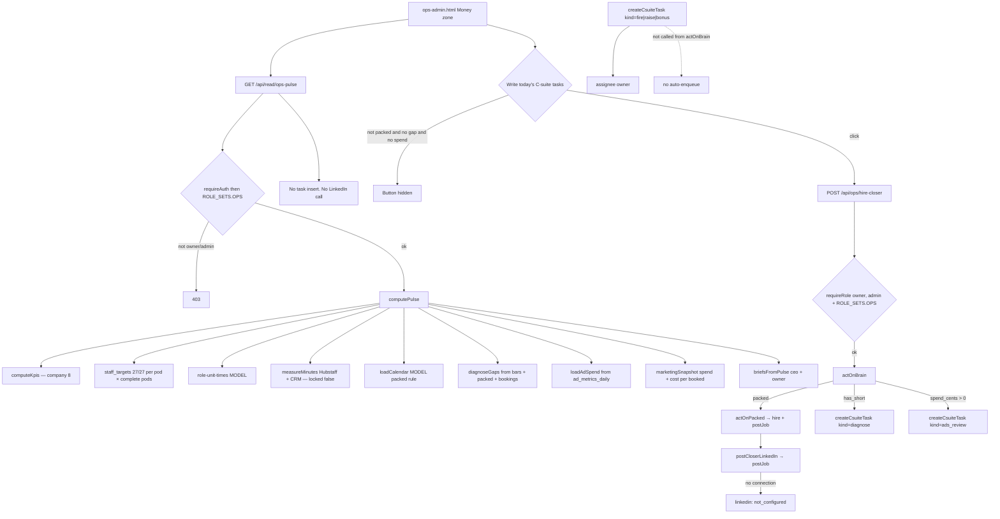

# ops-pulse — actual

What the code does today. Traced from `src/ops/`, `api/read/ops-pulse.mjs`, `api/ops/hire-closer.mjs`, and `public/app/ops-admin.html`. Not from the spec.

## Entry

- Screen: `public/app/ops-admin.html` section `#ops-pulse` on the Money zone
- Read: `GET /api/read/ops-pulse?period=today|7d|30d|qtd`
- Write: `POST /api/ops/hire-closer` — empty JSON body. `packed`, `org_id`, and `staff_id` on the body are refused
- Data layer: `FHData.opsPulse(period)`, `FHData.hireCloser()`
- Gate: owner and admin (`ROLE_SETS.OPS`). Job-applicant PII stays on HIRING reads, not this pulse

## Pulse (read only)

`src/ops/pulse.mjs` `computePulse`:

- Reuses `computeKpis` from `src/dashboard/kpis.mjs`
- Bars: role-level `staff_targets` monthly closer deposits and funding advisor files. Actuals from `call_outcomes` deposits and `clients.funded` this UTC month. Missing stays missing
- Clocks: `ROLE_UNITS` / `CAPACITY` with `source: "MODEL"`
- Measured minutes: `measureMinutes` → `measured_minutes`. Hubstaff `tracked_seconds` plus CRM timestamps. `n` floor 20. `locked: false` always. Does not overwrite MODEL
- Calendar: `loadCalendar` in `src/ops/hire-closer.mjs`. `beltJammed` is `calendar.packed`
- Gaps: `diagnoseGaps` — closer vs 27 deposits per pod, funding advisor vs 27 files per pod, uneven seats, bookings as a count only. Never hire a setter
- Hire profile: `hireProfileFromGaps`. Closer keeps the LinkedIn `postJob` path. Funding advisor is text only
- Ads: `loadAdSpend` reads `ad_metrics_daily`. Status `ok` or `not_configured` / `missing`. Does not write campaigns
- Marketing: `marketing` — spend, `cost_per_booked` (need 10 booked calls), `special_ad_category` fail-closed. Live Marketing API write unverified. Does not buy ads
- Fire / raise / bonus objects are always `{ auto_enqueue: false, rule_locked: false, note: "no … rule yet" }`
- Does not call `createCsuiteTask`, `postJob`, `inviteStaff`, or `suspendStaff`

## Packed rule (MODEL)

`src/ops/hire-closer.mjs`:

- `slots_per_closer_day = floor(480 / 45) = 10`
- Window: next 5 UTC weekdays
- Count: open closer-role tasks with `due_at` in that window
- Closers: `staff.role = 'closer'` and `status` active
- `due_at` count 0 → not packed
- closer count 0 and any slot → packed
- else packed when count >= closer_count × 10 × 5 × 0.9

## Write (`actOnBrain`)

`POST /api/ops/hire-closer` calls `actOnBrain`:

1. If packed: `actOnPacked` → `createCsuiteTask({ kind: "hire" })` + `postCloserLinkedIn` → existing `src/hiring/linkedin.mjs` `postJob`. One closer LinkedIn draft per month marker. Does not call `closeJob`
2. If `gaps.has_short`: `createCsuiteTask({ kind: "diagnose" })` → assignee `owner`, body `diagnose:gaps:YYYY-MM`
3. If ads status is `ok` and `spend_cents > 0`: `createCsuiteTask({ kind: "ads_review" })` → assignee `owner`, body `ads-review:YYYY-MM`

If there is no active row in `hiring_channel_connections` for LinkedIn, status is `not_configured`.

Never auto-enqueues `fire`, `raise`, or `bonus`. Never `suspendStaff`. Never writes `/api/campaigns/write`.

## Task shapes (not auto)

`src/ops/csuite-tasks.mjs`:

- Monthly: `hire`, `diagnose`, `ads_review`
- Keyed (`dedupeKey` required): `fire`, `raise`, `bonus` — assignee `owner`

## Briefs

`src/ops/briefs.mjs`: CEO text starts “What needs doing today?” Owner text starts “What will be done.” Missing numbers are named missing. No invented fire trigger, raise percent, or bonus dollar.

## UNVERIFIED

- Live LinkedIn Talent Solutions payload against a real company account (same note already on `src/hiring/linkedin.mjs`)
- Live Playwright cannot score the new route until this branch is deployed
