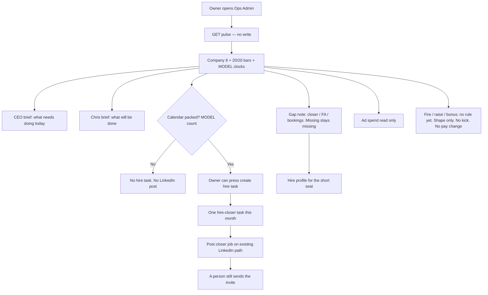

# ops-pulse — intended

What should happen when the owner (or admin) opens today’s Ops pulse.

Builder wrote this file. Chris approving it is the signature that it is true.

## In one picture

## Who this is for

Owner and admin. The AI COO has no login. A closer, setter, or funding advisor does not see this read.

## What the pulse is

One numbers object:

1. The eight company numbers already on the dashboard (reuse the same KPI engine).
2. The closer 20 deposits / month bar and the funding advisor 20 funded files / month bar from `staff_targets`.
3. Unit clocks from the MODEL time table. Label them MODEL. Do not claim a live stopwatch.

If a number is not there, say it is missing. Do not invent it.

## Two voices

- **CEO:** “What needs doing today?”
- **Chris / owner:** “What will be done.”

Same numbers. Two voices. No invented advice.

## Hire

When the closer calendar is packed (MODEL rule: 45-minute close call, 8-hour day, next 5 weekdays, 90% full), the owner can create **one** hire-closer task for that month and post the LinkedIn closer job on the **existing** hiring path.

When a seat is short vs the 20/20 bars, the pulse writes a short hire profile (closer vs funding advisor) and one look-at-gaps task this month.

- Do not hire setters. The setter is AI.
- Marking hired does not create a login. Invite is how a person gets in.
- Do not post every time the page loads. Read and write stay separate.
- Do not spam: one task body and one job marker per month.
- Funding advisor profile is text only. Do not invent a second job-post path.

## Gaps

From the belt + 20/20 + company 8 bookings only. Say which seat is short. If a number is missing, say missing. Bookings have no monthly bar. Never “hire a setter.”

## Ads

Read spend from the existing daily ads table. Show it on the pulse. If a real spend number is greater than zero, one look-at-ads task this month. Do not buy, pause, or scale ads.

## Fire, raise, bonus

The brain does not fire anyone. It does not revoke a login. It does not change pay.

There is **no locked fire / raise / bonus rule** yet. Do not invent “under 20 deposits → fire,” a raise percent, or a bonus dollar. Briefs say “no … rule yet.” Task shapes exist for C-suite (`owner`) only. They are not created automatically.

## Observable ground truth

### 1. Owner opens Ops Admin

**Should:** The Money zone shows Company KPIs and a Today’s briefs card.

**How you know:** You can read two blocks of plain text: CEO and Chris.

### 2. The pulse read does not write

**Should:** Loading the page does not create a task and does not post to LinkedIn.

**How you know:** `GET /api/read/ops-pulse` is the only call until someone presses the hire button.

### 3. Packed calendar

**Should:** Packed uses closer tasks with a due time in the next 5 weekdays vs MODEL capacity. No due times → not packed.

**How you know:** The card says MODEL. It never says “live stopwatch.”

### 4. Write-tasks button

**Should:** The button shows when packed, or a seat is short, or a real spend number is on file. Pressing it writes the matching C-suite tasks. If LinkedIn is not connected, the status is “not configured.”

**How you know:** A second press in the same month does not make a second hire, diagnose, or ads-review task.

### 5. Fire / raise / bonus

**Should:** The card says there is no fire, raise, or bonus rule yet. Nobody is kicked out. Pay does not move.

**How you know:** No staff row changes status. No revoke call. No `staff.comp` write.

## What this is not

- Hermes
- Auto fire / raise / bonus
- Buying, pausing, or scaling ads
- A second LinkedIn job-post path
