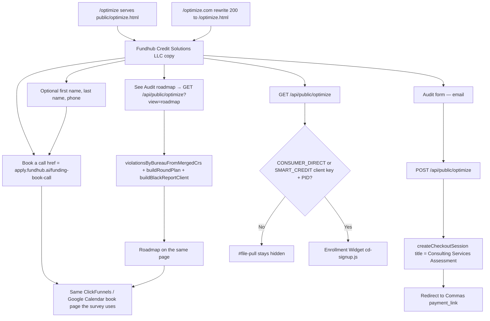

# optimize — actual

Traced from `public/optimize.html`, `api/public/optimize.mjs`, and `netlify.toml`. Not from the spec.

## Traced paths

- `public/optimize.html` — static page. Entity is Fundhub Credit Solutions LLC. Book a call is an `<a>` to `https://apply.fundhub.ai/funding-book-call`. Audit posts to `/api/public/optimize`. Page copy says Audit, not credit repair.
- `api/public/optimize.mjs` — GET returns `smartCredit: null` unless both a client key and a PID exist. GET `?view=roadmap` runs `src/optimize-page/roadmap.mjs` (metro2 + repair round-plan + UnderwriteIQ client map) on the stored sample file. POST ignores any client product title and always mints **Consulting Services Assessment** via `createCheckoutSession`. Never POST `/public-api/products/create`.
- `netlify.toml` — `/optimize.com` rewrite (status 200) to `/optimize.html`. Pretty URL `/optimize` is the file itself.
- No Identity IQ. No CRS. No xyl.in. Smart Credit widget is dark until env names exist.

## Not in this code

Smart Credit live enroll (no client key / PID in env). Identity IQ. CRS. A new Commas product. Blake ingest. Twilio from Gmail.
