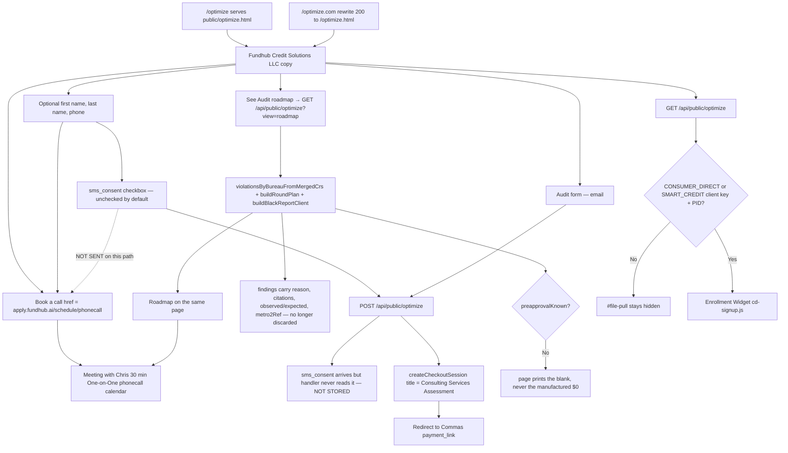

# optimize — actual

Traced from `public/optimize.html`, `api/public/optimize.mjs`, and `netlify.toml`. Not from the spec.

## Traced paths

- `public/optimize.html` — static page, built on the **funnel landing look** taken from
  `clickfunnels-fragments/04a-book-top.html` + `04b-book-bottom.html` (the booking pair): fixed
  44px grid backdrop, centred logo, spectrum eyebrow, two-part headline, 900px wrap, soft floating
  cards (`1px #E4E4E7`, 14px radius, `0 18px 44px` shadow), an FCRA trust marquee, and a
  disclaimer footer with the ghost wordmark. Form internals (`.field` / `.consent` / `.disclaim`)
  stay as the homepage survey builds them.
  Entity is Fundhub Credit Solutions LLC. Book a call is an `<a>` to
  `https://apply.fundhub.ai/schedule/phonecall`. Audit posts to `/api/public/optimize`.
  Page copy says Audit, not credit repair.
- **SMS consent** — an `sms_consent` checkbox sits under the phone field with the shipped consent
  wording (msg & data rates, frequency varies, STOP, HELP, Privacy, Terms). Its value is put on the
  Audit POST body. **Two gaps, both traced, neither invented:**
  (1) `api/public/optimize.mjs` never reads `sms_consent`, so a ticked box is **not recorded
  anywhere**; (2) the Book a call path is a plain `location.assign` and sends **nothing at all** —
  not the name, not the phone, not the consent. Consent is therefore captured in the browser and
  dropped on both paths. Recording it needs a handler change that is not in this commit.
- `api/public/optimize.mjs` — GET returns `smartCredit: null` unless both a client key and a PID exist. GET `?view=roadmap` runs `src/optimize-page/roadmap.mjs` (metro2 + repair round-plan + UnderwriteIQ client map) on the stored sample file. POST ignores any client product title and always mints **Consulting Services Assessment** via `createCheckoutSession`. Never POST `/public-api/products/create`.
- `netlify.toml` — `/optimize.com` rewrite (status 200) to `/optimize.html`. Pretty URL `/optimize` is the file itself.
- No Identity IQ. No CRS. No xyl.in. Smart Credit widget is dark until env names exist.

## Not in this code

Smart Credit live enroll (no client key / PID in env). Identity IQ. CRS. A new Commas product. Blake ingest. Twilio from Gmail.
