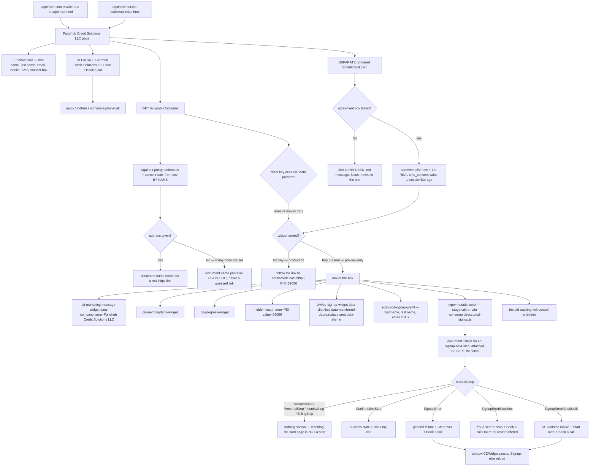

# optimize — actual

> **2026-08-28 — the ConsumerDirect SmartCredit&reg; sign-up box is now built into the page,
> and ConsumerDirect's twelve-item compliance wording is on the page around it.** The page is
> still ONE form. The Audit section, the Pay-for-Audit checkout and the roadmap render stay
> removed by owner decision; the roadmap API is untouched and still works, nothing draws it here.
> The FCRA rights ticker was removed — ConsumerDirect's checklist bans wording that suggests
> credit repair, and disputing / deletion / 30-day-investigation lines do exactly that.

Traced from `public/optimize.html`, `api/public/optimize.mjs`, and `netlify.toml`. Not from the spec.

## In one picture

## Traced paths

### The page splits into two clearly separate cards

`public/optimize.html` now renders three blocks, not one. The Fundhub details card
(first/last/email/mobile/SMS consent) is unchanged. Below it sits `section.scbox` — a
black-bordered card of its own, with its own rule and heading, carrying every SmartCredit&reg;
word on the page. Below that sits `section.fhbox` — Fundhub's own service, its own card, its
own rule, with the two what-happens-next steps and the Book-a-call control. ConsumerDirect
compliance item 7 (no bundling) and item 2 (their branding separate from ours) are the reason
for the split. Nothing merges the two cards.

**BRANDING UNVERIFIED.** ConsumerDirect attached branding guidelines to the partner email and
nobody in this repo has read them. So the SmartCredit card carries **no SmartCredit logo, no
SmartCredit colours and no "powered by" lockup** — words only, black on white. That is the
conservative choice, not a stated ConsumerDirect rule. The one blue control inside that card is
a Fundhub button going to a Fundhub call, which reads as "this bit is ours".

### The twelve compliance items, and where each one lives in the code

| # | Where it is now | State |
|---|---|---|
| 1 | Netlify SSL. Nothing in this repo. | passes, untouched |
| 2 | `section.scbox`, its own border/rule/heading; the "not a Fundhub product" sentence | on the page |
| 3 | `SmartCredit&reg;` throughout, plus a footer attribution line naming no owner company | on the page, **wording UNVERIFIED** |
| 4 | One sentence, deliberately narrow. `we pull all three bureaus` is gone from the page. | on the page |
| 5 | The FCRA ticker, the "mark what is being reported wrong" lede and the old step 02 are deleted | on the page |
| 6 | The "Read this before you sign up" callout, directly above the control and the box | on the page |
| 8 | The "What it costs" callout — $29.99 monthly, $19.99 monthly, no trial, charged until cancelled — **plus** ConsumerDirect's own `cd-memberplans-widget` when the box mounts | on the page |
| 9 | `#sc-legal` names all four documents. Each is a `span[data-sc-doc]` the script turns into a link **only when the server holds an https address**. | names on the page, **addresses NOT HELD** |
| 10 | `#sc-agree`, directly above the control. The click handler calls `preventDefault()` when it is unticked. | on the page, **and it really refuses** |
| 11 | The enrollment-start sentence, next to the price; plus `cd-progress-widget` | on the page, **exact charge moment UNVERIFIED** |
| 12 | The independent-cancellation paragraph in the card, repeated in the footer. `#sc-cancel` becomes a "How to cancel" link only when the server holds an address. | on the page, **cancel route NOT HELD** |

### The four policy addresses and the cancel route are read from env BY NAME, never invented

`api/public/optimize.mjs` exports `SMART_CREDIT_LEGAL_ENV` (`CONSUMER_DIRECT_SERVICE_AGREEMENT_URL`,
`CONSUMER_DIRECT_PRIVACY_POLICY_URL`, `CONSUMER_DIRECT_TERMS_OF_USE_URL`,
`CONSUMER_DIRECT_CONSUMER_RIGHTS_URL`) and `SMART_CREDIT_CANCEL_ENV`
(`CONSUMER_DIRECT_CANCEL_URL`). `smartCreditLegalFromEnv` accepts an address **only when it
parses as `https:`** — plain `http:`, a `javascript:` address, or anything malformed becomes
`null`. `null` reaches the page and the document name stays plain text.

**None of these five names is set anywhere today.** The addresses are not published in
ConsumerDirect's docs and appear nowhere in this repo. They were not guessed. When someone gets
them from ConsumerDirect, `netlify env:set` lights the links up with no code change.

`legal` travels on **both** shapes — widget and plain link — so the wording is identical whether
or not a key exists.

### The box mounts exactly as ConsumerDirect's spec requires

`mountWidget` (guarded by a `mounted` flag, so a second click cannot mount twice) appends, in
order: `cd-marketing-message-widget` with `data-companyname="Fundhub Credit Solutions LLC"`,
`cd-memberplans-widget`, `cd-progress-widget`, a hidden `input[name=PID]`, then
`div#cd-signup-widget` carrying `data-clientkey`, `data-memberurl`, `data-productname` and
`data-theme`. Then `script#cd-signup-prefill` (JSON, first name / last name / email only), then
their `type="module"` file on `document.body`. The old tracking-link control is hidden — a
`[hidden]{display:none !important}` rule had to be added, because `.btn{display:block}` was
beating the browser default and the off-site link was staying on screen underneath the box.

`cd-cobrand-widget` is deliberately **NOT** mounted. Nobody has confirmed a co-brand logo is
configured on ConsumerDirect's side for PID 29056, and it is the one box most likely to be
governed by the unread branding guidelines.

`data-switcher` (the English/Spanish toggle) is **NOT** set. `SMART_CREDIT_AFFILIATE_URL_ES`
exists in the handler and is still unused. Every compliance sentence on this page is English
only, so switching the box to Spanish would leave the wording around it in the wrong language.

Theme defaults to `"sc"` — ConsumerDirect's own SmartCredit look — via `widgetThemeFromEnv`,
overridable by `CONSUMER_DIRECT_WIDGET_THEME` to `material` / `bootstrap` / `sc` / `galaxy`.
Anything else falls back to `sc`.

### The signal is listened for, and all three failures are told apart

`document.addEventListener("cd-signup-next-step", ...)` is attached **first**, before the config
fetch and before any mount — their file is `async defer` and can start either side of ours.

Only `e.detail.step` is read. `customerToken` and `customerEmail` name a real person; neither is
read, logged, put in a web address, or sent anywhere. There is no new outbound `fetch` on this
page.

`ConfirmationStep` is the only success. `BillingStep` shows nothing — reaching the card page is
not a sale. `SignupErrorOutsideUS`, `SignupErrorBlackbox` and `SignupError` each paint a
different, plain-English stop. `SignupErrorBlackbox` deliberately offers **no** restart: if
their fraud screen stopped someone, pushing them straight back through it is wrong.
`window.CDWidgets.restartSignup()` is used where a restart is offered, falling back to a reload.

**UNVERIFIED, and it is not testable from here:** whether ConsumerDirect's box already prints
its own copy of the four policy links, its own "per month" wording, its own registered-mark
symbol, or its own agreement tickbox. Nobody has done a practice run. If it does, some wording
on this page is said twice. If it does not, this page is the only place it is said. Read the box
on a deploy preview before changing either.

### The no-key path is unchanged, on purpose

`smartCreditFromEnv` still returns the widget shape **only** when a client key and a PID both
exist. Production holds no key, so the control stays an `<a>` to
`https://smartcredit.com/cblp/?PID=29056`, no ConsumerDirect file is ever fetched, and the
compliance wording is all still on the page. `optimizePageConfig({})` has a test proving
`scriptUrl` is undefined without a key.

### Two older gaps, still open

- **SMS consent is still not recorded.** It used to be written to browser storage as `true`
  whatever the person actually ticked; that is fixed — `sms_consent: sms.checked === true`. But
  `api/public/optimize.mjs` still never reads it, and the Book-a-call path is still a plain
  `location.assign` that sends nothing. Consent is captured in the browser and dropped. Fixing
  that needs a handler change that is not in this commit.
- **`optimize-intended.md` is now behind the code in two places.** It still describes the Audit
  section and the Pay-for-Audit checkout, which the owner removed from the page on 2026-08-28,
  and it does not describe the SmartCredit agreement tickbox that now gates the sign-up control.
  Reported as a finding, not reconciled. Agents do not edit the intended file.

## Not in this code

`cd-cobrand-widget`. `data-switcher` / Spanish. Rich prefill (date of birth, address, Social
Security number) — ConsumerDirect must switch that on for this account first and nobody has
asked. The `zxcvbn` password-strength file from unpkg.com — deliberately skipped, it is a
third-party file on a page where people type a Social Security number. Any record of a finished
sign-up in our own database — where that should be written was not decided here. Identity IQ.
CRS. A new Commas product.
