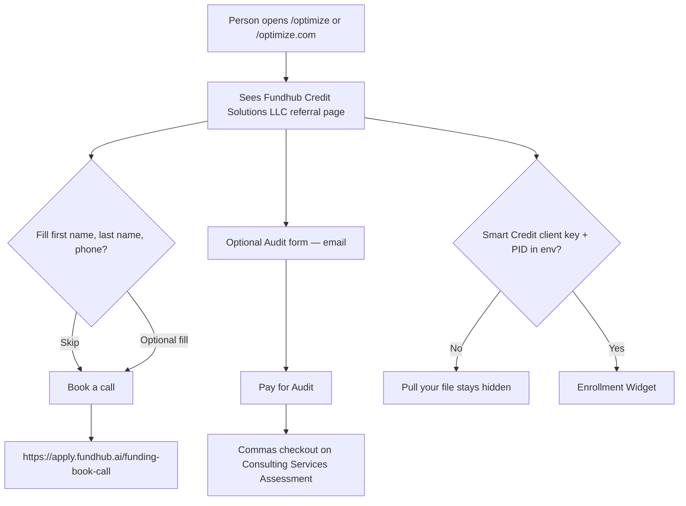

# optimize — intended

**COMPLIANCE REVIEW REQUIRED** — credit-repair referral page. Public words use **Fundhub Credit Solutions LLC**. No credit-outcome claims. Page copy says **Audit**, not credit repair.

Builder wrote this file. Chris approving it is the signature that it is true.

Hidden public page. Referrals only. Book a call. Optional Audit checkout on the existing keep product. Smart Credit enroll only if client key + PID exist.

## In one picture

## Who this is for

A referred person. Not staff. Not a client login.

## What should happen

1. `/optimize` and `/optimize.com` show the same page.
2. First name, last name, and phone are optional. The person can book with those blank.
3. The Book a call button opens the existing survey calendar: `https://apply.fundhub.ai/funding-book-call`.
4. Audit is optional. The page says Audit. Checkout uses the keep title **Consulting Services Assessment**. No new Commas product.
5. Smart Credit / pull-your-file only appears when `CONSUMER_DIRECT_CLIENT_KEY` (or `SMART_CREDIT_CLIENT_KEY`) and `CONSUMER_DIRECT_PID` (or `SMART_CREDIT_PID`) are set. New integrations use the Enrollment Widget.
6. There is no Identity IQ link. There is no CRS pull.
7. Copy does not say a score will go up. Copy does not say credit repair.

## Observable ground truth

### 1. Hidden page loads

**Should:** The person sees Fundhub Credit Solutions LLC and a Book a call button.

**How you know:** Open `https://fundhub.ai/optimize` or `https://fundhub.ai/optimize.com`. Same page.

### 2. Book without filling the form

**Should:** Book a call still opens the calendar.

**How you know:** Leave the three fields blank. Click Book a call. The next URL is `https://apply.fundhub.ai/funding-book-call`.

### 3. Audit checkout

**Should:** Pay for Audit opens a Commas checkout for Consulting Services Assessment.

**How you know:** Enter an email. Click Pay for Audit. The next URL is a Commas / Fanbasis pay link. The catalog title on that session is Consulting Services Assessment.

### 4. No fake credit enroll

**Should:** Pull your file is hidden until the Smart Credit key names exist. Nothing starts Identity IQ or CRS.

**How you know:** No Identity IQ, no xyl.in, no CRS. No widget script unless the config door says the keys are set.
