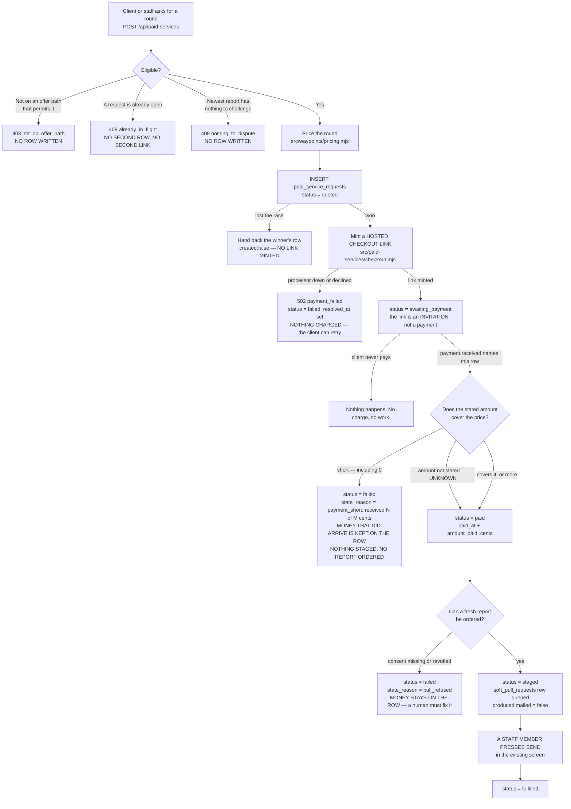

# The paid round — what the code actually does

**Hand-written, from the code, on 2026-09-05.** Not generated. The nine generated pages in this
folder answer "who can reach which route"; this one answers "what happens to a paid request, and
what happens when it goes wrong".

Every claim below names the file that makes it true. Where the code does something you would not
expect, the exception is written down rather than rounded off.

**COMPLIANCE REVIEW REQUIRED** (CLAUDE.md §7) — fee timing and payment rail.

**There is no button yet.** The endpoint and the handler exist and are tested. The screen that
calls them is a later wave. Nothing on this page is reachable by a client through the app today.

---

## What a paid round is

Owner-set. It is **not** "mail the letters we already wrote". A client presses it when they have
stalled or when new damage has appeared. So the order is:

1. price it,
2. take payment,
3. **re-pull the file**,
4. build the dispute from the freshest data and the client's own submission history.

A round built from a report pulled in January and mailed in April disputes things that may already
be gone.

## What it costs

Owner-set, integer cents, in `src/waypoints/pricing.mjs`:

| Line | Code | Cents |
|---|---|---|
| A round, all three bureaus | `round_base` | 10000 |
| A creditor letter | `creditor_letter` | +1000 |
| CFPB and state attorney general filings | `escalation_filings` | +2000 |

Stored as line items on the row, not as a single number, so a receipt itemises and a later price
change does not restate what somebody already paid. `db/migrations/331` refuses a row whose lines
do not add up to its total.

**A paid round does not consume `repair_programs.rounds_cap`.** The two counters are independent
and the enforcement is structural: `paid_service_requests` has no column referencing
`repair_programs`, so there is no join that could conflate them.

---

## The states a request moves through



---

## The one rule this page exists to protect

**Payment stages the mail. It does not send it.**

`src/metro2/delivery/send.mjs:3` and `api/repair/send.mjs:3` both forbid mailing from
`payment.received`, in those words.

`staged` means, precisely:

* a `soft_pull_requests` row exists, so a fresh report is on order;
* the request is on the open board a staff member works from;
* **nothing has been mailed**, and `produced.mailed` on the row says `false`.

`src/handlers/paid-service-payment.mjs` imports no mail function and emits no event a mailer
listens for. There are no letters to mail at that point in any case — they are built from the
report that has only just been ordered.

Proved, not asserted: `src/handlers/paid-service-payment.pg.test.mjs` drives the real event through
the real handler against a real Postgres and then counts `dispute_letters` rows for that client
before and after. The count does not move, and no row reaches `status = 'sent'`.

---

## One press, one row, one charge

Three guards, in this order. The first two can each be beaten by a genuine race; the third cannot.

| Guard | Where | What it catches |
|---|---|---|
| An open-request read | `openRoundFor()`, `src/paid-services/round.mjs` | the ordinary second press, seconds apart |
| A derived replay key `paid_round:<client>:r<n>` | `derivedIdempotencyKey()` | two presses that both slip past the read |
| Three unique indexes | `db/migrations/331` and `345` | everything else |

**And the charge follows the row: the checkout link is minted only when the INSERT created
something.** A losing press never reaches the processor. That is the part that actually prevents a
double charge; the guards above only prevent a double row.

### A defect found and closed on 2026-09-05

`331`'s two indexes were not enough, and this was measured against a real Postgres, repeatably:

```
press A   reads "nothing open"   reads MAX(round_no)=0 → slot 1   INSERT
press B   reads "nothing open"                                    ...
                                 reads MAX(round_no)=1 → slot 2   INSERT
```

B's open-request read happened *before* A's INSERT, so it saw nothing. B's counter read happened
*after* it, so B took a different slot — and a different slot means a different derived key. Two
rows. Two checkout pages for one press of one button.

`db/migrations/345_paid_service_one_open.sql` adds
`uq_paid_service_requests_one_open` — one open request per client per service kind — which is the
identical fix `090` made for `soft_pull_requests`. Ten simultaneous presses now produce one row and
one link, at the module and over HTTP, and both are tested.

**The exception, written down:** a losing press gets one of two answers depending on which
microsecond it lost in — the winner's row (`created:false`), or a `409 already_in_flight`. Both are
correct and both are one row and one charge. The code does not, and cannot, promise which.

---

## Every refusal, and what it does to the row

| Refusal | HTTP | Row after | Money |
|---|---|---|---|
| `not_on_offer_path` | 403 | none written | none taken |
| `already_in_flight` | 409 | unchanged — the open row is handed back | none taken |
| `nothing_to_dispute` | 409 | none written | none taken |
| `payment_failed` | 502 | `failed`, `resolved_at` set, `checkout_url` null | **none taken** — no card was ever touched |
| `payment_short` | 409 | `failed`, `state_reason = payment_short: received N of M cents…`, **`paid_at`, `amount_paid_cents` and `payment_ref` kept**, `produced.payment_shortfall_cents` set | **partly taken** — a human must refund or chase it |
| `pull_failed` | 502 | `failed`, `state_reason = pull_refused:…`, **`paid_at` and `amount_paid_cents` kept** | **already taken** — a human must resolve it |

A `failed` row holds no open slot, so a processor outage does not lock a client out of retrying.
Tested.

### `payment_short`, and the three things it deliberately does not fire on

Measured defect, 2026-09-05: nothing compared the figure a webhook reported against the figure the
client was billed. `amountCents: 0` was recorded as a payment, and one cent against an $110 round
reached `staged` with a real `soft_pull_requests` row — a fresh report ordered and the round on a
human's board, bought for a penny. `recordPayment()` now compares the two and refuses a short one.

It does **not** fire on:

* **An amount the webhook does not state.** NULL means unknown; the quote fallback below is
  unchanged, and unknown must not become an accusation of underpaying.
* **An overpayment.** The client is not short, so the work runs and a human handles the difference.
* **A row with no price on it.** `price_total_cents` NULL is "not priced yet"; there is no
  shortfall to assert against nothing.

The comparison is strictly `<`, so an exact payment is accepted — stated here because a wrong
comparator would refuse every ordinary round, and that case has its own test.

**Known gap, written down rather than rounded off:** a *negative* stated amount is not caught by
this guard. `known` requires `>= 0`, so `amountCents: -50` falls through to the quote fallback and
is recorded as a full payment. 331's `paid_service_requests_paid_amount_ck` refuses to store a
negative, so there is nowhere to put the figure, and a completed charge does not arrive negative —
a refund is its own event.

`pull_failed` is the only refusal that happens after money has been taken. The handler logs it at
`warn` level with the request id, because it is money taken for work that has not started.

---

## Unknown survives (CLAUDE.md §12)

`anythingToDispute()` returns `true`, `false` or **`null`**, and the null is the point.

| On file | Answer | Effect |
|---|---|---|
| No pull at all | `null` | **allowed** — never having been pulled is not grounds to refuse |
| A pull whose `result` retention has tombstoned (`src/retention/classes.mjs:147`) | `null` | allowed |
| A pull we can read, no negatives | `false` | **refused** |
| A pull we can read, negatives | `true` | allowed |
| A demo pull only (`is_demo`) | `null` | allowed — a seeded file never decides for a real client |

Elsewhere: `price_total_cents` null means *not priced*, which is not free — a CHECK refuses zero, so
neither can be read as the other. `amount_paid_cents` null means *no payment recorded*, not "paid
nothing". A payment webhook that does not state an amount falls back to the quote and records
`produced.payment_amount_source = "quote"`, so nobody later reads a quoted figure as a confirmed
one.

---

## No silent card capture

Nothing in this repository can charge a stored token: `src/subscriptions/charger.mjs:25` is an empty
charger map and `:88` is a second environment lock. Payment happens on a hosted checkout page at
the processor (`src/payments/commas-api.mjs:337`). A minted link is an **invitation**, not a
payment.

The session is minted with metadata `{ link_ref: <request id>, client_id, org_id }`, and
`src/adapters/commas.mjs:237-246` reads that bag back out as `payload.ref` on the way in — which is
how a webhook finds the request it paid for. **No amount matching**: matching by dollar figure would
attach a client's unrelated $100 payment to a round they never asked for.

⚠️ Same CONFIRM caveat the rest of the Commas integration carries: the exact key Commas echoes
metadata back under has not been observed against a live payload. If that round trip is wrong for
`payment_links` it is wrong here too.

The processor-facing product title is `Document round N` and nothing else, because
`src/payments/commas-safe-copy.mjs` bans "credit", "bureau", "repair", "fee", "capital", "score" and
"inquiry" from outbound copy. That is asserted by a test, not remembered.

---

## Entitlements are not granted here

`src/handlers/money-chain.mjs:654` already calls `grantFromTransaction()` on `payment.received`, and
that stays its job. `src/handlers/paid-service-payment.mjs` grants nothing and does not invent a
second unlock path.

---

## Known gaps

* **The handler is not on the live bus.** `register()` exists and is tested, but the one line that
  calls it belongs in `src/register-all.mjs`, which is not this lane's file. Until that line lands,
  a real `payment.received` does **not** reach this handler and a paid round stays at
  `awaiting_payment` forever.
* **`fulfilled` is nobody's job yet.** Nothing in this lane moves a request from `staged` to
  `fulfilled`. The staff send path does not know about `paid_service_requests`.
* **Rounds 4 and 5 must never read as filed.** Nothing in this system records whether a CFPB or
  state attorney general complaint was actually submitted
  (`src/metro2/letters/catalog.mjs:57-65`). Buying the `escalation_filings` add-on buys the
  *production* of those letters. This lane writes no timeline text, so it says nothing either way —
  the screen lane must not.
