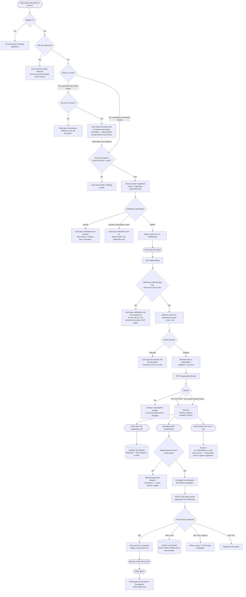

# Push notifications — the pipe

**COMPLIANCE REVIEW REQUIRED** (CLAUDE.md §7) — credit-repair messaging. The gate in
`src/push/payload.mjs` decides what words can reach a client's phone.

What this is: a client can add the portal to their phone's home screen, turn on
notifications, and a message we send arrives on that phone and opens the portal.

What this is **not**: any message. Nothing sends a notification today. No nudge, no
payment alert, no reminder. The pipe is built and the taps are not connected — see
**Wiring it to something** at the bottom.

---

## The state a device moves through

---

## What is actually built

| Piece | File |
|---|---|
| The table | `db/migrations/352_client_push_subscriptions.sql` |
| Encryption at rest | `src/push/store.mjs` (same shape as `src/banking/plaid.mjs`) |
| Encryption in transit + VAPID | `src/push/crypto.mjs`, proven in `src/push/crypto.test.mjs` |
| What a notification may say | `src/push/payload.mjs` |
| The one place that transmits | `src/messaging/providers/web-push.mjs` |
| Fan-out and retire-the-dead | `src/push/send.mjs` |
| Routes | `api/push/key.mjs`, `api/push/subscribe.mjs`, `api/push/unsubscribe.mjs` |
| Service worker | `public/app/client-portal-sw.js` |
| Install manifest | `public/manifest.webmanifest`, icons in `public/app/icons/` |
| The card and the ask | `public/app/client-portal.html` |
| Prove one arrives | `scripts/push/send-test-push.mjs` |

## Configuration

Four variables. Nothing works without all four, and nothing pretends to.

| Name | What it is |
|---|---|
| `VAPID_PUBLIC_KEY` | Public. Sent to every browser that subscribes. |
| `VAPID_PRIVATE_KEY` | Secret. Signs our requests to the push services. |
| `VAPID_SUBJECT` | `mailto:` or `https://` contact, so a push service can reach a human. |
| `PUSH_SUB_ENC_KEY` | Secret. 32 bytes, base64. Encrypts subscriptions at rest. |

Generate the VAPID pair: `node scripts/push/send-test-push.mjs --generate-keys`
Generate the storage key: `node -e "console.log(require('crypto').randomBytes(32).toString('base64'))"`

## The kill switch

Two of them, and either one is enough.

1. **One deploy.** Change `const KILL_SWITCH = false` to `true` in
   `public/app/client-portal-sw.js` and deploy. Every installed copy deletes its
   caches and unregisters itself the next time the browser checks the file.
2. **One URL, no deploy.** Open `/app/client-portal.html?push=off`. That device
   unregisters every service worker on the origin and empties every cache.

Turning it off for everyone without touching code: unset `VAPID_PRIVATE_KEY`. The
button disappears, and nothing can send.

## What the service worker can and cannot touch

Scope is the single URL `/app/client-portal.html`. Not `/app/`, which is where every
staff CRM screen lives, and not `/`. Two consequences, both deliberate:

- A request to `/api/` is **outside its scope** and never reaches it, so a client's
  financial data cannot enter a cache even by mistake.
- It cannot sit in front of a staff screen, so a bad worker cannot take the CRM down.

`src/push/service-worker.test.mjs` runs the worker in a fake browser and fails if an
`/api/` URL ever lands in the cache.

## Wiring it to something (NOT DONE — this is the follow-up)

Nothing sends a notification today. To connect the nudge engine:

1. Import `sendToClient` from `src/push/send.mjs`.
2. Call it beside the existing text-message send, not instead of it:
   `await sendToClient(db, { orgId, clientId, notification: { kind: "check_in" } })`.
3. If it answers `reason: "no_subscription_on_file"`, fall back to the text. If it
   answers `sent >= 1`, skip the text — that is the whole saving.
4. Add the notification's `kind` to `GENERIC_BODIES` in `src/push/payload.mjs` first.
   An unknown kind is refused, on purpose.

To route it through the message dispatcher instead (a bigger change, not needed for
the above):

1. Add `web-push` to `REGISTERED` in `src/messaging/providers/index.mjs`.
2. Add a `push` channel and a routing row to `message_channel_routing`.
3. Teach `src/messaging/dispatch.mjs` to resolve a push address from
   `client_push_subscriptions` rather than from a column on `clients` — a push
   address is a row, not a field, which is why `ADDRESS_FIELD` on that provider is a
   name and not a real column.

## What has not been proven

- No notification has been delivered to a real phone. That needs a deployed site, a
  real browser and a real push service, and it is the one step only a human can take.
  `scripts/push/send-test-push.mjs` is the tool for it.
- The iPhone branch is written from Apple's documented rules (iOS 16.4, home screen
  required) and tested as a code path. It has not been run on an iPhone.
