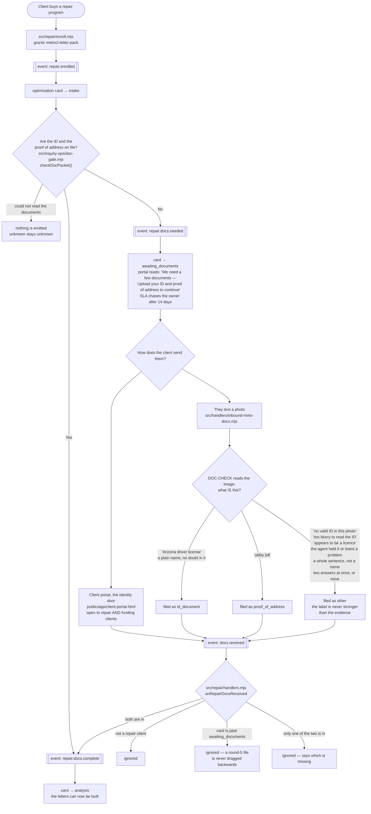

# repair documents — actual

What the code **does** today when a credit-repair client sends us the two
documents the whole program is built on: a government photo ID and a proof of
address. Traced from the code on branch `feat/repair-doc-path`, not from a spec.

The identity in those two pictures is what stays on the credit report. Every
other name and every other address on the report is disputed off against it. So
until both have arrived and been read, there is nothing honest to put in a
letter.

## In one picture

## What each piece is, and where it lives

| Step | File | Note |
|---|---|---|
| Enrolment | `src/repair/enroll.mjs` | Trial is capped at 2 rounds, full at 6. Owner-set; correct. |
| The stage list | `src/repair/pipeline.mjs` | `intake → awaiting_documents → analysis → …` |
| The client's words | `src/repair/portal.mjs` | "We need a few documents" |
| The 14-day chase | `src/repair/sla.mjs` | `awaiting_documents: 14 days → owner_contact_client` |
| Has the packet arrived | `src/inquiry-ops/doc-gate.mjs` | `checkDocPacket()` — the ONE implementation |
| Emits the two events | `src/repair/handlers.mjs` | `announceRepairDocState()` |
| Listens for uploads | `src/repair/register.mjs` | `docs.received → onRepairDocsReceived` |
| The upload doors | `src/repair/upload-doors.mjs` | the identity door opens for repair AND funding |
| A texted photo | `src/handlers/inbound-mms-docs.mjs` | classified before it is filed |
| Reads the images | `src/handlers/doc-check.mjs` | seeded in `db/migrations/114_ghl_agent_seed.sql` |

## What was broken until 2026-09-04

1. **A repair client could not see the identity door.** `activeUploadDoors()`
   opened the door carrying `id_document` and `proof_of_address` on the
   funding-snapshot entitlement only. A repair client is granted
   `metro2-letter-pack`, so all they ever saw was the bureau-response door. The
   program's first requirement had nowhere to be sent.

2. **`awaiting_documents` had never once been reached.** The stage, the client
   copy, the 14-day chase and the event handlers all existed. `repair.docs.needed`
   and `repair.docs.complete` were emitted by nothing at all, so every repair
   client sat on `intake` and no screen ever asked them for anything.

3. **A texted photo was filed as "other".** Every inbound picture message was
   registered with subtype `other`, so neither the document agent nor the
   document gate could tell an ID from a gas bill. A client who texted their
   licence had, as far as every check downstream was concerned, sent nothing.

## Three refusals worth knowing

* **Unknown is never "missing".** If the documents table will not answer,
  nothing is emitted. A client is never told they have not sent something on the
  strength of a failed read.
* **An upload never moves a file backwards.** `onRepairDocsReceived` only acts on
  a card sitting on `intake` or `awaiting_documents`. A client on round five
  texting a bureau letter changes nothing.
* **The label is never stronger than the evidence.** A photo is typed as a
  government ID only when the document agent plainly named one. The subtype
  falls back to `other` — the same as before any of this work — whenever:
  the agent's words carry a denial or a doubt ("no valid ID was visible", "too
  blurry to read the ID", "appears to be a driver's license", "possibly a
  passport", "belonging to someone other than the client"); the agent held the
  document, asked for a better one, or listed a problem with it; the answer is a
  sentence about the photo rather than a short name for it; the answer names two
  document types, or none. When two answers come back they must agree, and one
  answer we cannot read spoils the whole reply. Nothing is ever inferred from
  the filename, the sender, or the order the pictures arrived in: an MMS
  filename is `mms-<message id>-<n>` and says nothing. A photo that stays
  `other` is recorded with `classified_by: null`, so an unread picture never
  looks agent-verified.

  This matters because `id_document` is one leg of the identity gate in
  `src/inquiry-ops/doc-gate.mjs`, and that gate is what decides whether dispute
  letters may be mailed in a client's name. A wrong label there would open it on
  nothing.

## What this page does NOT claim

Three things on this path are real and are not fixed here. They are written down
so nobody reads the diagram as more finished than it is.

* **On a database built from the migrations alone, the document agent has no
  instructions, so no photo is ever classified.** Measured 2026-09-04 on two
  scratch Postgres databases with all 239 migrations applied to empty:
  `select code, status, length(coalesce(prompt,'')) from agents where
  code='DOC-CHECK'` returns `DOC-CHECK | draft | 0`, and 20 of the 22 seeded
  agent rows have the same empty prompt. `classifyMmsImage()` then returns
  `reason: 'agent_unavailable'` and the photo is filed as `other` — which is
  safe, and is the same answer the code gave before any of this work, but it
  means the classifier cannot help on such a database until an instruction is
  written onto that row. Whether the live database carries one was not measured
  here.

* **The credit-repair contract check does not run on this path.**
  `canLeaveIntake()` in `src/repair/croa.mjs` checks that a complete contract is
  on file before a repair file leaves `intake`. `src/repair/handlers.mjs` only
  applies it when the event payload carries `fromIntake`, and nothing in the
  repository sets that flag — `git grep -n fromIntake -- src` returns only the
  check itself. So enrolment moves the card to `awaiting_documents` without that
  check running. COMPLIANCE REVIEW REQUIRED.

* **Nothing moves a card out of `analysis` on its own.** When both documents
  land, the card moves to `analysis` and the client's portal reads "We're
  reviewing your report" (`src/repair/portal.mjs`). The only caller of
  `analyzeAndGenerate()` is `api/repair/generate.mjs`, which a member of staff
  has to press. `src/repair/sla.mjs` raises `engineering_engine_failure` on the
  staff board one hour later. No repair client had ever reached this stage
  before this change, so this is newly reachable behaviour.

## Not covered here

`docs/journeys/client-intended.md` is route-level only and says nothing about
document stages, so there is no intended-versus-actual gap to report on this
page. No new route, screen, tab or step was added — every piece above already
existed and was simply not connected to the next one.
