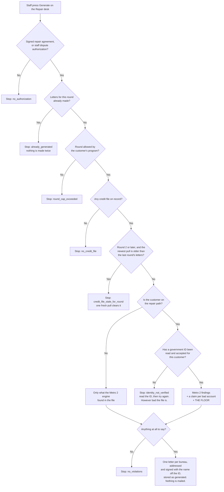
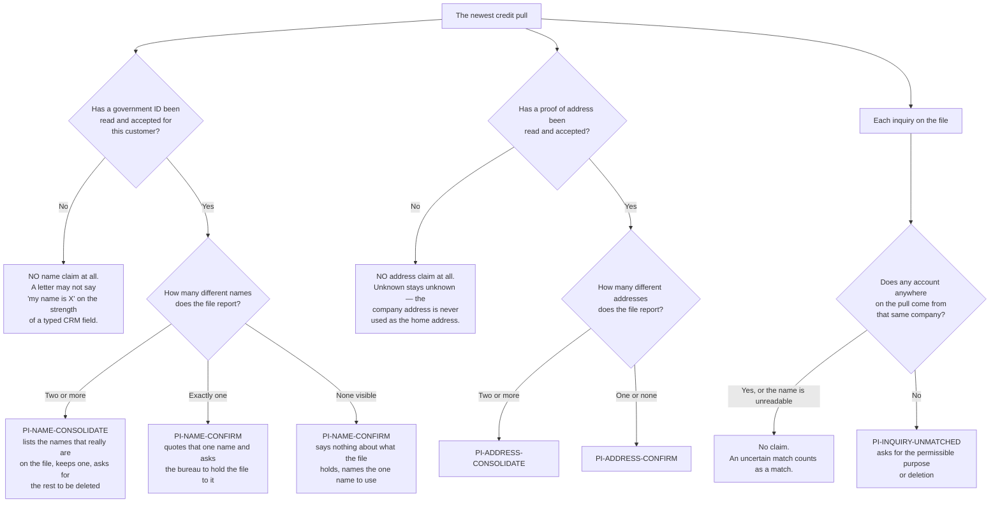

# The repair letter floor — what a credit-repair customer always gets

Owner decision, 2026-09-03, final.

> On **every** customer on the credit-repair path, on **every** round, clean file
> or not, always run personal-information cleanup: consolidate to exactly 1 name,
> consolidate to exactly 1 address, and dispute every credit inquiry that has no
> matching open account. That is the **floor** — it happens even when the file is
> completely clean and there is nothing else to dispute.

Letters about bad accounts sit **on top** of that floor. A customer who is not on
a repair path gets none of it, whatever their file holds.

**Two things the owner rule does not reach, and both are in the diagrams below.**
A customer on Round 2 or later whose newest credit pull is older than the last
round's letters gets no letter at all until a fresh pull lands. And a customer
with **no home address on record** gets the name cleanup but no address claim,
because we do not know their address and a letter may not state one we do not
have.

Traced from the code in `src/repair/analyze.mjs` and
`src/metro2/diy/personal-info-floor.mjs`, not from the spec.

## What happens when staff press Generate

**CHANGED 2026-09-06 — the ID check moved, and it now stops everybody.** It used
to sit on the "nothing to say" branch only. So a repair customer whose ID had not
been read, but who had a real problem on the file, still got all three letters —
just with the name and address requests missing from them. And the name printed
at the top of those letters, and signed at the bottom, came from
`clients.first_name` / `clients.last_name`: what a closer typed into a form, not
what any document proved. Measured by running it, on a customer with one
collection account. Now the check runs before any letter is built. A letter that
cannot be addressed truthfully is not written.

**On the repair path** means either a signed credit-repair agreement, or an
outcome tier of `REPAIR_ONLY` or `FUNDING_PLUS_REPAIR`. The agreement counts
first: somebody who bought repair is on the repair path whatever the analyzer
last stamped on their record.

## What the floor puts in the letter

### No document is addressed to a word

ADDED 2026-09-06. **COMPLIANCE REVIEW REQUIRED — credit-repair messaging.**

A person's name printed on a letter to a credit bureau, on a validation demand to a
collector, or on a complaint sworn under penalty of perjury is **either a real name or it is
absent**. There is no third answer, and no document is built with a word standing where the
name should be — not "Client", not "Consumer", not a bracketed blank.
`src/metro2/letters/consumer-name.cjs` is the one place that decides, and every renderer
imports it, including the CommonJS vendor letter writer.

**Two earlier write-ups on this were wrong, and here is the correction.**

*It said there were "exactly three places in this repository that print a customer's name
onto a document".* There are more than three, they were listed off the filesystem this time
(`src/`, `vendor/`, `scripts/`, `api/`, `public/`), and every one that mails something now
runs the same predicate:

| Where | What it prints | Now |
|---|---|---|
| `src/metro2/letters/generate.mjs` | bureau letterhead and body | refuses |
| `src/metro2/letters/sign-block.mjs` | the signature line, and the perjury declaration | refuses |
| `src/metro2/letters/furnisher-validation.mjs` | demand mailed to a collector | refuses |
| `src/metro2/letters/complaints.mjs` | the CFPB and state attorney general complaints | refuses |
| `src/metro2/diy/package.mjs` | the whole do-it-yourself packet | refuses first, with a reason |
| `src/metro2/diy/deliver.mjs` | resolves the name off the customer record | answers NULL |
| `src/inquiry-ops/letter-draft.mjs` | the inquiry-removal draft | answers NULL |
| `src/underwrite/letter-pack.mjs` | the funding / repair pack | withholds the letters, keeps the analysis |
| `vendor/underwriteiq-full/api/lite/letter-generator.js` | the mailed dispute PDF's sender block, its signature, and the "keep only my legal name" claim | refuses |

Only a WHOLE value counts as a stand-in, so a customer actually called "Pat Client" still
gets their letters.

*It said the CFPB and state attorney general complaint forms "only come out of the
do-it-yourself packet, not the repair desk".* **The opposite is true.**
`src/underwrite/letter-pack.mjs` `buildEscalationComplaints` returns immediately for every
pack that is not `"repair"`, so it is a repair-desk builder and nothing else. It feeds
`src/metro2/diy/package.mjs` `maybeComplaintFiles` from the same typed customer record the
bureau letters use, and it now takes the same name gate they do — before any work, not
inside the renderer.

**What this does NOT change.** The repair desk still holds its letters to the name read off
the uploaded government ID, as the section below describes. The gate above is the floor
under that, not a replacement for it: the do-it-yourself packet reads the typed customer
record, so a name gate is the only check standing between it and a letter addressed to
nobody. Raising the packet to the ID standard as well would stop every customer without a
read ID from getting one, which is a product decision nobody has made.

### The rule that makes this safe

A dispute letter is a statement of fact mailed to a credit bureau in the
customer's name. So:

* A **consolidation** claim is only made when the file genuinely carries two or
  more different names, or two or more different addresses. The names it quotes
  as being on the file are read off the file itself.
* A file that carries **one** name gets a claim confirming that one name should
  stay. It is never told it carries a second name that was never there. Bureau
  files routinely carry a middle initial that the customer record does not, and
  treating that difference as a duplicate would put a false statement in a mailed
  letter and demand deletion of the customer's own correctly reported name.
* **The name and the address the letter quotes come off the customer's uploaded
  government ID and proof of address, and nowhere else.** An agent reads both
  images; what it copies out is stored by `src/identity/verified.mjs` and that is
  what the letters quote. `clients.first_name` is what somebody typed during a
  sales call, and `pii_identity.addresses[0]` is whichever address happens to
  sort first. Neither is evidence, and a letter mailed to a credit bureau in a
  real person's name may not assert a name or an address on the strength of a
  typed field. Either may be missing, and missing means UNKNOWN: no claim.
* Once read, the verified name is the name to KEEP — the customer speaking about
  themselves. It is never used to decide what the bureau reported.
* The inquiry claim never says the customer failed to authorise the inquiry.
  Nothing in a credit report carries that fact, so the letter asks for the
  permissible purpose instead of asserting there was none.
* **The letter never states an address the customer has not given us.** A
  customer with no home address on record gets no address claim. The letterhead
  at the top of the page may still fall back to their company address, because
  the envelope needs a reply address, but nothing inside the letter says that is
  where they live.
* **A letter whose every claim says the file is CORRECT does not call itself a
  dispute.** On a spotless file the two claims are confirmations, so the letter
  is headed a personal information confirmation, each claim is headed a
  *Request* rather than a *Violation*, and the surrounding sentences ask for
  confirmation instead of telling the bureau the file is inaccurate. A letter
  with even one real dispute in it keeps the dispute wording, because then the
  dispute really is there.
* **A letter carrying BOTH kinds says so, per sentence.** The ordinary real
  customer has genuine problems on the file AND correct personal information, so
  one envelope holds both. Every sentence that demands deletion, or calls the
  contents inaccurate, or asks for a method of verification, is narrowed to *the
  disputed items*, and the confirmations are asked for separately in the same
  paragraph. Nothing in the letter asks a bureau to delete the customer's own
  correct name.
* **A repair customer whose ID has not been read yet is refused by name, and
  gets no letter of any kind.** The answer is `identity_not_verified`, not "the
  credit file looks clean". The file is not the problem; the missing document is,
  and the desk is told which one. This holds however bad the file is — a customer
  with three collections and no ID on record still gets nothing until the ID is
  read, because the name at the top of the letter and on the signature line has
  to come from the document too.
* **The name on the letter comes off the ID.** The letterhead and the signature
  block print the legal name the doc-check agent read, not `clients.first_name` /
  `clients.last_name`. Where the two disagree, the document wins. The RETURN
  ADDRESS is a separate thing and is allowed to fall back to the customer's
  company address: an envelope needs somewhere for the reply to go, which is not
  a statement about where anybody lives. The sentence "my address is X" inside
  the letter still comes only from an accepted proof of address.
* **A verified name with no accepted proof of address still produces letters.**
  The name is what a bureau matches a file by, so the name is what the gate is
  on. The address claim is simply not made.

### Rounds

Every claim is built from the newest stored pull, so an item a bureau deleted is
simply not in the next round's letter. The re-pull itself is not automatic, so
Round 2 and later refuse until a newer pull is on record. Round 1 has no earlier
round to be stale against, and the furnisher letters are not a rung on the
bureau ladder, so both are exempt.

## Where this lives

| What | File |
|---|---|
| The floor's claims and the rule that they never invent a variant | `src/metro2/diy/personal-info-floor.mjs` |
| The one name and the one address a document actually proved | `src/identity/verified.mjs` |
| Which sentences a confirmation-only or mixed letter is allowed to use | `src/metro2/letters/generate.mjs` |
| The sweep that fails if any letter says what its claims do not support | `src/metro2/letters/letter-honesty.test.mjs` |
| Claims for bad accounts (collections, charge-offs, lates) | `src/metro2/diy/derogatory.mjs` |
| The Metro 2 engine's own findings | `src/metro2/diy/from-crs.mjs` |
| Where the three are merged, the repair-path gate, the re-pull gate | `src/repair/analyze.mjs` |
| The endpoint staff press | `api/repair/generate.mjs` (POST `/api/repair/generate`) |
| Simulated credit files for a walkthrough | `scripts/sim/push-credit.mjs` |

Nothing in this flow mails anything. Handing a stored letter to a mail provider
is a separate, human step.
