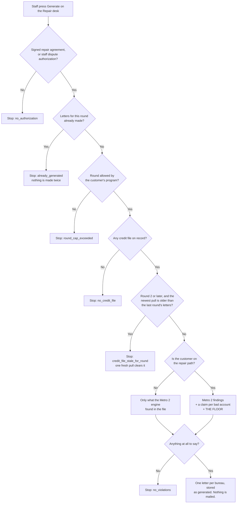
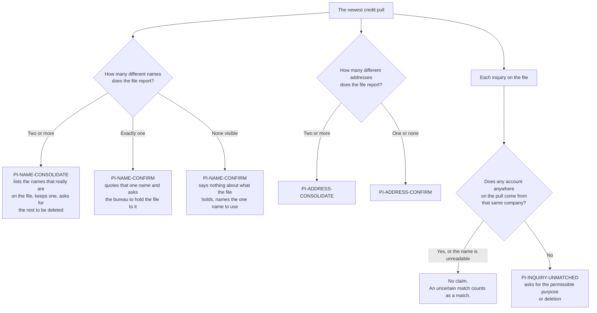

# The repair letter floor — what a credit-repair customer always gets

Owner decision, 2026-09-03, final.

> On **every** customer on the credit-repair path, on **every** round, clean file
> or not, always run personal-information cleanup: consolidate to exactly 1 name,
> consolidate to exactly 1 address, and dispute every credit inquiry that has no
> matching open account. That is the **floor** — it happens even when the file is
> completely clean and there is nothing else to dispute.

Letters about bad accounts sit **on top** of that floor. A customer who is not on
a repair path gets none of it, whatever their file holds.

Traced from the code in `src/repair/analyze.mjs` and
`src/metro2/diy/personal-info-floor.mjs`, not from the spec.

## What happens when staff press Generate

**On the repair path** means either a signed credit-repair agreement, or an
outcome tier of `REPAIR_ONLY` or `FUNDING_PLUS_REPAIR`. The agreement counts
first: somebody who bought repair is on the repair path whatever the analyzer
last stamped on their record.

## What the floor puts in the letter

### The rule that makes this safe

A dispute letter is a statement of fact mailed to a credit bureau in the
customer's name. So:

* A **consolidation** claim is only made when the file genuinely carries two or
  more different names, or two or more different addresses. The names it quotes
  as being on the file are read off the file itself.
* A file that carries **one** name gets a claim confirming that one name should
  stay. It is never told it carries a second name that was never there. Bureau
  files routinely carry a middle initial that the customer record does not, and
  treating that difference as a duplicate would put a false statement in a mailed
  letter and demand deletion of the customer's own correctly reported name.
* The name to keep comes from the customer's own record. That is the customer
  speaking about themselves. It is never used to decide what the bureau reported.
* The inquiry claim never says the customer failed to authorise the inquiry.
  Nothing in a credit report carries that fact, so the letter asks for the
  permissible purpose instead of asserting there was none.

### Rounds

Every claim is built from the newest stored pull, so an item a bureau deleted is
simply not in the next round's letter. The re-pull itself is not automatic, so
Round 2 and later refuse until a newer pull is on record. Round 1 has no earlier
round to be stale against, and the furnisher letters are not a rung on the
bureau ladder, so both are exempt.

## Where this lives

| What | File |
|---|---|
| The floor's claims and the rule that they never invent a variant | `src/metro2/diy/personal-info-floor.mjs` |
| Claims for bad accounts (collections, charge-offs, lates) | `src/metro2/diy/derogatory.mjs` |
| The Metro 2 engine's own findings | `src/metro2/diy/from-crs.mjs` |
| Where the three are merged, the repair-path gate, the re-pull gate | `src/repair/analyze.mjs` |
| The endpoint staff press | `api/repair/generate.mjs` (POST `/api/repair/generate`) |
| Simulated credit files for a walkthrough | `scripts/sim/push-credit.mjs` |

Nothing in this flow mails anything. Handing a stored letter to a mail provider
is a separate, human step.
