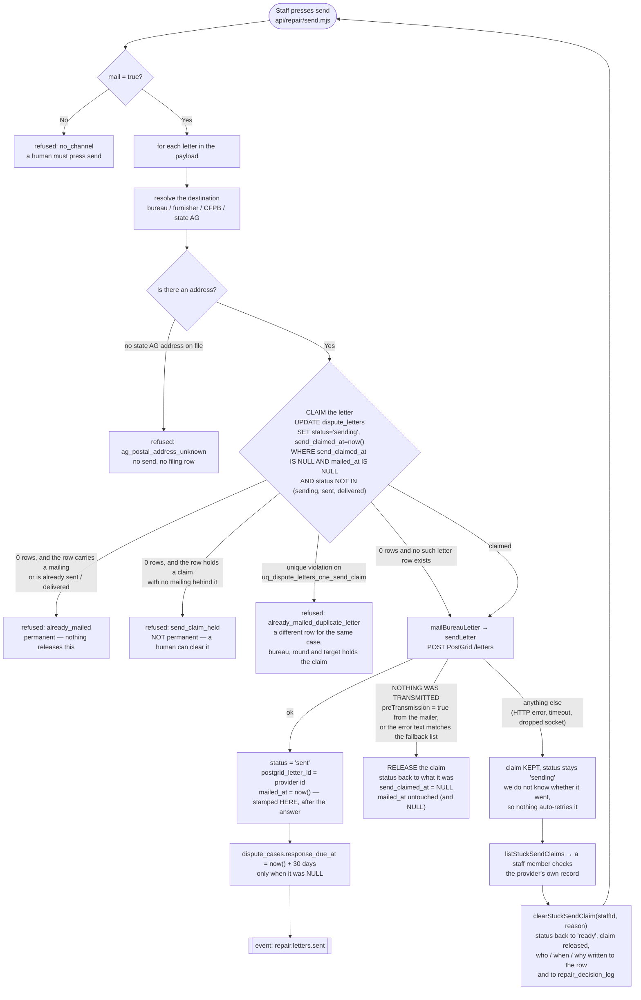
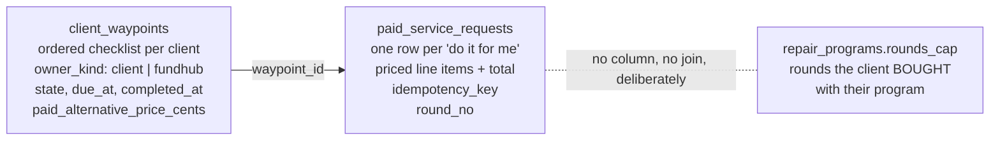

# repair letter send — actual

What the code **does** today when a staff member presses send on a repair
dispute letter, and what now stops the same letter going out twice. Traced from
`src/repair/send.mjs`, `src/repair/analyze.mjs`, `src/metro2/delivery/send.mjs`,
`src/messaging/providers/mail-letter.mjs`, `src/lib/outbound-fetch.mjs` and
`db/migrations/332` and `333` on branch `feat/portal-schema` — not from a spec.

**A human still presses send.** `src/metro2/delivery/send.mjs:3` and
`api/repair/send.mjs:3` both forbid mailing from `payment.received`. Nothing in
this change touches that.

## CORRECTION — what the first version of this page got wrong

The version of this page written with `db/migrations/332` said a send that
failed left the letter "claimed, for a human to reconcile — a support ticket".
**Both halves of that sentence were untrue.**

1. It was not only a failed *send* that did it. 332 stamped `mailed_at` at
   **claim** time, before the provider was called at all. So a send the outbound
   dry-run fence held — where nothing was transmitted and a transport rigged to
   throw was never reached — left the letter marked as mailed.
2. There was no human who could reconcile it, and **the damage was not limited
   to that one letter**. A brand-new replacement letter for the same case,
   bureau, round and destination was refused too, because the unique index
   counted the false stamp. Nothing in the repository could clear either. The
   letter and every future replacement for it were dead.

Measured on a scratch Postgres on 2026-09-05, three presses, with a transport
that throws if it is ever reached (it never fired):

| press | what happened | mailer calls |
|---|---|---|
| 1 — fence held the call | row became `sending`, `mailed_at` **stamped** | 0 |
| 2 — same letter, fence off | refused `already_mailed` | 0 |
| 3 — a brand new replacement row | refused `already_mailed_duplicate_letter` | 0 |

`db/migrations/333` is the repair. The rest of this page describes what the code
does **after** it.

## The send loop

## Was anything actually transmitted? The fact, then the strings

This one decision is the whole guard. Wrong one way, a real person gets two
identical dispute letters and we get two bills. Wrong the other way, a send that
never happened destroys the letter and every replacement for it.

`src/lib/outbound-fetch.mjs` — the single place an outbound request is made —
now returns `transmitted` on every result. It is **proven by control flow, not
guessed from a status code**: every `false` is returned from a branch that sits
above the `fetch` call.

* `transmitted: false` — the dry-run fence held it, no fence was declared, or
  there is no fetch implementation. Nothing left this process.
* `transmitted: true` — a request was started. A timeout and a dropped socket
  are **both** `transmitted: true` with `status: 0`, because the vendor may have
  accepted the work before the connection died.

`src/messaging/providers/mail-letter.mjs` carries that up on every failure as
`preTransmission`, and `src/repair/send.mjs` reads it before it reads any
message text. Under 332 it read only the text, against a list of eight fixed
strings, and the fence's wording was not on the list.

**The string list still exists, on purpose.** Two callers drop the flag: the
`mailSender` closure in `api/repair/send.mjs` rebuilds the mailer's result as
`{ ok, outcome, error }`, and `mailBureauLetter`'s own address refusals
(`src/metro2/delivery/send.mjs`) are plain objects that never had one. All of
those are genuinely pre-transmission and the list is what still catches them.
Delete the list and they start keeping claims they should release; trust the
list alone and the 332 bug comes back.

## Two facts, two columns, two indexes

| | `send_claimed_at` | `mailed_at` |
|---|---|---|
| means | this row is **taken** | this row **was mailed** |
| stamped | before the provider is called | only after the provider answered with an id |
| released automatically | yes — when nothing was transmitted | **never** |
| released by a human | yes — `clearStuckSendClaim`, on the record | **never, by anybody** |
| its unique index | `uq_dispute_letters_one_send_claim` | `uq_dispute_letters_one_mailing` |

Both indexes are partial, over `(org_id, case_id, bureau, round, target)`. The
claim index is a deliberate **superset** of the mailing index — a mailed row
keeps its claim, enforced by `dispute_letters_mailed_implies_claimed_ck` — which
is what lets a regenerated replacement for an already-mailed letter be refused
at **claim** time, before the call, rather than by a unique violation after the
envelope is in the post.

## Clearing a stuck claim, and what it cannot do

`clearStuckSendClaim(db, {orgId, letterId, staffId, reason})` in
`src/repair/send.mjs`. `listStuckSendClaims(db, {orgId})` is the read a screen
would list first.

It refuses unless all of these hold: the row is `sending`, it holds a claim, it
carries **no** `mailed_at`, it carries **no** `postgrid_letter_id`, and the claim
is at least **15 minutes** old (the transport's own hard timeout is 10 seconds,
so this cannot race a call that is merely slow). A staff id and a written reason
are both required and both stored on the row, and a
`repair.letter.send_claim_cleared` entry goes to `repair_decision_log`, which
`src/repair/lens.mjs` renders in plain English.

It clears `send_claimed_at` only. It never touches `mailed_at`, so it cannot
turn a letter that really went out into one that may go out again — that
invariant is `uq_dispute_letters_one_mailing` and nothing in the code path can
release a row from it.

**It can be wrong in the other direction, and that is accepted.** If the letter
did reach the provider and only the reply was lost, clearing lets a second one
go out. That is why it is deliberate, attributed and recorded, and why nothing
calls it on a timer.

**NOT WIRED TO A SCREEN YET.** Both functions are exported and proved by test,
and there is no HTTP route and no button. Until one exists a staff member cannot
reach this without a developer. See the handoff in the task report.

## Re-staging a round does not route around any of this

`src/repair/analyze.mjs` treats a letter in `generated`, `ready`, `queued`,
`sending`, `sent` or `delivered` as already staged. `sending` and `delivered`
were missing, so a re-stage of a round whose letter held a claim did not report
the round as already staged — it wrote a **second** `dispute_letters` row, which
the claim index then refused at send time. Re-staging was never a way out of a
stuck claim; it just made another dead letter. The way out is
`clearStuckSendClaim`.

## Why the claim happens before the provider call

`src/repair/send.mjs` used to set `status = 'sent'` after the mailer returned,
with no check of the current status, and `dispute_letters` carried no unique
index of any kind. Re-POSTing the same payload therefore mailed the same letters
again: two envelopes to the consumer, two to the bureau, two PostGrid bills. The
only thing in the way was a disabled button in a browser, which a retry, a
second tab or `curl` walks straight past.

Claiming after the call would not fix it, because two callers can both finish a
`SELECT` before either reaches its `UPDATE`. The claim is one statement, it runs
before anything is transmitted, and Postgres decides who wins.

## What NULL means here

* `dispute_letters.mailed_at` **NULL** — **not mailed.** That covers a claim in
  flight, a claim that died above the network, a claim a human cleared, and
  every row predating `db/migrations/332`. Never backfilled to a guessed value:
  the only write to this column in `333` is the `NULL` that undoes 332's false
  stamps on rows still sitting in `sending`.
* `dispute_letters.send_claimed_at` **NULL** — free to claim. Says nothing about
  whether anything was mailed; that is `mailed_at`.
* `dispute_letters.mail_cost_cents` **NULL** — UNKNOWN. It is not "free".
  **Nothing writes this column yet**; reading a price off the provider response
  is a later change.

## Still unguarded, on purpose

A letter posted with **no `letterId`** has no row in `dispute_letters` to claim,
so nothing stops a second one. That is unchanged behaviour, not a new hole:
`src/repair/send.mjs` has always accepted an ad-hoc `{bureau, html}` letter with
no stored row. The guard covers every letter the system generated.

## The schema behind the portal's paid round

`db/migrations/330` and `331` add the two tables the self-serve round sits on.
No endpoint reads them yet.

* **Overdue is a computed fact**: `due_at < now() AND state NOT IN (done,
  skipped)`. A NULL `due_at` means nobody set a deadline, and is never overdue.
* **`paid_alternative_price_cents` NULL** means no paid alternative exists. A
  CHECK refuses `0` outright, so nothing can read a zero and call it free.
* **A paid round does not consume a purchased round.** `round_no` on
  `paid_service_requests` is the self-serve counter;
  `repair_programs.rounds_cap` is the program counter. There is no column
  joining them, which is the enforcement.
* **A double press is one row**, adjudicated by
  `uq_paid_service_requests_idem (org_id, idempotency_key)` — the same partial
  unique index `events` and `soft_pull_requests` already use.

## Proven by

* `src/repair/send-double-mail.pg.test.mjs` — 12 tests on a real Postgres: the
  same payload twice makes one mailer call and one letter row; a duplicate row
  is refused; a pre-transmission refusal releases; a possibly-transmitted call
  keeps the claim; **a send the outbound fence held releases and the letter then
  really mails**; **a replacement letter claims after a released one**; **two
  simultaneous presses on one letter call the mailer exactly once**, and two
  simultaneous presses on two duplicate rows also mail once; **a stuck claim is
  cleared by a named human and the letter is sendable again**; clearing is
  refused on a letter that really was mailed; and the database itself refuses to
  release a mailing.
* `src/repair/analyze-restage-claim.pg.test.mjs` — a re-stage sees a letter stuck
  on `sending`, and one that is `delivered`, and writes no second row for either.
* `src/repair/send-guard.test.mjs` — the fact beats the string list in both
  directions, and the list still catches the chokepoint's own refusals.
* `src/lib/outbound-fetch-transmitted.test.mjs` — a fence hold, an unrecognised
  fence and a missing fetch implementation all report `transmitted: false`; a
  completed request, a thrown transport error and a timeout all report `true`.
* `src/messaging/providers/mail-letter.test.mjs` — every refusal above the
  network says `preTransmission: true`; an HTTP failure and a dropped connection
  say `false`.
* `src/repair/send-claim-migration-order.test.mjs` — `333` drops 332's claim
  CHECK **before** the backfill clears `mailed_at`. Written after the original
  order failed to apply to a database holding a stuck row.
* `src/waypoints/store.pg.test.mjs` — NULL price survives, `0` is refused, a
  receipt that does not add up is refused, a double press is one row, the
  program cap does not move.
* `src/waypoints/pricing.test.mjs` — $100 / +$10 / +$20 in integer cents.
