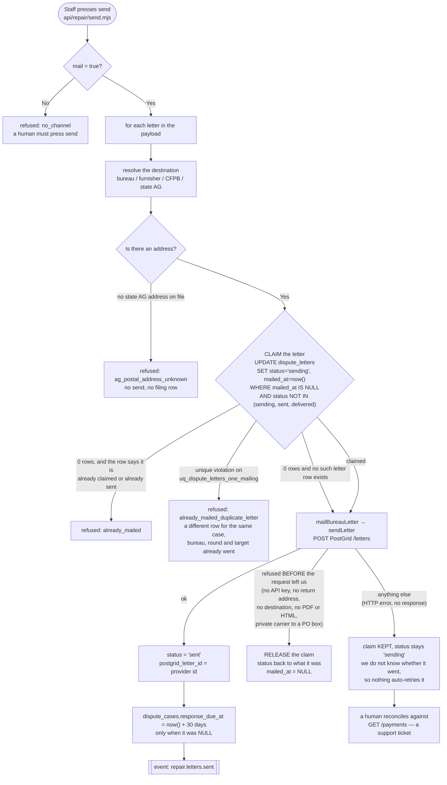
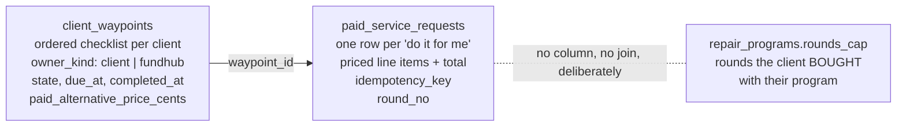

# repair letter send — actual

What the code **does** today when a staff member presses send on a repair
dispute letter, and what now stops the same letter going out twice. Traced from
`src/repair/send.mjs`, `src/metro2/delivery/send.mjs`,
`src/messaging/providers/mail-letter.mjs` and `db/migrations/332` on branch
`feat/portal-schema` — not from a spec.

**A human still presses send.** `src/metro2/delivery/send.mjs:3` and
`api/repair/send.mjs:3` both forbid mailing from `payment.received`. Nothing in
this change touches that.

## The send loop

## Why the claim happens before the provider call

`src/repair/send.mjs` used to set `status = 'sent'` after the mailer returned,
with no check of the current status, and `dispute_letters` carried no unique
index of any kind. Re-POSTing the same payload therefore mailed the same letters
again: two envelopes to the consumer, two to the bureau, two PostGrid bills. The
only thing in the way was a disabled button in a browser, which a retry, a
second tab or `curl` walks straight past.

Claiming after the call would not fix it, because two callers can both finish a
`SELECT` before either reaches its `UPDATE`. The claim is one statement, it runs
before anything is transmitted, and Postgres decides who wins.

## What NULL means here

* `dispute_letters.mailed_at` **NULL** — never claimed for mailing, or the row
  predates `db/migrations/332`. Never backfilled, so the partial unique index
  covers everything from that migration forward without rewriting one historic
  row.
* `dispute_letters.mail_cost_cents` **NULL** — UNKNOWN. It is not "free".
  **Nothing writes this column yet**; reading a price off the provider response
  is a later change.

## Still unguarded, on purpose

A letter posted with **no `letterId`** has no row in `dispute_letters` to claim,
so nothing stops a second one. That is unchanged behaviour, not a new hole:
`src/repair/send.mjs` has always accepted an ad-hoc `{bureau, html}` letter with
no stored row. The guard covers every letter the system generated.

## The schema behind the portal's paid round

`db/migrations/330` and `331` add the two tables the self-serve round sits on.
No endpoint reads them yet.

* **Overdue is a computed fact**: `due_at < now() AND state NOT IN (done,
  skipped)`. A NULL `due_at` means nobody set a deadline, and is never overdue.
* **`paid_alternative_price_cents` NULL** means no paid alternative exists. A
  CHECK refuses `0` outright, so nothing can read a zero and call it free.
* **A paid round does not consume a purchased round.** `round_no` on
  `paid_service_requests` is the self-serve counter;
  `repair_programs.rounds_cap` is the program counter. There is no column
  joining them, which is the enforcement.
* **A double press is one row**, adjudicated by
  `uq_paid_service_requests_idem (org_id, idempotency_key)` — the same partial
  unique index `events` and `soft_pull_requests` already use.

## Proven by

* `src/repair/send-double-mail.pg.test.mjs` — the same payload twice, one mailer
  call, one letter row; a duplicate row refused; a pre-transmission refusal
  released; a possibly-transmitted call kept.
* `src/waypoints/store.pg.test.mjs` — NULL price survives, `0` is refused, a
  receipt that does not add up is refused, a double press is one row, the
  program cap does not move.
* `src/waypoints/pricing.test.mjs` — $100 / +$10 / +$20 in integer cents.
