<!-- GENERATED by scripts/journeys/generate.mjs — do not edit by hand. Run `npm run journeys`. -->

# role-closer — actual

What the code **does** today for an employee whose `staff.role` is `closer`.
Generated from the routing table and the gate on each handler, not from a spec.

> **Who this is, in the code:** src/http/read-api.mjs — ROLE_SETS.STAFF includes 'closer'

## In one picture

```mermaid
flowchart TD
    START([role-closer arrives]) --> AUTH{Signed in?}
    AUTH -->|No| OUT[Refused — 401 not signed in]
    AUTH -->|Yes| WHO{Recognised as closer?}
    WHO -->|No| DENY[Refused — 403 forbidden]
    WHO -->|Yes| CAN[Can reach]
    CAN --> A_auth[Signing in and out — 6 routes]
    CAN --> A_banking[banking — 1 route]
    CAN --> A_campaigns[Campaigns — 8 routes]
    CAN --> A_chat[chat — 3 routes]
    CAN --> A_consent[consent — 1 route]
    CAN --> A_contracts[contracts — 1 route]
    CAN --> A_creative[Creative Factory — 7 routes]
    CAN --> A_dashboard[The dashboard — 4 routes]
    CAN --> A_documents[Documents — 1 route]
    CAN --> A_finance[Finance — 5 routes]
    CAN --> A_public[public — 1 route]
    CAN --> A_read[Reading data — 21 routes]
    CAN --> A_social[social — 2 routes]
    CAN --> A_top_level[Everything else — 13 routes]
    CAN --> A_webhooks[Incoming webhooks — 1 route]
    WHO -->|Yes| CANT[Blocked — 38 routes]
    CANT --> B_auth[Signing in and out — 1 blocked]
    CANT --> B_banking[banking — 2 blocked]
    CANT --> B_chat[chat — 1 blocked]
    CANT --> B_company_brain[company-brain — 1 blocked]
    CANT --> B_demo[demo — 1 blocked]
    CANT --> B_finance[Finance — 5 blocked]
    CANT --> B_hiring[Hiring — 6 blocked]
    CANT --> B_journeys[journeys — 2 blocked]
    CANT --> B_partner_brand[partner-brand — 1 blocked]
    CANT --> B_privacy[privacy — 1 blocked]
    CANT --> B_read[Reading data — 8 blocked]
    CANT --> B_staff[staff — 2 blocked]
    CANT --> B_top_level[Everything else — 7 blocked]
```

## What they can reach

**75 of 113 routes.**

| Route | Methods | Who the code lets in |
|---|---|---|
| `/api/agents` | POST | owner, admin, funding_advisor, closer, inquiry_specialist, setter, sales_manager |
| `/api/auth/login` | GET | anyone |
| `/api/auth/logout` | — | anyone |
| `/api/auth/magic-link` | — | anyone |
| `/api/auth/magic-link-verify` | — | anyone |
| `/api/auth/reset` | POST | anyone |
| `/api/auth/session` | — | anyone |
| `/api/banking/accounts` | GET, POST | owner, admin, funding_advisor, closer, inquiry_specialist, setter, sales_manager |
| `/api/campaigns/action-log` | GET | partner, staff |
| `/api/campaigns/connections` | GET | partner, staff |
| `/api/campaigns/detail` | GET | partner, staff |
| `/api/campaigns/fatigue` | GET | partner, staff |
| `/api/campaigns/list` | GET | partner, staff |
| `/api/campaigns/spend` | GET | partner, staff |
| `/api/campaigns/sync` | POST | partner, staff |
| `/api/campaigns/write` | POST | partner, staff |
| `/api/chat/ask` | POST | owner, admin, funding_advisor, closer, inquiry_specialist, setter, sales_manager |
| `/api/chat/messages` | GET, POST | staff |
| `/api/chat/peers` | GET | owner, admin, funding_advisor, closer, inquiry_specialist, setter, sales_manager |
| `/api/consent/capture` | GET, POST | employees: owner, admin, closer, funding_advisor plus: client |
| `/api/contracts` | POST | owner, admin, funding_advisor, closer, inquiry_specialist, setter, sales_manager |
| `/api/contracts/sign` | GET, POST | anyone |
| `/api/creative/actions` | POST | partner, staff |
| `/api/creative/approvals` | GET | partner, staff |
| `/api/creative/brand-kits` | GET | partner, staff |
| `/api/creative/generate` | POST | partner, staff |
| `/api/creative/jobs` | GET | partner, staff |
| `/api/creative/library` | GET | partner, staff |
| `/api/creative/run` | POST | partner, staff |
| `/api/dashboard/client` | — | staff |
| `/api/dashboard/clients` | — | staff |
| `/api/dashboard/pipeline` | — | staff |
| `/api/dashboard/seed` | — | staff |
| `/api/documents-upload` | POST | staff, client |
| `/api/documents/:id` | HEAD | **not a sign-in** — signed link |
| `/api/finance/alerts` | GET, POST | owner, admin, funding_advisor, closer, inquiry_specialist, setter, sales_manager |
| `/api/finance/entities` | GET, POST | owner, admin, funding_advisor, closer, inquiry_specialist, setter, sales_manager |
| `/api/finance/liabilities` | GET, POST | owner, admin, funding_advisor, closer, inquiry_specialist, setter, sales_manager |
| `/api/finance/model` | POST | owner, admin, funding_advisor, closer, inquiry_specialist, setter, sales_manager |
| `/api/finance/soft-pull` | GET, POST | employees: owner, admin, closer, funding_advisor plus: client |
| `/api/health` | — | anyone |
| `/api/inngest` | — | **not a sign-in** — Inngest request signing |
| `/api/inquiries` | GET, POST | staff |
| `/api/message-templates` | POST | owner, admin, funding_advisor, closer, inquiry_specialist, setter, sales_manager |
| `/api/messages` | POST | staff |
| `/api/messages-outbound` | POST | owner, admin, funding_advisor, closer, inquiry_specialist, setter, sales_manager |
| `/api/org-brand` | GET, PUT | staff, partner, affiliate, client |
| `/api/pipeline-cards` | POST | owner, admin, funding_advisor, closer, inquiry_specialist, setter, sales_manager |
| `/api/public/partner-page` | GET | anyone |
| `/api/read/agents` | GET | owner, admin, funding_advisor, closer, inquiry_specialist, setter, sales_manager |
| `/api/read/company-brain` | POST | owner, admin, funding_advisor, closer, inquiry_specialist, setter, sales_manager |
| `/api/read/contracts` | GET | owner, admin, funding_advisor, closer, inquiry_specialist, setter, sales_manager |
| `/api/read/conversations` | GET | owner, admin, funding_advisor, closer, inquiry_specialist, setter, sales_manager |
| `/api/read/documents` | GET | owner, admin, funding_advisor, closer, inquiry_specialist, setter, sales_manager |
| `/api/read/entitlements` | GET | employees: owner, admin, funding_advisor, closer, inquiry_specialist, setter, sales_manager plus: client |
| `/api/read/finance-ask` | POST | owner, admin, funding_advisor, closer, inquiry_specialist, setter, sales_manager |
| `/api/read/finance-command` | GET | owner, admin, funding_advisor, closer, inquiry_specialist, setter, sales_manager |
| `/api/read/finance-os` | GET | owner, admin, funding_advisor, closer, inquiry_specialist, setter, sales_manager |
| `/api/read/funding-rounds` | GET | owner, admin, funding_advisor, closer, inquiry_specialist, setter, sales_manager |
| `/api/read/inbox` | GET | owner, admin, funding_advisor, closer, inquiry_specialist, setter, sales_manager |
| `/api/read/inquiries` | GET | owner, admin, funding_advisor, closer, inquiry_specialist, setter, sales_manager |
| `/api/read/message-templates` | GET | owner, admin, funding_advisor, closer, inquiry_specialist, setter, sales_manager |
| `/api/read/messages` | GET | owner, admin, funding_advisor, closer, inquiry_specialist, setter, sales_manager |
| `/api/read/money-map` | GET | owner, admin, funding_advisor, closer, inquiry_specialist, setter, sales_manager |
| `/api/read/products` | GET | owner, admin, funding_advisor, closer, inquiry_specialist, setter, sales_manager |
| `/api/read/search` | GET | owner, admin, funding_advisor, closer, inquiry_specialist, setter, sales_manager |
| `/api/read/tradelines` | — | owner, admin, funding_advisor, closer, inquiry_specialist, setter, sales_manager |
| `/api/read/transactions` | GET | owner, admin, funding_advisor, closer, inquiry_specialist, setter, sales_manager |
| `/api/read/underwrite` | GET | owner, admin, funding_advisor, closer, inquiry_specialist, setter, sales_manager |
| `/api/read/workflows` | GET | owner, admin, funding_advisor, closer, inquiry_specialist, setter, sales_manager |
| `/api/shifts` | GET, POST | staff |
| `/api/social/publish` | POST | partner, staff |
| `/api/social/schedule` | POST | partner, staff |
| `/api/tasks` | GET, PATCH | staff |
| `/api/webhooks/:provider` | — | **not a sign-in** — provider signature |

### Worth knowing

- **4 routes also accept a shared secret instead of a sign-in** (`DASHBOARD_SECRET`), so a caller holding that value reaches them without being anybody in particular: `/api/dashboard/client`, `/api/dashboard/clients`, `/api/dashboard/pipeline`, `/api/dashboard/seed`.
- **9 routes are genuinely open** — no sign-in needed, reachable by anyone and not by this journey in particular: `/api/auth/login`, `/api/auth/logout`, `/api/auth/magic-link`, `/api/auth/magic-link-verify`, `/api/auth/reset`, `/api/auth/session`, `/api/contracts/sign`, `/api/health`, `/api/public/partner-page`. These are the sign-in routes and the health check.
- **3 routes need no sign-in but are NOT open.** `/api/documents/:id` (signed link), `/api/inngest` (Inngest request signing), `/api/webhooks/:provider` (provider signature). Anyone can call these, but a caller without the right signature is refused.

## What they are blocked from

**38 of 113 routes.**

| Route | Methods | Who the code lets in |
|---|---|---|
| `/api/auth/admin-reset` | POST | owner, admin |
| `/api/banking/revoke` | GET, POST | owner, admin |
| `/api/banking/sync-accounts` | POST | owner, admin, sales_manager |
| `/api/chat/portal-message` | POST | client |
| `/api/company-brain/reviews` | GET, POST | owner |
| `/api/demo/simulate` | DELETE, POST | owner, admin |
| `/api/finance/bank-accounts` | GET, POST | owner, admin, sales_manager |
| `/api/finance/bills` | GET, POST | owner, admin, sales_manager |
| `/api/finance/cards` | GET, POST | owner, admin, sales_manager |
| `/api/finance/cashflow` | GET, POST | owner, admin, sales_manager |
| `/api/finance/subscriptions` | GET, POST | owner, admin, sales_manager |
| `/api/hiring/application` | GET | owner, admin |
| `/api/hiring/bench` | GET | owner, admin |
| `/api/hiring/candidates` | GET | owner, admin |
| `/api/hiring/decisions` | GET | owner, admin |
| `/api/hiring/funnel` | GET | owner, admin |
| `/api/hiring/postings` | GET | owner, admin |
| `/api/inquiry` | — | inquiry_specialist, admin, owner |
| `/api/journeys` | GET, PUT | owner, admin |
| `/api/journeys/ask` | POST | owner, admin |
| `/api/journeys/run` | POST | owner, admin, sales_manager |
| `/api/partner-brand` | GET, PUT | owner, admin |
| `/api/partner-brand/verify-domain` | POST | owner, admin |
| `/api/partner-pages` | GET, PATCH, POST | owner, admin |
| `/api/payment-links` | GET, POST | owner, admin, sales_manager |
| `/api/pii` | GET, POST | owner, admin, inquiry_specialist, funding_advisor |
| `/api/privacy/erasure` | GET, POST | owner, admin |
| `/api/products` | POST | owner, admin, sales_manager |
| `/api/read/affiliates` | GET | owner, admin, sales_manager |
| `/api/read/banking-surface` | GET | owner, admin, sales_manager |
| `/api/read/commissions` | GET | owner, admin, sales_manager |
| `/api/read/company-brain-affiliate` | POST | affiliate, partner |
| `/api/read/failed-events` | GET | owner, admin |
| `/api/read/invoices` | GET | owner, admin, sales_manager |
| `/api/read/partners` | GET | employees: owner, admin, sales_manager plus: partner |
| `/api/read/staff` | GET | owner, admin, sales_manager |
| `/api/staff/monitoring-consent` | POST | owner |
| `/api/staff/telemetry` | GET | owner, admin, sales_manager |

## UNVERIFIED

_None — every route's gate was traced to its source._

## How to check this yourself

Every row above comes from two places, and you can open both:

- **Which routes exist:** the `ROUTES` map in `netlify/functions/api.mjs`. A handler
  missing from that map answers 404, so that map is the definition of what exists.
- **Who each one lets in:** the gate written at the top of each `api/…` handler.

Run `npm run journeys` to rebuild this file. `npm test` fails if it is out of date.
