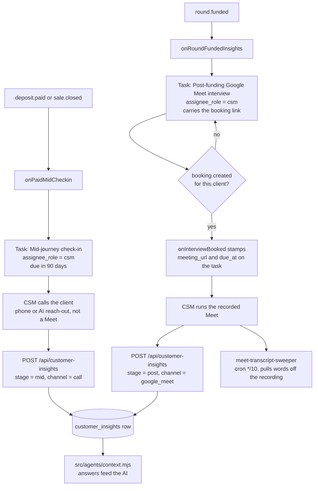
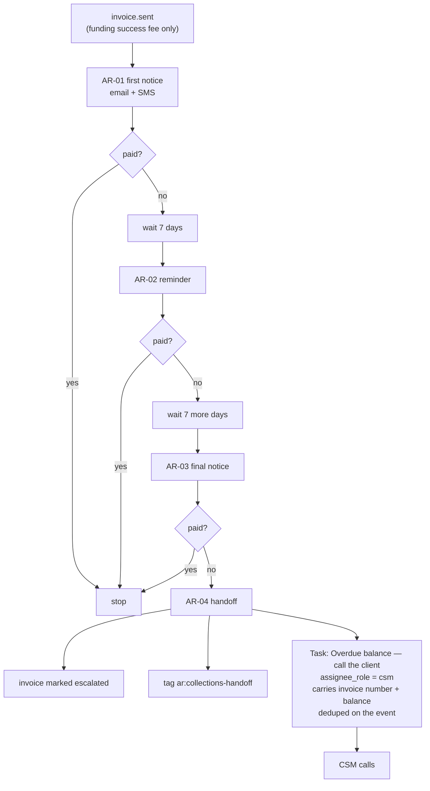
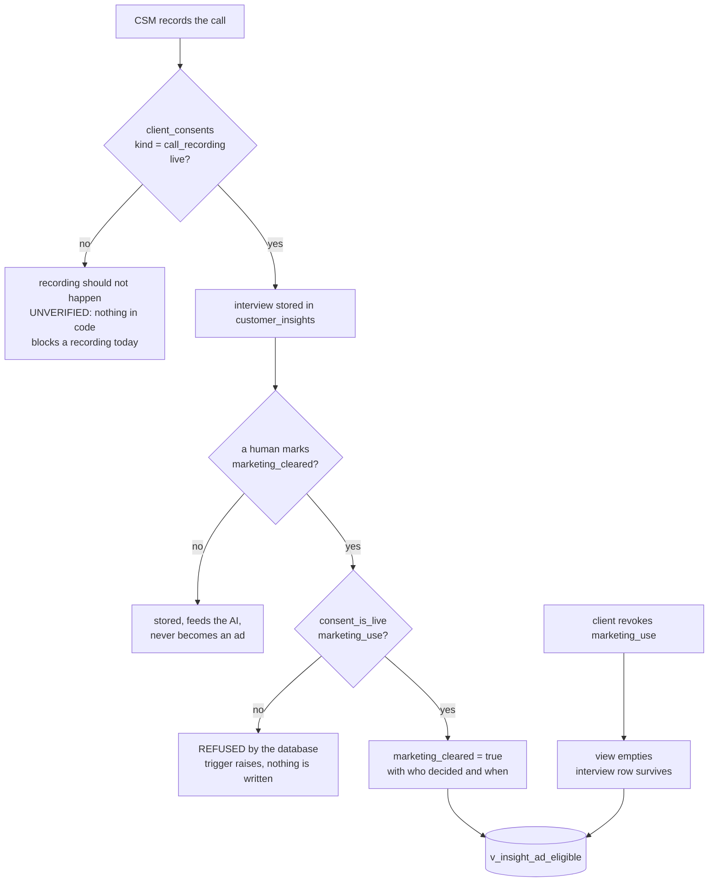

# CSM (Client Success Manager) — what the code actually does

Traced from the code by hand on 2026-09-05, not from the plan. Anything the code
did not show is marked `UNVERIFIED` rather than drawn.

> **`npm run journeys` does NOT write this file, and must not be pointed at it.**
> The other `role-*-actual.md` pages are that script's output: route tables
> showing which endpoints a role can reach. This page is a different thing — the
> flow of the work through the role, hand-traced. Adding `role-csm` to the
> generator's list would overwrite these diagrams with a route table and lose
> everything the page is for.

There is deliberately **no `role-csm-intended.md`** yet. Intended journeys are
hand-authored by Chris and agents do not write them (CLAUDE.md §4).

Traced from: `src/handlers/customer-insights.mjs`, `src/register-all.mjs`,
`src/lib/create-task.mjs`, `src/insights/store.mjs`, `src/insights/questions.mjs`,
`src/workflows/ar-collections.mjs`, `src/workflows/meet-transcript-sweeper.mjs`,
`db/migrations/166`, `290`, `291`, `292`, `293`.

---

## The two calls the CSM owns

**Both tasks read one constant.** `ASSIGNEE_ROLE` in
`src/handlers/customer-insights.mjs` was `funding_advisor` until 2026-09-05 and
is now `csm`, so both moved together. Registered live at
`src/register-all.mjs:14`.

**The mid check-in fires at day 90**, the halfway point of the 180-day term that
is the only program length stated anywhere in this repo. It was 7 days after
payment until 2026-09-05, which was a welcome call wearing the wrong name — a
week in, nothing has happened yet, so "how is it going" had no answer.

`MID_DUE_DAYS` in `src/handlers/customer-insights.mjs` is the one number.

`UNVERIFIED` — it is not computed per contract. `contracts.signed_at +
term_days/2` looks like the right answer and cannot be built: nothing writes
`term_days` onto a contract, 287 deliberately moved the term into the agreement
text, and zero contracts carry one. A client on a different-length agreement
gets the same day 90.

---

## Chasing money, and where a person finally enters

**Before 2026-09-05 this ladder ended at K and L.** It escalated the invoice,
tagged the client, and stopped. Nothing read that tag, so three unpaid notices
were followed by nobody calling. M is the change.

**Scope, unchanged:** only invoices whose source is `funding_success_fee`.
Subscription and agreement balances do **not** enter this ladder. `UNVERIFIED`
whether Chris wants them to — nothing in the code decides it either way.

---

## Whether a recording may become an ad

**Two consents, not one.** Agreeing to be recorded is not agreeing to be
advertised, and before `db/migrations/291` the table could not hold the
difference — `client_consents.kind` allowed only `soft_pull_consent` and
`dispute_authorization`.

**The stored flag is not the permission.** `marketing_cleared` records that a
human decided about this specific recording. `v_insight_ad_eligible` is the
answer to "may we cut an ad from this today" and re-checks the consent live, so
a revocation empties it without rewriting a single interview row.

**`UNVERIFIED` — nothing in the code stops a call being recorded without a
`call_recording` consent row.** The data slot exists (291). The gate on the act
of recording does not. Recording happens in Google Meet, outside this system.

---

## What the CSM is paid

`commission_rules.basis` now accepts `collections`, paired only to
`cash_collected` — money actually received, net of refunds. `sale_attributions`
accepts the same basis so a CSM can be credited on the deal.

**No rate is set.** Rates in this system are rows with effective dates, never
values in code (`db/migrations/013`). Until Chris adds a rule scoped
`role = 'csm'`, a CSM earns nothing on collections and the calculator reports
"no base rule for this basis" as a warning rather than paying zero silently.

An **upsell** needs none of this: an upsell is a sale, so it is `front_end` with
`role = 'csm'`, which is a config row. `UNVERIFIED` — no code path today
attributes an upsell to whoever was on the check-in call.

---

## What the CSM can see

`ROLE_TABS.csm` in `public/app/shell.js` resolves to the shared staff surface
plus `consent-capture.html`, matching how closer and funding advisor are set up.
Lands on `client-control-panel.html`. **No new screen was added.**

**The CSM has a queue.** `GET /api/read/csm-queue` returns their open tasks with,
for each one, the client's name, what they owe, and what they already own — the
three questions a check-in call needs answered before it starts. Balance comes
from `v_invoice_aging` and is **null when the client has no invoice, never 0**,
because "owes nothing" and "we have not looked" are different answers.

**The consent screen takes all four kinds.** `consent-capture.html?client_id=…
&kind=call_recording` and `&kind=marketing_use`. Asked on separate visits so
neither rides in on the other's tick.

**A CSM may record the two conversation consents and NOT a soft-pull consent.**
A consent is what unlocks a credit pull, so the role set on this endpoint is
gated per kind: `role_may_not_capture_this_kind` is the refusal.
